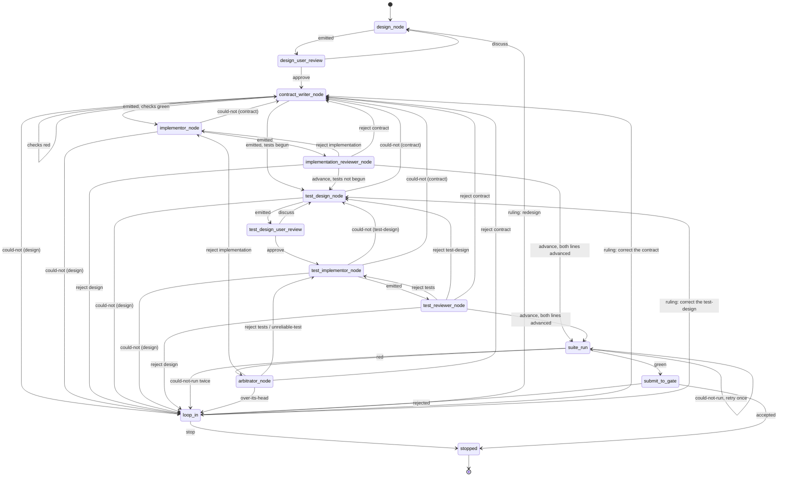

# The design-to-main state machine

The design-to-main workflow takes a design written in English and delivers an implementation and its tests to the gate that guards `main`, or hands the component back to the user as stopped. This document specifies the program that runs that workflow: its states, its transitions, what each state receives and emits, how it counts, what it records, and where it stops. It is written for the agent that will build it and for the agents that will run inside it, none of whom will have read the conversations it came from.

**Provenance.** The rules here were ruled by the user in two walks and one vocabulary ruling. The reasoning and the discarded alternatives are in their minutes, not here:

- `docs/walk/pr-review-graph-coder-reviewer-originator-loops-minutes.md` — the first walk (2026-09-03/04), which produced the rules the superseded draft summarised. Its minutes use the older names *code-design* and *test-code-design* for what this document calls the design and the test-design.
- `docs/walk/state-machine-design-cold-read-triage-minutes.md` — the second walk (2026-09-04/05), which triaged the draft's cold read and produced this document. Every ruling cited below as "item N" is there.
- The coverage-type vocabulary (§2) was ruled 2026-09-03 in the MD-skills seat; see §2 for where it is recorded.

**Standing decisions.** Where this document cites one, it means the numbered list under the heading "Standing decisions" in the objective page, `docs/wiki/queue/nedschorus-ai-native-software-development-objective.md`. **That page is not yet on `main`**: it is on the merge-lane seat's branch and will land, then move to `docs/wiki/`; its numbering is how it cites itself and is stable except where noted in §10. The AI-native architecture, `docs/cross-project/nedschorus-ai-native-software-development.md`, carries an earlier list under its own §19 with 17 entries; where a number below means the same thing in both lists (13 and 14) this document says so. All other section citations of the form §N are to that architecture document.

## 1. What the machine is

**The workflow is the process. The state machine is the program that runs it. The nodes are its states.** The state machine is code and holds no judgement. It assembles each node's package, launches the node, reads the exit the node returns, checks that the destination is a legal transition from that state (§3.2), routes, counts (§7), commits and pushes every exit to the component's branch (§9), and pauses the run to hand the component to the user when a transition says so — a node's exit, or a counter reaching its ceiling. Standing decision 13, and the architecture's decision 13, say why: state transitions, counters, validation and promotion belong in deterministic code.

**A node is a state of the machine, of one of three kinds.** An *agent node* is a prompt: each instance is a fresh agent that receives one package, does one task, emits one exit, and ends. A *user state* is a conversation with the user; the machine records its result as a file before routing on it. A *machine state* is mechanical work the state machine does itself. The table in §3.1 says which each state is.

**Between agent instances, only files cross.** An agent persists within its own instance — across the cold-read iterations of §4, or the turns of a conversation — and never across instances. The user is the one participant with memory across the whole run, which is why the counters in §7 bound the automated work and leave the user's own conversations unbounded.

**Together the states are one code-prompt-code composite**: code invoking prompts and reading their exits. Its input is a conversation with the user about one component; its two outputs are a submission to the gate, or the component handed back as stopped. The fleet already has the pattern: `scripts/cold-read-grid.py` is code that launches reviewer cells and reads their status lines.

## 2. Vocabulary

A **component** is what one design describes. A **run** is a component's whole life in the machine, from the design conversation to a terminal state; a loop-in (§6.5) pauses a run and does not end it. Counters, the branch, and the settled rulings are per component, which is per run.

A **package** is everything one agent-node instance receives, assembled by the machine and delivered over one input connection; the arbitrator (§6.4) is the one node that receives two. A package holds files. Every agent node downstream of the design receives the **standard delivery**: the design, the contract once it exists, the settled-rulings file (§9), and — when the node is re-entered after a rejection or a `could-not` — the notes or `could-not` that caused the re-entry and the version being corrected. The table in §3.1 lists only what a node receives beyond that.

An **exit** is what a node emits and the machine routes on: a **verdict** and a **destination**, as one structured record. A node also writes files — artifacts, notes, evidence — which the machine commits and delivers, but does not route on. Every node has one output connection and emits one exit per instance.

A **write** is a writer instance finishing with an artifact. A **`could-not`** is a writer instance stopping because its inputs did not suffice; it names the input and what was missing. A **build** is a write of the implementation or of the tests (§7). A **correction** is a re-write of the contract or the test-design after a rejection or a `could-not` against it. A **redesign** is a re-write of the design.

A **writer** produces a pipeline artifact: the design, the contract, the implementation, the test-design, the tests. A **judge** produces no pipeline artifact; its notes and evidence are committed as record and never built from. The user is neither (§6.5).

The **design** is intent. Nothing below it decides intent. The **contract** is derived from the design (§5). An **implementation** is what the implementor builds; its **coverage type** is `script`, `prompt`, `script-and-prompt`, or `excluded` with one of four reasons — `can't-test`, `no-test-needed`, `don't-know-how-to-test`, `no-test-available`. The user ruled that vocabulary for tests on 2026-09-03 and confirmed on 2026-09-05 that it names what an implementor built as well; the ruled text with each reason's reading is in the MD-skills seat's walk minutes, `docs/walk/cold-read-terminology-pass-rulings-minutes.md` under "Item 1", not yet on `main`, and becomes the write-test-plan skill's text when that skill lands. The name is the ruled one and is kept although "coverage" is a test-side word.

A **nit** is a real defect with no observable consequence. `log-in` for `login` in a comment is a nit; the same typo in a CLI flag is a contract defect, because a caller observes it. Nits are recorded in a judge's notes, in their own section, and never routed to a writer as work.

A **cold read** is the fleet's zero-context review instrument, `.claude/skills/cold-read/SKILL.md`, run by `scripts/cold-read-grid.py`: reviewer agents with no context from the conversation that produced a document report what each passage made them think it meant and what defects they found. In this machine it is not a state (§4).

**Final prose** lands where people read it: `docs/`, the wiki, skills, `CLAUDE.md`. **Pipeline prose** is consumed by nodes and lands on the component's branch as record. The design and the test-design are final prose; the contract and the loop-in reports are pipeline prose.

The suite is **green** or **red**. "Pass" is not used.

## 3. States and transitions

### 3.1 The states

Names carry the `-node` suffix the user gave them (item 3). The Package column lists what a node receives beyond the standard delivery of §2.

| State | Kind | Package beyond the standard delivery | Exit |
| --- | --- | --- | --- |
| `design-node` | agent, in conversation with the user | the conversation; on a redesign, the loop-in report | `emitted` |
| `design-user-review` | user | the design, cold-read | `approve` / `discuss` |
| `contract-writer-node` | agent | — | `emitted` / `could-not` |
| `implementor-node` | agent | — | `emitted` with coverage type / `could-not` |
| `implementation-reviewer-node` | agent | the implementation's files | `advance` / `reject <artifact>` |
| `test-design-node` | agent | — | `emitted` / `could-not` |
| `test-design-user-review` | user | the test-design, cold-read | `approve` / `discuss` |
| `test-implementor-node` | agent | the test-design | `emitted` with coverage type / `could-not` |
| `test-reviewer-node` | agent | the test-design; the tests' files | `advance` / `reject <artifact>` |
| `suite-run` | machine | the implementation; the tests | `green` / `red` / `could-not-run` |
| `arbitrator-node` | agent | the implementation line's package; the test line's package; the branch history | `advance` / `reject <artifact>` / `unreliable-test` / `over-its-head` |
| `loop-in` | user | the loop-in report | the user's ruling: a destination, or `stop` |
| `submit-to-gate` | machine | the accepted implementation and tests | `accepted` / `rejected` |
| `stopped` | terminal | — | — |

**The two lines never see each other's output.** The implementor never receives the tests or the test-design; the test-designer and test-implementor never receive the implementation. Packages are assembled files, not a checkout of the branch, so a node sees only what its row and the standard delivery name. The lines meet in `suite-run`, which is the machine's, and in the arbitrator.

### 3.2 The transitions

This table is normative. The machine holds it, checks every destination a node emits against it, and treats a destination not in it as a machine error routed to `loop-in` with focus `unknown`. The diagram in §3.3 is derived from it.

| From | On | To | Counter (§7) |
| --- | --- | --- | --- |
| `design-node` | `emitted` | `design-user-review` | redesigns, if this was a redesign |
| `design-user-review` | `approve` | `contract-writer-node` | — |
| `design-user-review` | `discuss` | `design-node` | — (the user's own time) |
| `contract-writer-node` | `emitted`, program checks (§5.3) green | `implementor-node`; and, if tests have begun, `test-design-node` | corrections, if this was a correction |
| `contract-writer-node` | `emitted`, program checks red | `contract-writer-node` (fresh) | — |
| `contract-writer-node` | `could-not` against the design | `loop-in`, focus `design` | — |
| `implementor-node` | `emitted` | `implementation-reviewer-node` | implementation builds |
| `implementor-node` | `could-not` against the contract | `contract-writer-node` | corrections |
| `implementor-node` | `could-not` against the design | `loop-in`, focus `design` | — |
| `implementation-reviewer-node` | `advance`, tests not yet begun | `test-design-node` | — |
| `implementation-reviewer-node` | `advance`, tests begun and the test line advanced | `suite-run` | — |
| `implementation-reviewer-node` | `advance`, tests begun and the test line not yet advanced | waits for the test line | — |
| `implementation-reviewer-node` | `reject implementation` | `implementor-node` | — |
| `implementation-reviewer-node` | `reject contract` | `contract-writer-node` | corrections |
| `implementation-reviewer-node` | `reject design` | `loop-in`, focus `design` | — |
| `test-design-node` | `emitted` | `test-design-user-review` | corrections, if this was a correction |
| `test-design-node` | `could-not` against the contract | `contract-writer-node` | corrections |
| `test-design-node` | `could-not` against the design | `loop-in`, focus `design` | — |
| `test-design-user-review` | `approve` | `test-implementor-node` | — |
| `test-design-user-review` | `discuss` | `test-design-node` | — |
| `test-implementor-node` | `emitted` | `test-reviewer-node` | test builds |
| `test-implementor-node` | `could-not` against the test-design | `test-design-node` | corrections |
| `test-implementor-node` | `could-not` against the contract | `contract-writer-node` | corrections |
| `test-implementor-node` | `could-not` against the design | `loop-in`, focus `design` | — |
| `test-reviewer-node` | `advance`, the implementation line advanced | `suite-run` | — |
| `test-reviewer-node` | `advance`, the implementation line not yet advanced | waits for the implementation line | — |
| `test-reviewer-node` | `reject tests` | `test-implementor-node` | — |
| `test-reviewer-node` | `reject test-design` | `test-design-node` | corrections |
| `test-reviewer-node` | `reject contract` | `contract-writer-node` | corrections |
| `test-reviewer-node` | `reject design` | `loop-in`, focus `design` | — |
| `suite-run` | `green` | `submit-to-gate` | — |
| `suite-run` | `red` | `arbitrator-node` | — |
| `suite-run` | `could-not-run`, first time | `suite-run` (retry) | — |
| `suite-run` | `could-not-run`, second time | `loop-in`, focus `unknown` | — |
| `arbitrator-node` | `reject implementation` | `implementor-node` | — |
| `arbitrator-node` | `reject tests` or `unreliable-test` | `test-implementor-node` | — |
| `arbitrator-node` | `reject contract` | `contract-writer-node` | corrections |
| `arbitrator-node` | `over-its-head` | `loop-in`, focus `unknown` | — |
| any counter | reaches its ceiling | `loop-in`, focus per §7 | — |
| `loop-in` | ruling: a destination | that state, with the ruling in the settled rulings | — |
| `loop-in` | `stop` | `stopped` | — |
| `submit-to-gate` | `accepted` | `stopped` (the run is complete) | — |
| `submit-to-gate` | `rejected` | `loop-in`, focus `unknown`, the gate's findings as the report | — |

Three rules the table relies on:

- **A corrected contract invalidates everything built from the old one.** When `contract-writer-node` re-emits, the machine marks both lines not-advanced; the implementor rebuilds (a build, §7), and if tests have begun the test-designer re-derives. A stale review never reaches `suite-run`. This is the check that keeps the `advance` verdicts honest without provenance fields.
- **Tests begin after the first implementation build**, which is the first evidence the design can be built from (item 6.8). The machine holds a `tests-begun` flag; the first `advance` from `implementation-reviewer-node` sets it and routes to `test-design-node`. Sequencing changes when the test line runs, not what it sees.
- **The arbitrator has one trigger, a red suite.** The build ceiling does not route to it (§7).

### 3.3 The diagram

Derived from §3.2. Mermaid state identifiers cannot carry hyphens, so `design-node` appears as `design_node`; the names are the same names.

Counter ceilings (§7) route to `loop_in` from wherever the counter is incremented and are not drawn as edges.

### 3.4 The two terminal states

**`submit-to-gate`.** The machine hands the accepted implementation and tests to the gate. What the gate does is the gate's (standing decision 14, the same in both lists): the git-gatekeeper, `docs/cross-project/git-gatekeeper-design.md`, is the permanent path, and `CLAUDE.md`'s interim pull-request lane — a branch cut from current `main`, a pull request, review and merge at the merge-lane seat — holds until it is active. The gatekeeper's ruled activation shape (its design, "RULED 2026-08-29") is that it opens a pull request rather than pushing; the program as built pushes a single candidate commit and is the pre-ruling build. Whether the gate's pull request will carry that single commit or the topic branch with its pass commits is unspecified in the gatekeeper design; the retention rule of §9 holds under either. If the gate or the lane rejects the submission, the machine treats the rejection as a loop-in with the gate's findings as the report: a rejection there means this machine's own review missed something, which is worth the user's look rather than another automatic round.

**`stopped`.** Reached when the gate accepts, or when the user rules `stop` at a loop-in. The branch and its record remain (§9).

## 4. Writers

**A writer validates by attempting.** Its prompt carries the enumerated checks for its inputs — the contract's are in §5.3; the design's and the test-design's are owed by step 1 of the architecture's §18 build order (§11) — and says: if your inputs fail these checks, or are missing information you need, or raise questions you must have answered before you can build, stop and emit `could-not` naming the input and what was missing. The `could-not` is the asking; the machine routes it to that input's writer, who answers by re-writing. There is no separate validator node. The user folded it into the writer on 2026-09-05 (item 8): a separate node doubled the cost of reading the same package, and no case showed it catching what a writer told to ask first would not.

**A `could-not` is not a write.** It increments no build counter; it is charged to the input it was against (§7). When a later node fails on an input that passed its writer's checks, that failure shows which check was missing from the list; adding it is step 1's work, not the machine's.

**A writer's exit says nothing about its inputs.** Anything it worked around and still finished is a nit in its own notes, which are committed as evidence (§9) and read by judges, not routed.

**Every agent node that emits prose cold-reads it inside the node before emitting.** The design, the contract, the test-design, and every loop-in report are prose. The writer runs `scripts/cold-read-grid.py` on its draft, reads the reports, revises, and may run it once more; it emits after at most two rounds. The reports return to the agent that wrote the draft, never to a fresh one: only the writer knows what it was trying to say, and a fresh agent handed a cold-read report mostly smooths what reads badly. Measured on this fleet (cold-read-research seat, `cold-read-records/2026-09-03-cold-read-tier-roster-campaign/REPORT.md`, machine-local; the figures are means over calibrated judges): a fresh author given the reports resolved 14–17 of 50 known defects; the writer's own revision resolved 42.7. So the machine does not own the cold read and it is not a state. The skill's final step — walking findings with the user — is not part of the in-node read; it happens at the user-review states. Which reviewers compose the grid is the campaign's to settle (§11); the writer invokes whatever the grid runs.

**Implementations and tests are reviewed and run, not cold-read.** Whether a `prompt`-typed implementation should also be cold-read is open (§11).

## 5. The contract

### 5.1 What it is

Everything about a component a caller can observe without reading its code, where a caller is anything that invokes the component or reads what it leaves. Anything you would have to read the source to know is implementation, not contract. Bounding "everything" to what the design promises is open (§11).

The contract is derived from the design by `contract-writer-node`, before either line runs, so that both lines build to it and neither needs the other. It is pipeline prose; the user is not a routine gate on it (§6.5).

### 5.2 Form

Five numbered groups. Design by Contract's three — preconditions, postconditions, invariants — with preconditions split by who is responsible and postconditions split by what is checked.

| Group | Holds |
| --- | --- |
| `caller-supplies` | A precondition on what the caller passes in. One clause each, with what makes it invalid. |
| `world-requires` | A precondition on what must already be true that the component does not create. Each names its refusal, or is declared `unchecked`. |
| `caller-receives` | A postcondition on what the caller gets back, per case, and how the outcome is observed. |
| `world-changes` | A postcondition on what is different after a run, per case. |
| `world-unchanged` | The invariant: what is the same after a run, and which runs it covers. |

Rules the contract writer follows:

1. One clause, one sentence, one observable. A sentence ends at a period outside a code span.
2. Every clause names how it is seen: the test that would fail if it were violated, or, where no test can reach it, how a reviewer demonstrates it by hand. Observability decides whether it is a clause; testability decides its evidence.
3. Every `caller-receives` clause names the observable that distinguishes the outcomes. For a script, the exit status, conventionally 0 for success; for a prompt, the result in its report; for `script-and-prompt`, both. An `excluded` implementation has no contract of this kind (§11).
4. A **refusal** is the component declining to act because a `world-requires` clause fails. It is one `world-requires` clause and one `caller-receives` clause sharing a number with suffixes `a` and `b`. An `unchecked` clause has no refusal and names no test.
5. A clause is **challenged** when a node asserts in its exit, with a failure scenario, that the clause is wrong. Where the contract is challenged or silent, the design governs (§8).

### 5.3 The checks

**Program checks** — the machine runs a script on the emitted contract before any downstream node receives it; a failure routes to a fresh `contract-writer-node` uncharged (§3.2). They are token checks: every clause numbered, in a group, one sentence; every refusal a matched `a`/`b` pair; every `caller-receives` clause naming its observable; every clause naming a test, a by-hand demonstration, or `unchecked`.

**Agent checks** — every node that receives the contract runs these before its own work and emits `could-not` against the contract on a failure: each clause states one observable; no clause names internals; no two clauses contradict, as far as the reader can see; every `caller-supplies` clause has its invalid case; every `world-unchanged` clause says which runs it covers; every outcome in `caller-receives` is produced by some stated condition; **every observable the design promises a caller has a clause**; and the test a clause names would fail if the clause were violated — a judgement, which is why it is not a program check.

### 5.4 In a dispute

Where the contract speaks, it governs. Where it is silent or challenged, the design governs. Nothing below the design decides intent (§8).

## 6. Judges, and the user

### 6.1 What every judge emits

An exit — verdict and destination — and one notes file. The verdicts are `advance`, meaning no substantial issue whether or not there are nits; `reject <artifact>`, naming the artifact under review or a prose parent of it; and, for the arbitrator only, `unreliable-test` and `over-its-head`. The destination is the transition §3.2 pairs with the verdict, and the machine checks it. **A judge never edits the artifact it judged, the contract, or the design.** Every fix is done by a fresh writer at the destination.

Notes are evidence for that writer. Each substantial entry is a concern with a failure scenario and may carry a proposed fix. Nits go in a separate section headed as such; the receiving writer's prompt says nits are not work. Rejecting a prose parent carries a failure scenario; it need not carry a failing test, because the suite descends from that parent.

**A judge reports no prose findings.** A claim stated too strongly, a term used before it is defined, wording a reader dislikes: none of it is a finding. Wording that leaves a promise open, so two readings give two behaviours, is a contract finding. The reason is the measurement behind `CLAUDE.md`'s review rule: prose findings between cooperative agents produce fix rounds whose fixes are the next round's findings. This binds judges; the cold read inside a writing node is the writer's own instrument and reports what it likes to the writer.

### 6.2 The implementation reviewer

Receives the standard delivery and the implementation's files. It writes and runs its own tests to its own completion bar, performs by hand any demonstration a clause names, and keeps all of it under its evidence directory (§9), never in the suite. **It does not receive the suite or the suite's result**, in any round: a reviewer handed the project's tests tries less hard to write its own and inherits the project's sense of what matters, and one handed a green score approves on the score. Its stopping point is its own judgement within the resource limits every node gets (step 1's, §11). How its tests might later be reused is not designed.

### 6.3 The test reviewer

Receives the standard delivery, the test-design, and the tests' files. It reads the tests against the contract and the test-design — do they reach the behaviour they claim, would they fail if the clause were violated, do they mirror an implementation they never saw — and judges. It does not run them, because it never receives the implementation; `suite-run` runs them. It has three prose parents and may reject any of them.

### 6.4 The arbitrator

**Routed mode.** The arbitrator is the node with two input connections: the implementation line's package and the test line's, with the branch history (§9) alongside. It is routed to on a red suite, which is the one way the two lines' disagreement becomes visible. Whether they actually conflict, and where, is what it determines:

| It finds | Verdict | Destination |
| --- | --- | --- |
| The contract speaks to the point; one artifact contradicts it | `reject <that artifact>` | its writer, fresh |
| The contract is silent or challenged; the design settles it | `reject contract` | `contract-writer-node`, a correction |
| A test gives different results on the same inputs, and the implementation does not | `unreliable-test` | `test-implementor-node` |
| The implementation gives different results on the same inputs | `reject implementation` | `implementor-node` |
| Neither the contract nor the design settles it | `over-its-head` | `loop-in`, focus `unknown` |

To establish the last three it may ask the machine to rerun the suite, which the machine does. It never routes back to `suite-run` with nothing changed. If its ruling would send work to a writer whose counter is at its ceiling, the ceiling wins: the machine loops in and the ruling rides in the report.

**Status mode.** The user may invoke an arbitrator at any point after the run starts. That instance receives one package — the branch history — pauses the run, answers questions or writes a status report, and emits no routing exit; any ruling the user gives in that conversation is recorded in the settled rulings and the run resumes where it paused. The arbitrator in routed mode may likewise open a conversation with the user at its own discretion when the run looks wrong to it. **The machine opens the channel — a tmux session on the user's Mac, launched the way `scripts/handoff-supervisor.py` launches a seat — and the arbitrator does the talking.** The user may also let it run without intervening.

### 6.5 The user

The user appears in three user states and nowhere else.

**`design-user-review` and `test-design-user-review`.** The user reads the document after its cold read and before it fans out, and approves or discusses. `discuss` returns to the writer for another draft; it is the user's own time and is not counted. These are this machine's instances of standing decision 19 — the user reviews all final prose after its cold read, before it lands — which also covers every landing document outside the machine: wiki pages, `CLAUDE.md`, skills. Not the contract, which is pipeline prose with its own checks (§5.3); not implementations or tests; not traffic between nodes. Whether the user reads before approving is the user's business.

**`loop-in`.** The machine pauses the run and hands the component to the user with a **loop-in report**, whose focus is `design`, `contract`, `test-design`, or `unknown`. It is reached by:

- a `reject design` or a `could-not` against the design — every rejection of the design is a conversation with the user (item 6.2), and re-entering `design-node` from it is a redesign;
- a `could-not-run` from `suite-run` twice, or a rejected submission (§3.4);
- the arbitrator's `over-its-head`;
- any counter at its ceiling (§7): the third redesign, the second correction of the contract, the second correction of the test-design, or the build ceiling.

The report is written by the node whose exit triggered the loop-in — a judge from its notes, a writer from its `could-not` — except at a counter ceiling or a gate rejection, where the machine invokes an arbitrator in status mode to write it from the branch history. The author cold-reads it inside its node before the machine delivers it. It carries the evidence, the commits it cites, and the settled rulings, so that a second report on the same component does not re-ask what the user has ruled. What else it must contain is not specified; the user's placeholder (2026-09-04) is: prepare the information the user needs, then cold-read it — every report the machine delivers to the user is cold-read first. Live conversation is not.

The loop-in is a conversation, opened on the report, with a fresh agent. The user's ruling ends it: a destination, which the machine records in the settled rulings and routes to, or `stop`.

## 7. Counting

The machine keeps these counters per component in the run-state file (§9). It counts the expensive work and bounds the cheap.

| Counter | Increments when | Ceiling | At the ceiling |
| --- | --- | --- | --- |
| **redesigns** | `design-node` is re-entered from `loop-in` | the third re-entry is not made | `stopped` — the user has ruled three times and the machine does not open a fourth |
| **implementation builds**, per redesign | `implementor-node` emits `emitted` | 3 per design epoch, 9 in all | `loop-in`, focus `unknown` |
| **test builds**, per redesign | `test-implementor-node` emits `emitted` | 3 per design epoch, 9 in all | `loop-in`, focus `unknown` |
| **contract corrections** | `contract-writer-node` is re-entered after a rejection or `could-not` against the contract | 2 | `loop-in`, focus `contract` |
| **test-design corrections** | `test-design-node` is re-entered after a rejection or `could-not` against the test-design | 2 | `loop-in`, focus `test-design` |

A **design epoch** is the life of one version of the design: the original and up to two redesigns, three epochs, which is where nine comes from. **Round N** is the state of the machine after the Nth implementation build in the current epoch; it is the same number as that counter.

- **Only an `emitted` exit increments a build counter.** A `could-not` is charged to the input it was against and to nothing else.
- **A correction is not a build.** Contract-writer ping-pong with no code written costs nothing from the build budget. A rebuild forced by a corrected contract is a real build and is charged; because the contract loops the user in at its second correction, a defective contract can cost at most two builds before the user sees it.
- **A suite run is part of the build it follows.** It is mechanical and uncounted.
- **The arbitrator resets nothing** and increments nothing; every route it takes leads to a counted writer or to the user.
- The ceilings are the user's numbers. Lowering a build ceiling means changing the per-epoch figure; the total follows.

## 8. Disputes and where they go

The design is intent, and nothing below it decides intent. A dispute — a judge finding an artifact wrong, or the two lines disagreeing — resolves by one descent:

1. **The contract speaks.** The artifact contradicting it is wrong and goes back to its writer. Judges settle this without needing the design.
2. **The contract is silent or challenged, and the design speaks.** The contract is defective; a fresh contract writer corrects it from the judge's notes, as a correction.
3. **Neither speaks.** No node below the design may decide, so the user does: a judge's `reject design`, or the arbitrator's `over-its-head`, both reach the user through `loop-in`.

After its approval, the design changes only through `loop-in`: because something below it could not be built from it, because a judge found a failure scenario in it, or because neither it nor the contract settled a dispute. It is never re-read for drift. A redesign is a new conversation between the user and a fresh agent, carrying the loop-in report; a designer holding context it never wrote down is a defect signal, not a resource.

## 9. Git is the record

Every component has a topic branch, cut by the machine from `origin/main` and named for the component, following the topic-branch rule in `docs/issues/238-topic-branch-creation-script-design.md`. The branch has a fixed layout:

| Path | Holds |
| --- | --- |
| `design.md` | the design, current version |
| `contract.md` | the contract |
| `test-design.md` | the test-design |
| `src/` | the implementation |
| `tests/` | the suite — the test-implementor's tests and nothing else |
| `evidence/<state>-<n>/` | a judge's notes and its own tests, or a writer's notes, for the nth instance of that state |
| `reports/loop-in-<n>.md` | each loop-in report |
| `settled-rulings.md` | every ruling the user has given on this component: approvals, `discuss` outcomes, loop-in rulings; append-only |
| `run-state.json` | the counters, the `tests-begun` and both-lines-advanced flags, and the current state |

**Every exit is committed and pushed by the machine**, whether or not it produced an artifact: a `could-not`, a red suite, an arbitrator's ruling, a user's ruling are all commits. The commit message carries a structured trailer — `Node:`, `Exit:`, `Write:` (the write number, for writes), and the counter values — on the model of the gatekeeper's trailer (its design, "The trailer"). The branch history is therefore the record of the run; the arbitrator reads it with `git log` and `git show`, and the loop-in report cites commits from it. A process that dies between writing files and committing is recovered by the machine from the last commit.

**Topic branches carrying pass history are pushed to origin and retained after landing**, until the component is retired; cleanup is fleet maintenance, issue #226. Under either shape the gate may take (§3.4), this branch is where the pass history lives.

**Settled rulings are delivered in every package** (§2) and, at any cold read of a document on the branch after the first, to the reviewer cells. Cells that could not see the rulings re-raise them: measured on this fleet (MD-skills seat, five rounds on one prompt; cold-read-research seat, the same `REPORT.md` as §4), precision on instruction prose whose rulings the cells had not seen ran far below precision on designs. The grid today takes only a target; passing it a rulings file is instrument work, not this document's.

The architecture's §20 `supersedes` edges and §5 disposition dimension are not used inside a run; the branch is.

## 10. Departures from the AI-native architecture

The architecture's §19 opens: "Recommendations elsewhere remain proposals until accepted and built." Its §5, §6 and §7 are therefore proposals, and this document departs from them where the user ruled otherwise, saying why. Two departures also touch standing decisions 4 and 21 of the objective page, whose current wording keeps a separate validator and tells a producing node not to audit its inputs; the user reversed both on 2026-09-05 and their rewording is pending his review. Until then this document governs the machine and those two decisions are being brought into line with it, not the reverse.

**One exit, not four dimensions** (§5, "Do not force all meaning into one state field"). A judge emits a verdict and a destination the machine checks against §3.2, and everything else goes in the notes as evidence. Two representations of one fact drift; the second is not made into state.

**No separate validator node** (§5 duties 1 and 3; decisions 4 and 21). A writer checks its inputs by the enumerated list in its own prompt and stops with `could-not` (§4). The reason is the user's: a separate node doubled the cost of reading one package without a demonstrated catch.

**No local nit repair** (§5, "When a nit may be repaired silently"; decision 4's second half). A judge never edits; nits are recorded and never routed.

**Tests after the first build, not in parallel** (§6, "Code and test planning"). The first build is the first evidence the design is buildable; the test budget is not spent before it.

**Git, not a workflow store, as the run's record** (§20). The run's state is the branch and one JSON file on it, and both the arbitrator and the user already know how to read a branch.

## 11. Not decided here

- **Provenance and attestation fields** on packages and exits. Step 1 of the architecture's §18 build order owns them; this design lands into that step's GitHub issue as its pair when the merge-lane seat files it, and does not pre-empt it.
- **The design's and the test-design's enumerated checks**, in the form of §5.3. Step 1.
- **Resource limits per node** — time, tokens, retries — which bound every "to its own judgement" above. Step 1.
- **The loop-in report's required content**, beyond §6.5's placeholder.
- **Whether a `prompt`-typed implementation is cold-read** as well as reviewed. The user's rule is that prose emitted to a next node is cold-read; an implementation is reviewed against a contract. Both apply to a prompt; which wins is his.
- **What an `excluded` implementation is** — whether an implementor ever exits `excluded`, and what its contract and review are.
- **Bounding the contract's "everything a caller can observe"** to what the design promises. The first walk's definition stands until he rules.
- **What the gate's pull request carries** — the single candidate commit or the topic branch. The gatekeeper design does not say; merge-lane is routing it.
- **Which reviewers compose a cold read**, and passing the settled rulings to the grid. The cold-read-research seat's campaign and the cold-read skill, respectively.
- **How a reviewer's own tests might be reused.** Evidence only, for now.
