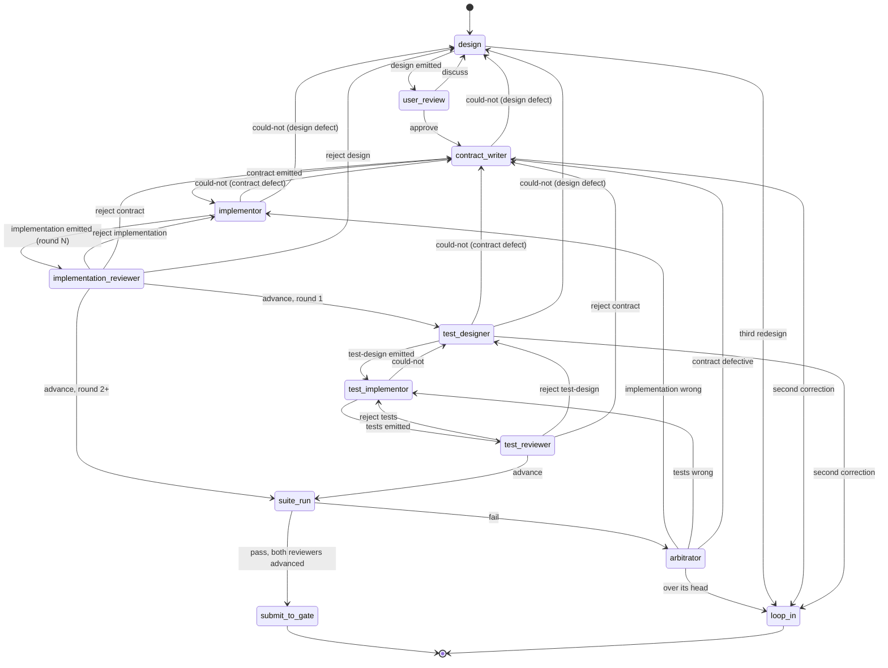

# The design-to-main state machine

The design-to-main workflow takes a design written in English and delivers implementation and tests to the gate that guards `main`. This document specifies the program that runs that workflow: its states, its transitions, what each state receives and emits, how it counts, and where it stops. It is written for the agent that will build it and for the agents that will run inside it, neither of whom will have read the conversations it came from.

Every rule here was ruled by the user in two walks, on 2026-09-03 and 2026-09-04–05. The reasoning and the discarded alternatives are in the minutes of those walks, not here:

- `docs/walk/pr-review-graph-coder-reviewer-originator-loops-minutes.md` — the first walk, which produced the rules the 2026-09-04 draft summarised.
- `docs/walk/state-machine-design-cold-read-triage-minutes.md` — the second walk, which triaged that draft's cold read and produced this rewrite.

Where this document cites a **standing decision**, it means the numbered list under the heading "Standing decisions" in `docs/wiki/queue/nedschorus-ai-native-software-development-objective.md`. That page is in a queue at the time of writing and will move to `docs/wiki/`; the heading and the numbers are stable. Where it cites the **AI-native architecture**, it means `docs/cross-project/nedschorus-ai-native-software-development.md`, by section number. Decision 14 of that document's §19 states the rule this machine ends at: there is one gate to `main`, and it is not this machine.

## 1. What the machine is

**The workflow is the process. The state machine is the program that runs it. The nodes are its states.** The state machine is code, and it holds no judgement. It assembles each node's package, launches the node, reads the exit the node returns, routes on that exit, counts, records to git, and opens a channel to the user when a node's exit says to. Every sentence below that says "the machine does X" is a specification for that code (standing decisions 7 and 13).

The nodes are prompts. Each node instance is a fresh agent that receives one package, does one task, emits one exit, and ends. Nothing crosses a node boundary except files.

Together they are one **code-prompt-code composite**: code that invokes prompts and interprets their exits, with a single input — an approved design — and a single output — a submission to the gate. This is the fleet's existing pattern, not a new one: `scripts/cold-read-grid.py` is code invoking reviewer prompts and interpreting their reports.

**The user is the one participant with memory across the whole run.** Every agent is fresh. That is why the counters in §7 are, at bottom, a cap on how many times the machine spends the user's attention, which is the one input it cannot manufacture.

## 2. Vocabulary

A **node** is a state of the machine: a prompt the machine invokes with a package.

A **package** is everything one node instance receives, assembled by the machine and delivered over one input connection. A package holds files. The design is in every package.

An **exit** is what a node emits: a structured value the machine routes on, and nothing else the machine reads. Every node has exactly one output connection, on which it emits exactly one exit per instance.

A **writer** is a node that produces an artifact: the design, the contract, the implementation, the test-design, the test implementation. A **judge** is a node that produces no artifact: a reviewer, the arbitrator. The user is neither; see §6.

The **design** is the English document the workflow starts from. It is intent. Nothing below it may decide intent.

The **contract** is everything about a component that a caller can observe without reading its code. It is derived from the design by the contract writer. See §5.

An **implementation** is what a writer builds from a design and a contract. It may be a script, a prompt, both, or nothing, and which one is part of the writer's exit; the values are the four **coverage types** the user ruled for tests on 2026-09-03 and confirmed for implementations on 2026-09-05: `script`, `prompt`, `script-and-prompt`, `excluded`, with `excluded` carrying one of four reasons. The ruled text is in `docs/walk/cold-read-terminology-pass-rulings-minutes.md` (MD-skills seat, in the MD-skills worktree) under "Item 1", and will become the write-test-plan skill's text when that skill lands. This document does not restate it.

A **pass** is one successful write by a writer. **Round N** is the state of the machine after the Nth successful implementation write. See §7.

A **nit** is a real defect with no observable consequence. The user's example: `log-in` for `login` in a comment is a nit; the same typo in a CLI flag is a contract defect, because a caller observes it. Position decides. Nits are recorded in a judge's notes and are never routed to a writer as work.

A **cold read** is the fleet's zero-context review instrument, `.claude/skills/cold-read/SKILL.md`: several reviewer agents, each with no context beyond the document, report what each passage made them think it meant and what defects they found. In this machine it is not a node. See §4.

A **loop-in** is the machine opening a channel to the user. See §6.

## 3. States and transitions

### 3.1 The states

| State | Kind | Package (beyond the design) | Emits |
| --- | --- | --- | --- |
| `design` | writer, with the user | the conversation; on a redesign, the loop-in report that caused it | the design, cold-read |
| `user-review` | the user | the design after its cold read | `approve` / `discuss` |
| `contract-writer` | writer | — | the contract, or `could-not` |
| `implementor` | writer | the contract | the implementation and its coverage type, or `could-not` |
| `implementation-reviewer` | judge | the contract; the implementation to be reviewed | notes, verdict, destination |
| `test-designer` | writer | the contract | the test-design, cold-read, or `could-not` |
| `test-implementor` | writer | the contract; the test-design | the tests and their coverage type, or `could-not` |
| `test-reviewer` | judge | the contract; the test-design; the tests | notes, verdict, destination |
| `suite-run` | the machine | the implementation; the tests | pass, or the failing tests |
| `arbitrator` | judge | two packages; the branch history | notes, verdict, destination |
| `submit-to-gate` | terminal | the accepted implementation and tests | a check-in to the gate |
| `loop-in` | terminal for this run | the report | the user's ruling, in conversation |

Two rules about the table:

- **The design is in every package** and is not repeated in the column. A test-designer that lacked the design would have to restate it inside the test-design, and a restatement drifts.
- **Neither writer ever receives the other's output.** The implementor never sees the tests or the test-design; the test-designer and test-implementor never see the implementation. An implementor who can see the tests writes to the tests instead of the contract; a test-implementor who can see the implementation tests what the code does instead of what the contract promises. The two lines meet only in `suite-run`, which is the machine's, and in the arbitrator.

### 3.2 The transitions

**The table is normative and the diagram is checked against it.** If they disagree, the diagram is wrong.

Written out, the ordinary path is: the user and an agent write the design; the design node cold-reads it; the user reads it and approves; the contract writer derives the contract; the implementor builds; the implementation reviewer reviews; the test-designer designs the tests; the test-implementor builds them; the test reviewer reviews; the machine runs the suite; it passes; the machine submits to the gate.

**Tests begin after the first implementation write.** The first write is the proof that the design can be built from; the test budget is not spent before that proof exists. Round 1's implementation review therefore has no suite to run and is the reviewer's own investigation only. Sequencing changes *when* the test line runs, not *what* it sees: its packages never contain the implementation.

**Fan-out is the machine's, not a node's.** Where one artifact reaches several consumers — the design reaches everyone — the writer emitted it once, and the machine delivered it several times. A node has one output connection.

### 3.3 The two terminal states

**`submit-to-gate`.** The machine hands the accepted implementation and tests to the gate. What happens after is the gate's, per standing decision 14: the git-gatekeeper (`docs/cross-project/git-gatekeeper-design.md`) is the permanent path, and the interim pull-request lane in `CLAUDE.md` holds until it is active. This machine is not the gate and must not become one. The gatekeeper, as built, does not merge a branch: it writes the submitted content as one candidate commit and pushes it fast-forward to `main`. Main therefore receives one commit per component regardless of how many passes the topic branch holds.

**`loop-in`.** The machine opens a channel to the user, and this run ends in conversation. It is reached when a node's exit says so (§6), and it is the only way anything in this machine reaches the user other than `user-review`.

## 4. Writers

A writer receives its package and does its task. It does not review its inputs as a separate step, and there is no validator between it and its inputs. Instead:

**A writer validates by attempting.** Its prompt says: if your instructions are missing information you need, or you have questions that must be answered before you can build, ask them first and stop. A writer that stops this way emits `could-not`, naming what was missing and which input it was missing from. That is the whole of validation: the earlier draft's separate validator node was folded into the writer on 2026-09-05 because a writer that asks before building has burned nothing, and a separate node doubled the cost of reading the same package without a test case showing it caught anything the writer would not.

What survives from the validator is its checklist. Each writer's prompt carries the enumerated checks for its input — the contract's are in §5.3; the design's and the test-design's are to be enumerated in the same form as part of build step 1 — and a `could-not` exit names which check failed. When a later node fails on an input that passed its checks, the named checks show which one was missing. That is how the lists grow.

**A writer that emits an artifact says nothing about its inputs.** Not a finding, not a tag. Anything it worked around and still finished is a nit in its own notes.

**A `could-not` exit is not a pass.** It increments no build counter (§7). What bounds it is the counter of whatever it was charged to: a `could-not` against the design is a redesign; against the contract, a correction.

**Every writer of prose cold-reads its own output before emitting it.** The design, the contract, the test-design, and every loop-in report are prose. The cold read runs inside the writing node — the writer invokes the instrument, receives the report, and revises — iterated once or twice, and the node emits when the writer is satisfied. The report returns to the agent that wrote the draft, never to a fresh one, because only the writer knows what it was trying to say; a fresh agent handed a cold-read report can only smooth what reads badly, which is the prose loop with extra steps. Measured (cold-read-research seat, 2026-09-03 campaign, `cold-read-records/2026-09-03-cold-read-tier-roster-campaign/REPORT.md`, machine-local): a fresh author given the reports resolved 14 to 17 of 50 known defects; the writer's own pass resolved 42.7. So the machine does not own the cold read and it is not a state. Inside a node, the writer persists across its own cold-read iterations; the no-persistence rule of §1 bounds nodes, not the iterations inside one.

**Implementations and tests are not cold-read.** They are reviewed and run.

## 5. The contract

### 5.1 What it is

Everything about a component a caller can observe without reading its code. A caller is anything that invokes the component or reads what it leaves: the agent or script that runs it, its tests, the next command in a chain. Anything you would have to read the source to know is implementation, not contract.

The contract is derived from the design by the contract writer, before the implementor or the test-designer runs. It is what lets the two lines work without seeing each other: both build to the contract. It is pipeline prose — consumed by nodes and checked mechanically — and the user is not a routine gate on it (§6).

### 5.2 Form

Five numbered groups. Three are Design by Contract's preconditions, postconditions and invariants; postconditions are split in two because what a caller receives and what is different afterwards are checked by different assertions.

| Group | Holds |
| --- | --- |
| `caller-supplies` | A precondition on what the caller passes in: arguments, options, environment. One clause each, with what makes it invalid. |
| `world-requires` | A precondition on what must already be true that the component does not create. Each is checked with its refusal, or declared unchecked. |
| `caller-receives` | A postcondition on what the caller gets back, per case, and how success and failure are observed. |
| `world-changes` | A postcondition on what is different after a successful run. |
| `world-unchanged` | The invariant: what is the same after a run, and which runs it covers. |

Rules the contract writer follows, and the checks in §5.3 enforce:

1. One clause, one sentence, one observable.
2. Every clause names how a test sees it: what the test runs and what it compares.
3. Every `caller-receives` clause says how success and failure are observed. For a script that is the exit status — 0 success, nonzero failure — and scripts must state it. For a function it is the return value; for a prompt, the verdict in its report. The rule is universal; the exit status is the script's case of it.
4. A refusal is a `world-requires` clause and a `caller-receives` clause, numbered together.
5. A clause that is observable but that no test can reach is still a contract clause, and it says so: it names how a reviewer demonstrates it by hand. Observability governs membership; testability governs the clause's evidence.

### 5.3 The contract's checks

Every writer carries the checks for its input (§4). The contract's are enumerated here because the contract is the artifact both lines build from.

**Program-checkable** — a script confirms these before any agent reads the contract; a failure is a mechanical fix and is not a pass:

- Every clause is numbered and in one of the five groups.
- Every clause is one sentence.
- Every refusal has both a `world-requires` clause and a `caller-receives` clause.
- Every `caller-receives` clause names how success and failure are observed.
- Every clause names a test or a by-hand demonstration.

**Agent-checkable** — the implementor and the test-designer check these before building, and emit `could-not` against the contract on a failure:

- Each clause states exactly one observable.
- No clause mentions internals.
- No two clauses contradict.
- Every `caller-supplies` clause has a stated invalid case.
- Every `world-unchanged` clause says which runs it covers.
- Every failure named in `caller-receives` is produced by some stated condition.
- The test a clause names would fail if the clause were violated — which a program cannot tell.

### 5.4 Where the contract sits in a dispute

Where the contract speaks, it governs. Where it is silent or challenged, the design governs. Nothing below the design decides intent. See §8.

## 6. Judges, and the user

### 6.1 What every judge emits

Every judge — implementation reviewer, test reviewer, arbitrator — emits the same three things and nothing else: **notes**, a **verdict**, and a **destination**. The machine routes on the destination. The verdict and the notes are evidence for the node at the destination, which is always a fresh writer or the user. **A judge never fixes anything.** It never edits what it judged, the contract, or the design.

Notes are one file. Each substantial entry is a concern with a failure scenario and may carry a proposed fix. A nit is recorded and routed nowhere.

The verdicts are `advance` — no substantial issue, nits or none — or a rejection naming which artifact is wrong: the artifact under review, or a prose parent of it. Rejecting a prose parent carries a failure scenario; it cannot carry a failing test, because the suite descends from that parent and is no oracle for a defect in it.

**Prose findings are not reported.** A claim stated too strongly, a term used before it is defined, wording a reader dislikes: none of it enters the loop. Wording that leaves the promise itself open, so two readings give two behaviours, is a contract finding. The reason is the fleet's own measurement, recorded in `CLAUDE.md`'s review rule: prose findings between cooperative agents produce fix rounds whose fixes are the next round's findings.

### 6.2 The implementation reviewer

Receives the design, the contract for the scope under review, and the implementation to be reviewed — the branch, or the files, that the writer emitted. It writes and runs its own tests to its own completion bar and keeps them with its notes as evidence. **It does not receive the suite or the suite's result.** A reviewer handed the project's tests tries less hard to write its own and inherits the project's sense of what matters; a reviewer handed a green score approves on the score. Its tests do not enter the suite; how they might be reused is not designed here.

### 6.3 The test reviewer

Receives the design, the contract, the test-design, and the tests. Everything said of the implementation reviewer applies, with one difference: it has a second prose parent above it, so it may reject the test-design as well as the contract. It never receives the implementation.

### 6.4 The arbitrator

The arbitrator is the node that receives two packages. It is routed to when the suite fails — the implementation and the tests disagree — and its package also carries the branch history (§9), which makes it the one node with the overview of the whole run. Whether there is a conflict is what it determines, not what triggers it.

| It finds | Verdict | Destination |
| --- | --- | --- |
| The two agree after all | `advance` | `suite-run` |
| They disagree, and the contract speaks to the point | the contradicting artifact is wrong | a fresh `implementor` or `test-implementor` |
| They disagree, the contract is silent or challenged, and the design settles it | the contract is defective | a fresh `contract-writer`, as a correction (§7) |
| They disagree, and neither the contract nor the design settles it | over its head | `loop-in` |
| A test gives different results on the same inputs | the test is unreliable | a fresh `test-implementor` |

**The arbitrator talks to the user.** It reaches out when it is over its head, and at its own discretion when the run looks wrong to it; the user may invoke it at any point after the start for a status report or a conversation, and it answers from the branch history. The machine opens the channel — a tmux session on the user's Mac, the fleet's existing seat mechanism — and the arbitrator does the talking. The user may also let it run without intervening.

### 6.5 The user

The user is a node in exactly one routine path and a destination in one exceptional one.

**Routine: `user-review`.** The user reads the design after its cold read and before it fans out, and approves or discusses. This is the instance in this machine of standing decision 19 — the user reviews all final prose, after its cold read, before it lands — and the same rule covers every landing document outside this machine: wiki pages, `CLAUDE.md`, skills. Not the contract, which is pipeline prose; not implementations or tests; not traffic between nodes. What the user does with the document before approving is the user's business and the machine does not branch on it.

**Exceptional: `loop-in`.** Reached by any of:

- a third redesign — the design has failed downstream three times;
- a second correction to the contract — the user is not a gate on contracts, but a contract that has failed twice is the suspect and the user needs to see it;
- a second correction to the test-design, for the same reason;
- the arbitrator's over-its-head exit;
- the arbitrator's own discretion.

Every loop-in delivers one **report**, of one type, with a focus field: `design`, `contract`, `test-design`, or `unknown`. The node whose exit triggered the loop-in writes it — a judge from its notes, a writer from its `could-not` — and cold-reads it inside its own node before emitting, because the user is the reader with the least context. The report carries the evidence, the branch history's summary, and the user's prior rulings on this component, so a second report never asks the user to decide something already decided.

What the report must contain beyond that is not yet specified. The user's placeholder, 2026-09-04: prepare the information the user needs, then cold-read it. Anything the user has to read is cold-read first.

A loop-in arrives as a conversation, not a file: the design began in one, and a design that has failed downstream resumes in one, with a fresh agent, the report, and the accumulated rulings.

## 7. Counting

The machine holds three counters per component. It counts what is expensive.

| Counter | Increments when | Ceiling | At the ceiling |
| --- | --- | --- | --- |
| **redesigns** | the design is re-emitted after a `could-not` or a rejection against it | 3 | `loop-in`, focus `design` |
| **builds** (per redesign) | an implementation write **finishes successfully**; test writes are counted alike, and begin after build 1 | 3 per redesign, 9 total | the third unclosed build goes to the arbitrator, not to the user |
| **corrections** | the contract or the test-design is re-emitted after a rejection against it | 2 each | `loop-in`, focus `contract` or `test-design` |

Rules:

- **Only a successful write increments `builds`.** A `could-not` exit is charged to whatever it was against: the design (a redesign) or the contract (a correction). It never burns the build budget, because no build happened.
- **A prose correction is charged to `corrections` only.** A cheap prose ping-pong must never burn the expensive budget; the earlier draft charged contract rejections as passes and the user found the loop that produced.
- **A suite run is part of the build it follows.** Running the suite is mechanical and the machine does it; it is not a pass and not a round.
- **The arbitrator resets nothing.** A ruling that sends work back to a writer is that writer's next pass or correction.
- **Nine builds is a ceiling, not a target.** Every earlier exit makes it unlikely. Lowering it is a one-number change and the user's call.

## 8. Disputes and where they go

The design is intent, and nothing below it decides intent. Every dispute in the machine resolves by the same descent:

1. **The contract speaks.** The artifact contradicting it is wrong and goes back to its writer. Judges settle this without the design.
2. **The contract is silent or challenged, and the design speaks.** The contract is defective. A fresh contract writer corrects it from the judge's notes. That is a correction (§7).
3. **Neither speaks.** No node below the design may decide, so it goes to the user. From a reviewer that is a rejection against the design; from the arbitrator it is over-its-head.

The design itself changes on exactly two triggers, both failures: something below it could not be built from it, or an implementation cannot be built that passes the tests. It is never re-read looking for drift. A redesign is a new conversation between the user and a fresh agent, carrying the loop-in report; a designer holding context it never wrote down is a defect signal, not a resource.

## 9. Git is the record

Every pass writes to the same file names on the component's topic branch and commits, with the pass number, the counter values, and the emitting node in the commit message. The branch history is therefore the complete record of the run: every version of the design, the contract, the implementation, the test-design and the tests, and every judge's notes, in order. It replaces the earlier draft's numbered files.

- **The arbitrator's package is the branch history.** It reads the run with `git log` and `git show`; that is what gives it the overview (§6.4).
- **A loop-in report cites commits**, so the user can open any version.
- **Topic branches carrying pass history are pushed to origin and retained after landing.** The gatekeeper writes one commit to `main` per component (§3.3), so the pass history exists only on the topic branch, and deleting the branch would delete the record.
- **Main is never cluttered** by this, because nothing here writes to main; the gate does.

The `supersedes` and dispositions machinery of the AI-native architecture §20 is not used inside a run; git is. What the user has ruled on a component is carried as a **settled set** — a file on the branch, appended by `loop-in`, delivered in every subsequent package and to the cold-read cells at the second read — so a fresh agent cannot reopen what the user closed. Measured on this fleet (MD-skills seat, five rounds on one prompt; cold-read-research, cells that never saw the rulings ran at 0.13–0.32 precision against 0.87–1.00 on designs): rulings the cells cannot see are rediscovered as findings.

## 10. Departures from the AI-native architecture

The architecture's §5, §6 and §7 are notes sections and not prescriptive, so a departure is permitted and this is the saying-why. Where a departure touches a standing decision, that decision is being re-presented to the user by the merge-lane seat at the time of writing, and this document will be repointed when it is ruled.

**One exit, not four dimensions** (§5, "Do not force all meaning into one state field"). This machine's judges emit a destination the machine routes on and put the verdict and everything else in the notes as evidence. Two representations of one fact drift; the second is not made into state.

**No separate validator, and no examination step** (§5 duties 1 and 3; and two standing decisions whose current wording has every node examine its inputs and keeps a separate validator — the user reversed both on 2026-09-05 and they are being re-presented for rewording, so this document cites them by that description until the new numbers are stable). A writer validates by attempting and stops with `could-not` (§4). The reason is behavioural and the user reached it twice independently: a node primed to inspect its inputs finds something, leans on it, and tries less hard at the work it was given.

**Tests after the first build, not in parallel** (§6, "Code and test planning"). The first successful build is the proof the design is buildable; the test budget is not spent before it (§3.2).

**Git, not a workflow store, as the run's record** (§20). A run's state is small enough to be a branch, and the arbitrator and the user both already know how to read one.

## 11. Not decided here

- **Provenance and attestation fields** on packages and exits. Build step 1 of the architecture (§18, "Adopt the vocabulary, provenance fields, and result schema") owns them; this design lands into that step's GitHub issue as its pair when the issue is filed, and does not pre-empt it.
- **The loop-in report's required content**, beyond the placeholder in §6.5.
- **How reviewer tests might be reused.** They are evidence with the notes; nothing more is designed.
- **The design's and the test-design's enumerated checks**, in the form of §5.3. Build step 1.
- **Which reviewers compose a cold read.** The cold-read-research seat's campaign is settling it.
