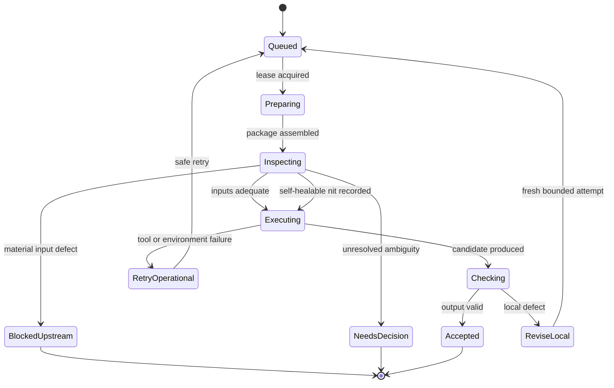
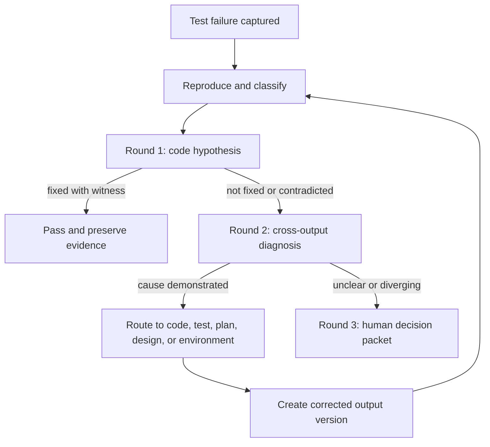
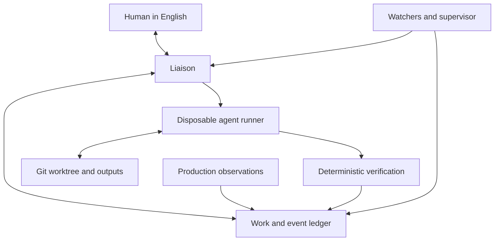

# Notes behind the objective: AI-native software development at Nedschorus

**What this file is, in the user's words: instructional or explanatory, possible implementation details, not prescriptive, not vetted, and not maintained to match reality.** It is the detail behind the project's objective, which is [the objective page](../wiki/queue/nedschorus-ai-native-software-development-objective.md). The objective states each subject at a level a reader can follow end to end; this file carries the mechanism behind the same subjects, in the same order. A subject with no detail yet simply has no section here.

**How to use it.** Read the objective for what the project is trying to be, and read this for one way a piece of it might work. A design that departs from a section here is not blocked and should say why it departs. A design that contradicts the objective is blocked, because the objective's standing decisions are ruled.

**If a section here seems wrong, stale, or at odds with the objective**, that is worth reporting rather than working around. An agent the user is directing raises it in its own session. An agent he is not directing reaches him through the liaison, or by filing a GitHub issue labelled `draft`, which is his review queue in the issue world.

**Provenance.** Split on 2026-09-04 from the architecture document at docs/cross-project/nedschorus-ai-native-software-development.md, which this same change deletes; it is readable in git history at the commit before its deletion. The split was made under the rulings of the walk recorded at `docs/walk/2026-09-03-ai-native-architecture-overview-decisions-minutes.md`. The text below is as it was written, except where those rulings renamed something.

---

## 2. What is established and what is distinctive

Most individual techniques are well known. The value is in how they are combined and where authority is placed. “Distinctive” below describes the proposed synthesis; it is not a claim of legal or research novelty.

| Idea | Status in the broader field | Role here |
| --- | --- | --- |
| Finite-state workflows and durable jobs | Well established | Make progress explicit, restartable, and inspectable. |
| Git branches, worktrees, reviews, and required checks | Well established | Provide versioning, isolation, reconciliation, and promotion. |
| Human-in-the-loop escalation | Well established | Preserve human authority over intent, risk, and ambiguity. |
| Independent review and N-version checking | Well established | Reduce correlated creator/reviewer errors. |
| Event logs, heartbeats, leases, and supervisors | Well established | Recover after process, agent, or computer failure. |
| Observability and incident triage | Well established | Convert production behavior into evidence and work. |
| A fresh agent for each bounded transformation | Increasingly common | Prevent hidden conversational history from becoming required state. |
| Every producing node must challenge its inputs | A strong review practice, less often made a workflow invariant | Exploits each node’s unique point of view before defects propagate. |
| Create/review alternation for English and code outputs alike | A distinctive application of familiar verification ideas | Treats designs and test plans as executable governance, not informal notes. |
| Broad diagnosis with narrow mutation authority | A distinctive safety boundary | Lets an agent search for root cause anywhere while requiring human approval to redirect other nodes. |
| The persistent state machine as a replaceable process | A useful synthesis | Preserves one long human conversation without requiring one immortal model session. |
| A code-prompt-code system | Explicitly emerging in Nedschorus | Uses deterministic code for repeatable mechanics and prompts for judgments that cannot be enumerated safely. |

The most important design choice is not the sequence of boxes. It is the refusal to rely on hidden state between them.

## 3. What the research changes

The literature and open-source systems do not point toward a larger society of autonomous agents. They point toward a small, explicit workflow with better interfaces, mechanical policy delivery, durable evidence, and measured human intervention.

| Evidence | Finding | Change to this design |
| --- | --- | --- |
| [Agentless](https://arxiv.org/abs/2407.01489) | A fixed localization → repair → validation pipeline was competitive with much more complicated autonomous agents. | The controller chooses the next node. An agent recommends transitions but does not invent the workflow while executing. |
| [SWE-agent](https://arxiv.org/abs/2405.15793) | A purpose-built agent-computer interface materially improved repository navigation, editing, and feedback. | Treat the runner interface as a first-class component: small commands, concise observations, explicit edit results, and immediate error feedback. |
| [SWE-EVO](https://arxiv.org/html/2512.18470v6) and [SWE-Marathon](https://arxiv.org/html/2606.07682v1) | Current agents perform much worse on release-sized and very long-horizon tasks than on isolated issue repair. | Keep executions short and restartable. Evaluate integration across nodes instead of asking one agent to preserve a huge plan in working memory. |
| [Human oversight of agentic systems in practice](https://arxiv.org/html/2606.05391v1) | Experienced developers use four forms of oversight: prior control, co-planning, live monitoring, and post-hoc review. They use efficient heuristics rather than exhaustive supervision. | The system must support all four forms while reserving routine work for agents. Natural-language oversight is a workflow, not a final approval button. |
| [Overseeing Agents Without Constant Oversight](https://arxiv.org/html/2602.16844v1) | Better-presented process information helped people find errors faster but did not meaningfully improve final accuracy and could increase confidence. | Decision packets must expose testable claims, assumptions, counterevidence, and source links. A persuasive summary is not itself evidence. |
| [Evaluating Large Language Models for Code Review](https://arxiv.org/html/2505.20206v1) | Review quality improved when the problem description was supplied, but the evaluated models still made incorrect approvals and introduced regressions. | Reviewers receive the request, design, diff, tests, and evidence. No LLM review alone authorizes a risky change; deterministic checks and risk-based escalation remain independent. |
| [RepoComplianceBench](https://arxiv.org/html/2607.26819v1) | Coding agents rarely discovered repository rules on their own, and refusal/handoff rules were especially resistant to prompting. | Governing policy is assembled into every input package mechanically. The controller, sandbox, and gatekeeper enforce restraint; the prompt is not the only control. |
| [Prompt-injection studies of coding agents](https://arxiv.org/html/2509.22040v2) | Agents can mistake repository or external content for authoritative instructions. A reported [Aider architect/editor issue](https://github.com/aider-ai/aider/issues/5058) illustrates the danger at a model-to-model handoff. | Every input has an authority class. Repository content, issue text, tool output, and external pages are evidence, not instructions, unless the policy manifest explicitly promotes them. |
| [Build Systems à la Carte](https://www.microsoft.com/en-us/research/wp-content/uploads/2018/03/build-systems-final.pdf) | Build systems can be understood as tasks, dependencies, persistent information, and recomputation strategies. | Treat designs, code, plans, tests, and attestations as a dependency graph with targeted invalidation, not as one mutable conversation. |
| [W3C PROV](https://www.w3.org/TR/prov-dm/) and [in-toto attestations](https://github.com/in-toto/attestation) | Provenance can model entities produced by activities associated with human or software agents; attestations bind claims to output digests. | Borrow the simple entity/activity/agent model internally. Use release attestations when supply-chain integrity requires them; do not make cryptographic signing a prerequisite for the first workflow. |

These findings support five immediate design rules:

1. **The graph is code.** Agents operate nodes; they do not make unbounded plans about what the system should do next.
2. **Instructions are delivered, not discovered.** The runner computes the applicable policy set and records its hashes.
3. **Restraint is enforced outside the model.** Permission limits, approval points, retry ceilings, and promotion rules live in deterministic control code.
4. **Oversight is evidence-centered.** The human sees intent, assumptions, changes, witnesses, and uncertainty together.
5. **Prompts are production outputs.** Node definitions are versioned, tested against scenarios, compared before and after changes, and promoted through the same process as code.

## 4. Vocabulary

| Term | Meaning |
| --- | --- |
| **Work item** | One bounded requested change, defect, investigation, or maintenance task. |
| **Output** | A durable input or output: request, design, plan, code, tests, review, evidence, or decision. |
| **Node definition** | The versioned instructions, permissions, input contract, output contract, and transition rules for one operation. |
| **Node execution** | One disposable attempt to apply a node definition to a specific input package. |
| **Input package** | The task, pinned repository revision, governing output versions, instructions, constraints, and relevant evidence. |
| **Policy manifest** | The ordered, hashed list of authoritative instructions that the runner mechanically loads for an execution. |
| **Attestation** | A review result tied to exact output versions and supported by findings or checks. |
| **State machine** | The durable program that routes work between nodes. It is code and holds no judgement. |
| **Liaison** | The agent that carries questions and answers between the system and the human. A go-between, never a doer. |
| **Nit** | A local, unambiguous, behavior-preserving defect that can be fixed and verified within the node’s authority. |
| **Material defect** | A problem that can affect behavior, intent, interfaces, safety, acceptance criteria, or downstream validity. |
| **Decision packet** | An English explanation of evidence, diagnosis, alternatives, recommendation, confidence, and the exact human decision needed. |

## 5. The universal node contract

Every node may have a different purpose, but all should obey the same outer contract.

### Inputs

A node receives:

- A precise task and success conditions
- A pinned repository revision or immutable output set
- Exact governing output versions
- A policy manifest containing the applicable repository instructions
- The authority class of every input source
- Allowed tools and write scope
- Time, retry, and resource limits
- The result schema it must return

“Has access to the code” should normally mean access to the repository at a pinned revision, not a giant prompt containing selected source files. The node may search the repository, but the package must identify which outputs govern its decisions.

### Duties

The node must:

1. Verify that the package is complete and internally consistent.
2. Acknowledge the policy manifest and treat all other text as data rather than instruction.
3. Inspect the inputs from its specialist point of view.
4. Stop or escalate when a material upstream defect makes the intended output unreliable.
5. Perform only the bounded task it was given.
6. Check its own output mechanically where possible.
7. Return a structured result plus a plain-English summary.

### Output

A successful producing node returns a candidate output, provenance, evidence, and a recommended transition. A non-producing node returns evidence and a route. No important result should exist only in an agent’s final chat message.

A node’s internal lifecycle can remain small:

`Accepted` means accepted by the producing node’s own checks. An independent review may still reject the output.

### Do not force all meaning into one state field

“Pass,” “fail,” “nit,” and “report to the human” are not four mutually exclusive states. They answer different questions. Store at least four orthogonal dimensions:

| Dimension | Suggested values |
| --- | --- |
| **Verdict** | `pass`, `nit`, `fail`, `inconclusive` |
| **Suspected location** | `current_node`, `upstream`, `integration`, `environment`, `external_boundary`, `unknown` |
| **Disposition** | `advance`, `self_heal`, `revise_local`, `backtrack`, `ask_human`, `retry_operational`, `stop` |
| **Output eligibility** | `promotable`, `diagnostic_only`, `none` |

The outer result may expose convenient named outcomes such as:

- `PASS`
- `PASS_SELF_HEALED`
- `REVISE_LOCAL`
- `BLOCKED_UPSTREAM`
- `NEEDS_DECISION`
- `RETRY_OPERATIONAL`
- `FAILED_SYSTEM`

This follows a useful pattern already present in the Nedschorus main-gatekeeper: return a named outcome together with facts, a human summary, and a concrete `next_action`.

### When a nit may be repaired silently

A nit may be fixed without asking the human only when all of these are true:

- The correction is objective and unambiguous.
- It stays inside the node’s granted authority.
- It does not change product behavior or accepted intent.
- It cannot invalidate a sibling output without detection.
- A deterministic check or focused review can verify the repair.
- The repair is recorded.

Examples include formatting, an obvious typo that does not alter meaning, a mechanical import ordering fix, or generated-file refresh. An ambiguous requirement, a changed public interface, a weakened assertion, a new dependency, or a choice among reasonable designs is not a nit.

If a small upstream defect has one unambiguous interpretation, the node may proceed using that interpretation and record a cleanup item. If the interpretation could affect behavior, it must stop. Draft work created before discovering the defect may be preserved as `diagnostic_only`, but it must not be promoted or used as an accepted downstream input.

## 6. The pipeline, step by step

Every forward step contributes a different kind of scrutiny. The following table is the compact specification; the sections after it explain the less obvious parts.

| Node | Governing inputs | Unique point of view | Normal output | Important non-success route |
| --- | --- | --- | --- | --- |
| Define work | Human request, repository, operating constraints | Intent, scope, acceptance boundary | Work definition | Ask human when intent is underspecified or contradictory. |
| Create design | Accepted work definition, code, relevant contracts | Architecture, interfaces, invariants, migration, operations | Design | Report missing decisions or infeasible constraints. |
| Review design | Work definition, candidate design, code | Coherence, completeness, compatibility, unnecessary complexity | Design attestation/findings | Return local findings or recommend revisiting work definition. |
| Write implementation | Accepted design, code, local instructions | Concrete feasibility and implementation consequences | Code change and evidence | Stop promotion if the design has holes or contradictions. |
| Review implementation | Design, change, repository, checks | Conformance, correctness, maintainability, side effects | Code attestation/findings | Revise code or request bounded root-cause analysis. |
| Write test plan | Accepted design, risk model, current tests | Testability, oracles, boundaries, missing behavior | Test plan | Stop if behavior cannot be observed or acceptance criteria are unclear. |
| Review test plan | Design, plan, repository | Coverage, independence, consequence ranking, feasibility | Plan attestation/findings | Revise plan or route design defect upstream. |
| Write test implementation | Accepted plan and design, repository | Executability of plan, fixture realism, observation points | Test code and evidence | Stop if plan is impossible, circular, or defective. |
| Review test implementation | Plan, design, tests, limited implementation context | Whether tests prove intended behavior rather than mirror code | Test attestation/findings | Revise tests or route to plan/design. |
| Integrate | Accepted code/tests, dependency graph, target branch | Cross-item textual and semantic compatibility | Integrated candidate | Reconcile conflicts; ask human about intent or priority. |
| Build and test | Integrated revision, deterministic commands | Observed agreement among outputs and environment | Evidence and release candidate | Enter bounded failure diagnosis. |
| Deploy | Accepted release candidate, environment contract | Release safety, rollout, rollback, version identity | Deployment record | Roll back, retry operationally, or open incident. |
| Production triage | Complaint/telemetry, deployed version, outputs, environment | Real behavior at scale and external boundaries | Diagnosis and routed work item | Ask human when evidence or ownership is unclear. |

Each node uses the universal lifecycle, but its `Executing` phase has a small, purpose-specific sequence. These are progress markers, not additional autonomous loops:

| Node | Purpose-specific internal states |
| --- | --- |
| Define work | `capturing → scoping → checking_acceptance → defined` or `waiting_human` |
| Create design | `discovering → modeling → specifying_interfaces → checking_design → candidate` |
| Review design | `orienting → tracing_requirements → attacking_assumptions → verdict` |
| Write implementation | `locating_change → implementing → checking_locally → candidate` |
| Review implementation | `reading_diff → tracing_to_design → checking_risks → verdict` |
| Write test plan | `ranking_consequences → defining_oracles → selecting_cases → checking_plan → candidate` |
| Review test plan | `tracing_to_design → challenging_oracles → checking_coverage → verdict` |
| Write test implementation | `preparing_fixture → implementing_cases → proving_reach → checking_tests → candidate` |
| Review test implementation | `reading_tests → challenging_independence → checking_reach → verdict` |
| Integrate | `updating_base → applying_changes → resolving_text → checking_semantics → integrated` or `conflict` |
| Build and test | `preparing_environment → running → collecting_evidence → passed`, `failed`, or `infrastructure_error` |
| Diagnose | `capturing → reproducing → hypothesizing → discriminating → routing` or `inconclusive` |
| Deploy | `staging → deploying → verifying_health → healthy`, `rolled_back`, or `failed` |
| Production triage | `collecting → correlating → classifying → recommending_route` or `waiting_evidence` |

These names should remain descriptive rather than aspirational. A node records a transition only after the corresponding fact is durable. For example, `checking_tests` means the checks actually ran and their evidence was saved; it does not mean the agent intended to run them.

### Define work

The initial English request becomes a durable work definition. It should capture purpose, observable success, exclusions, risk, dependencies, and unresolved questions. This is the first point where the system protects the human from accidental ambiguity: an agent may draft structure and recommend interpretations, but it must ask before making a product decision that changes meaning.

This output is not necessarily a long specification. For a small change it may be a few precise paragraphs. A bounded output must be sufficient, not verbose.

### Design and design review

The design should state the behavioral contract and enough implementation structure for code and tests to be derived independently. It should cover interfaces, invariants, important failure modes, migration or compatibility constraints, and operational evidence. It should also state what is deliberately left to local implementation judgment.

The reviewer cold-reads the design against the work definition and repository. It should distinguish a defect in the design, a requirement question the design cannot answer, an implementation detail that need not be designed centrally, and a harmless editorial nit.

An accepted design becomes the common governing parent of the code branch and test-plan branch.

### Code and test planning

The coder and test planner can usually work in parallel from the accepted design. Their separation matters. The test planner should derive expected behavior, risks, oracles, and red conditions without copying implementation choices. The coder should not rewrite the design silently to make implementation easier.

The coder may be the first participant to discover that an interface is impossible, an invariant is contradictory, or a migration assumption is false. That is useful output. The correct response to a material design defect is not “best effort code”; it is a precise block with evidence and a recommended design correction. Any partial code may be retained for diagnosis, not promoted.

Likewise, the test planner may reveal that the design has no observable success condition or omits a consequential boundary case. Its responsibility is to surface the defect before tests institutionalize an invented answer.

### Test writing and review

The test writer translates the accepted plan into executable evidence. It should prove that the test reaches the behavior it claims to cover, that the oracle is independent enough to catch an implementation mistake, and that fixtures represent the intended environment.

The test reviewer checks for false confidence: tautological assertions, fixtures that reproduce the implementation’s mistaken assumptions, tests that never reach the changed path, and overfitting to one implementation. Some white-box context is legitimate, but the governing behavior should remain visible.

### Integration and reconciliation

The default is optimistic parallelism:

1. Give each work item a branch or worktree based on a pinned revision.
2. Let independent nodes proceed until a real dependency or conflict appears.
3. Attempt a normal Git reapply, merge, or rebase.
4. Run deterministic integration checks.
5. Reconcile semantic disagreement among designs, code, and tests.
6. Ask the human only when intent, precedence, risk, or sequencing must be chosen.

A clean textual merge is not proof of semantic compatibility. Two changes in different files may still implement incompatible assumptions. Tests and reconciliation are part of the integration boundary.

## 7. Review and root-cause routing

A reviewer’s primary job is to evaluate the output at its node. It should not blame the current node merely because that is what it was handed.

Review independence is deliberate:

- The reviewer receives the complete problem description and governing documents, but not the creator’s private conversation or conclusions about disputed points.
- A review is tied to exact output hashes. Changing the output invalidates the attestation.
- Deterministic evidence is checked independently of the reviewer’s prose.
- A reviewer explains each finding in terms of an observable consequence, violated requirement, or unhandled risk.
- A reviewer does not edit the output it is judging. A fresh fixer receives accepted findings.

Review depth is proportional to consequence, not diff size:

| Risk | Minimum evidence |
| --- | --- |
| Low, local, reversible | One fresh review, focused deterministic checks, and ordinary integration checks |
| Material behavior or shared interface | One fresh review, full relevant tests, regression witness, and explicit design traceability |
| Security, privacy, data loss, irreversible migration, or deployment control | Independent second review using a different model or review strategy, adversarial tests, rollback evidence, and human approval |

Two agents agreeing is evidence, not truth. Different models or prompts are useful when their failure modes are genuinely different; duplicating the same context and rubric may only repeat a correlated error.

When evidence suggests the problem lies elsewhere, the reviewer may perform a bounded causal search. Nedschorus issue [#22, review-change](https://github.com/nedschorus/nedschorus/issues/22), already proposes looking for causes beyond the immediate finding. The safe division of authority is:

- A reviewer may inspect relevant neighboring outputs and name an actionable suspected cause.
- A root-cause node may inspect broadly across the output graph, repository, execution evidence, and external contracts.
- Neither may silently modify or invalidate outputs outside its assigned node.
- The state machine routes the recommendation; cross-node ambiguity goes to the human.

The root-cause report should include:

- The observed failure and exact evidence
- The immediate mechanism
- The violated expectation and the output that defines it
- A causal chain, including contributing causes when appropriate
- Alternative explanations considered
- Evidence supporting and contradicting each live hypothesis
- The earliest demonstrably unsupported or incorrect assumption
- A recommended destination in the graph
- Confidence and the exact human decision needed, if any

The system must allow the answer “the failure is at the project boundary.” That could mean an external API, production configuration, hardware behavior, data contract, organizational rule, or user expectation. “External” is not a complete diagnosis; the report should identify the boundary assumption that failed and recommend whether the project should adapt, collect evidence, or escalate to an outside owner.

## 8. Test-failure policy

Test failures are where a naive system tends to loop. The repair policy should be diagnostic, bounded, and externally counted.

The recommended default is:

1. **Capture and reproduce.** Preserve the complete failure, rerun enough to distinguish deterministic from intermittent behavior, and prove the relevant path was reached.
2. **Round 1: code hypothesis.** Code is often the likely cause, so permit one evidence-based implementation correction. Verify with a regression witness: green with the fix, red when the fix is removed, green when restored.
3. **Round 2: cross-output diagnosis.** Compare code, tests, test plan, design, environment, and instrumentation. State a causal hypothesis and seek discriminating evidence before another edit.
4. **Round 3: human.** If the cause remains ambiguous, attempts are diverging, or a choice of intent is required, stop and give the human a recommendation.

These are diagnostic rounds, not an entitlement to make three speculative edits. A clear design defect found in the first round should route immediately. Rephrasing the same failed fix to a new agent does not count as a distinct strategy.

Nedschorus currently has a policy inconsistency to resolve. The queued [diagnose-failure procedure](https://github.com/nedschorus/nedschorus/blob/main/docs/issues/queue/21-diagnose-failure-test-procedure.md) calls for root-cause analysis by round two and a breaker at round three, which fits the policy above. The queued [agent-loop rules draft](https://github.com/nedschorus/nedschorus/blob/main/docs/wiki/queue/agent-loop-rules-draft.md) permits more fresh fixer attempts, including a widened team. Before implementation, those documents should be reconciled around one externally enforced counter. The three-stage policy is the simpler and safer default.

## 9. Production evidence is part of the design

Deployment is not the end of the graph. It changes the available point of view. Real users, data, dependencies, load, timing, and configuration expose conditions that pre-production tests may not.

Each design and test plan should include an **observability contract** proportional to risk:

- What successful behavior can be observed
- Which failures or invariant violations must produce evidence
- Which request, work, release, user, or transaction identifiers correlate events
- Which boundary calls need timing, status, and failure classification
- Which metrics, traces, logs, audit events, or user-visible error codes are appropriate
- How sensitive data is redacted and how long evidence is retained
- Which alerts exist and what action they recommend
- How an operator can identify the deployed version and roll it back

This does not mean every module should log everything. Indiscriminate logging creates noise, cost, and privacy risk. The design should identify the evidence needed to distinguish important failure hypotheses. Instrumentation may live at module boundaries, shared middleware, deployment infrastructure, or a focused diagnostic path.

[OpenTelemetry](https://opentelemetry.io/docs/concepts/signals/) is the strongest external component to adopt here. Its standard signals and [context propagation](https://opentelemetry.io/docs/concepts/context-propagation/) can correlate traces, metrics, and logs with trace and span identifiers. It standardizes transport and correlation; the design still decides what evidence is meaningful. [Sentry user feedback](https://docs.sentry.io/product/user-feedback/) is an optional turnkey way to join English complaints to runtime errors and traces, but Sentry is not required by the architecture and any suitable OpenTelemetry-compatible backend can be used.

A production observation should enter as a durable incident or work item containing as much of the following as is available:

- The user’s exact English complaint
- Time, environment, deployed revision, and release identifier
- A correlation, request, trace, session, or error identifier
- Relevant logs, metrics, traces, screenshots, or input samples
- Reproduction status and impact
- Privacy and access restrictions on the evidence

The production-triage node classifies the likely location as code, tests, test plan, design/requirement, environment/configuration, external boundary, or insufficient evidence. It recommends the re-entry point. A production defect should also ask whether a reasonable test, monitor, invariant, or boundary check could prevent the class of failure from recurring, without pretending every production condition was knowable in advance.

## 10. The state machine, the liaison, and the human conversation

**This section was rewritten on 2026-09-04 and describes two things where it once described one.** As written it had a single "state machine" that both routed work between nodes and carried the conversation with the human. The user ruled that no such entity exists: "there is only the global state machine with nodes", and separately that the channel to him is a liaison seat, a go-between and never a doer. So the routing half is the **design-to-main state machine**, which is a program, and the human-facing half is the **liaison**, which is an agent. Nothing here is a state machine, and nodes do not communicate through an agent.

The state machine is a program, not an agent, and it holds no judgement. Its duties are to:

- Track work items, output versions, dependencies, and current nodes
- Construct or request complete input packages
- Start, lease, cancel, and restart node executions
- Receive structured results and verify legal transitions
- Preserve exact node questions and human answers durably
- Route accepted outputs forward and defects backward
- Coordinate independent work and reconciliation
- Recover from durable state after process or machine failure

The liaison is the human-facing half, and its whole job is carrying. When a node returns `user` as its destination, the state machine assembles the packet and the liaison presents it as a concise decision rather than a raw dump, carries the human's answer back, and does no work of its own. When the liaison is not running, an agent reaches the user by filing a GitHub issue labelled `draft`.

Natural-language human oversight occurs at four points:

| Oversight form | Human role | System support |
| --- | --- | --- |
| Prior control | Sets purpose, constraints, risk, authority, and automation level | Work definition, policy manifest, permission profile, and explicit defaults |
| Co-planning | Reviews the design and redirects decomposition before expensive work | Design output, alternatives, estimates, and unresolved decisions |
| Live steering | Pauses, cancels, answers, or backs up a running work item | State machine status, interrupt/cancel controls, exact question routing, and durable checkpoint |
| Post-hoc review | Judges accepted outputs, evidence, and production outcomes | Linked intent/design/diff/tests, decision packets, and root-cause reports |

The default is not constant human monitoring. The system surfaces decisions at the point where human judgment has the highest leverage and lets routine nodes continue independently.

The state machine is ongoing as an identity and conversation, not as an immortal model process. A fresh state-machine process should reconstruct its working view from canonical state:

- An append-only event and conversation record
- Accepted output versions and provenance edges
- Pending questions and recorded human decisions
- Active leases, heartbeats, and interrupted executions
- Node-definition, prompt, model, and tool versions
- A compact per-work-item summary that points back to the complete record

Provider conversation compaction should not be canonical state. Nedschorus’s [fast handoff design](https://github.com/nedschorus/nedschorus/blob/main/docs/cross-project/fast-handoff-design.md) takes the right basic approach: end the old session, write a durable handoff, retain transcript context, and start a fresh session. The proposed state machine should generalize that mechanism across work items. Compacted summaries are disposable indexes; exact requirements, decisions, questions, and evidence remain durably addressable.

### State machine and worker states

There is no need for one universal state enum. Each component should own the smallest state machine that describes it.

| Object | Useful states |
| --- | --- |
| Work item | `ready`, `running`, `waiting_human`, `waiting_dependency`, `reconciling`, `complete`, `cancelled` |
| Node execution | `queued`, `preparing`, `inspecting`, `executing`, `checking`, then a terminal outcome |
| Worker process | `starting`, `active`, `exited_cleanly`, `abandoned`, `retryable` |
| Output | `candidate`, `accepted`, `superseded`, `stale`, `diagnostic_only`, `rejected` |
| Deployment | `planned`, `deploying`, `healthy`, `degraded`, `rolled_back`, `failed` |

Nedschorus offers a good concrete precedent in its [main-gatekeeper design](https://github.com/nedschorus/nedschorus/blob/main/docs/cross-project/main-gatekeeper-design.md): `SCREENING → WORKING → PUSHING → CHECKED-IN` or `REFUSED`, with externally visible outcomes such as `checked-in`, `in-progress`, `abandoned`, and `unknown`. These are deliberately specific to the gatekeeper. The new controller should reuse the pattern—explicit states, durable effects, idempotent recovery, facts, and next action—without copying the gatekeeper’s state names into unrelated nodes.

## 11. Policy delivery, trust, and permissions

The input package contains text from many sources, but not all text has authority to direct the agent. The runner classifies inputs before launch:

| Class | Examples | May direct agent behavior? |
| --- | --- | --- |
| Runtime policy | Platform safety rules, tool permissions | Yes; highest authority and enforced outside the prompt where possible |
| Human direction | Current request and recorded decisions for this work item | Yes, within runtime policy |
| Project policy | Applicable `AGENTS.md`, `CLAUDE.md`, node definition, accepted workflow rules | Yes, assembled mechanically and pinned in the policy manifest |
| Governing output | Accepted work definition, design, test plan | Defines intended product behavior; cannot expand tools or permissions |
| Project evidence | Source files, tests, issues, reviews, command output | No; evidence to inspect, including text that resembles instructions |
| External or generated evidence | Web pages, dependency docs, user-supplied files, another agent’s report | No unless the human explicitly promotes a claim into a governing output |

The runner, not the model, determines which scoped policy files apply. It records their paths, order, and hashes in the policy manifest and includes their operative text in the execution context. Requiring an agent to notice and open the right policy file is a known failure mode, not a valid enforcement strategy.

The deterministic control plane enforces:

- Read and write paths
- Network access
- Which commands and credentials are available
- Maximum attempts, time, and cost
- Human approval before consequential operations
- Legal workflow transitions
- Output hashes required for promotion
- The gate to `main` and deployment credentials

Repository and external content must be treated as potentially hostile even when all participating agents are cooperative. A README, issue, test fixture, compiler message, or web page can contain instruction-shaped text accidentally or deliberately. Sandboxes, minimal credentials, network denial by default, and separation of evidence from policy limit the consequence of an agent confusing data with instructions.

The same boundary applies between agents. A designer’s or reviewer’s output is a typed output, not a higher-authority prompt. The next node receives it as a governing output or evidence according to the controller’s transition, never merely because the previous agent told it what to do.

## 12. Resilience, restart, and self-update

The recovery boundary is the last committed workflow state, not an agent’s hidden reasoning.

- If an agent crashes, its lease expires and a fresh agent reruns the node from the same package.
- If a node process crashes after writing a candidate but before promotion, the candidate remains unpromoted and can be inspected or discarded safely.
- If the computer crashes, an external supervisor restarts the watchers and state machine, which reconstruct active work.
- If a human leaves for a week, unanswered questions remain durable without consuming an agent session.
- If a model or prompt changes, current executions remain pinned; new work uses the accepted new version.
- If the system updates itself, it checkpoints before takeover and retains the prior version for rollback.

Every externally visible operation should be idempotent or protected by a durable idempotency key. A restart must be able to distinguish “never started,” “still running,” “finished but response lost,” and “abandoned.” Nedschorus’s gatekeeper digest/resubmission behavior is a useful model.

Watchers should detect expired leases, missing heartbeats, wedged sessions, incomplete promotions, and stale human questions. Watchers and the state machine must themselves be under ordinary operating-system or container supervision so that they do not share one failure domain.

Nedschorus has already built first-stage seat recovery in `scripts/recover-crashed-seats.py`. GitHub issue [#242](https://github.com/nedschorus/nedschorus/issues/242) tracks stronger liveness identity, clean-exit recording, durable parking, restart verification, and manual resume; issue [#116](https://github.com/nedschorus/nedschorus/issues/116) covers broader fleet restart. Completing those is more valuable now than adopting a large external workflow platform.

## 13. Provenance, invalidation, and parallel work

Accepted outputs should be immutable. A correction creates a new version with links such as:

- `derived_from`: exact governing inputs
- `supersedes`: the previous version
- Repository revision or content hash
- Node-definition and prompt version
- Agent/model/tool identity sufficient for audit
- Review attestations and test evidence
- Human decisions and exceptions

When design version 2 becomes design version 3, the system does not erase all downstream work. It marks descendants of version 2 potentially stale. A reconciliation node decides whether code, plans, and tests remain valid, need focused review, or must be recreated. Unrelated work continues.

This is essentially build-system reasoning applied to engineering outputs: explicit inputs, versioned outputs, dependency edges, and targeted invalidation.

Parallelism follows naturally. Items A, B, C, and D use the same state machine and separate branches/worktrees. The system does not need perfect independence; it needs conflict detection at integration and a safe route when automated reconciliation fails. Nedschorus’s gatekeeper already uses Git’s atomic push as the concurrency decision: a loser reapplies and either succeeds or returns a concrete conflict. The missing addition is semantic checking for different-file conflicts, which belongs in integration tests and reconciliation rather than in a more elaborate locking scheme.

## 14. Evaluation and improvement of the AI nodes

Prompts and agent runners are production code. A node-definition change can alter what gets written, what gets ignored, and when the human is interrupted. It must be evaluated before it becomes the default.

Each node should have a small, growing scenario suite containing:

- Ordinary successful cases
- An incomplete or contradictory input that should block upstream
- A true nit that should be repaired without escalation
- A superficially small change that is actually material
- A case requiring an exact human question
- A tool or environment failure that should be classified operationally
- A repository-policy refusal or mandatory handoff
- Instruction-shaped text embedded in evidence
- A previously escaped real defect
- A recovery case interrupted at each durable boundary

Review and diagnosis nodes additionally need seeded findings with known locations: current output, upstream output, integration, environment, external boundary, and genuinely inconclusive. This tests routing accuracy rather than merely whether the agent writes a plausible review.

Promotion of a node definition follows the normal system:

1. Version the candidate prompt, tools, model settings, and result schema.
2. Run the current and candidate definitions on identical pinned workspaces.
3. Score objective facts mechanically: files changed, commands run, tests passed, permissions honored, output schema, and transition chosen.
4. Grade judgment fields with a human-calibrated rubric, never an unconstrained “does this look good?” model call.
5. Review regressions and disagreements independently.
6. Let the human approve any material tradeoff in false blocks, false advances, cost, or interruption rate.
7. Canary the candidate on low-risk work and retain instant rollback to the previous definition.

The most important measures are not raw task completion:

- **Unsafe advance rate:** a node produced promotable output from materially defective inputs.
- **Correct backtrack rate:** a node found the defect and recommended the right earlier output.
- **False escalation rate:** the human was interrupted for something safely resolvable inside the node.
- **Nit-boundary error:** a material choice was treated as a nit, or a nit was treated as blocking.
- **Review escape rate:** a seeded or previously known defect passed review.
- **Recovery correctness:** a restarted execution duplicated or lost an externally visible effect.
- **Human time, latency, and cost:** measured per accepted work item, not per agent call.

Nedschorus should begin with ordinary Python scenario tests because its runners and gatekeeper are already Python and complexity must be earned. [Inspect AI](https://github.com/UKGovernmentBEIS/inspect_ai) is the strongest later fit for larger cross-model agent evaluations: it is Python-based and supplies tasks, tools, sandboxes, transcripts, and scoring. [Promptfoo](https://github.com/promptfoo/promptfoo) is a useful alternative when a declarative provider matrix and coding-agent red-team suite are more important than staying Python-native. [SeaView](https://arxiv.org/abs/2504.08696) is worth studying if long execution traces become difficult to compare, but trajectory visualization is not required for the first workflow.

## 15. What Nedschorus already provides

The following is a repository-and-GHI snapshot, not a statement that every proposal has shipped. Nedschorus itself uses a useful distinction: **built, in process, planned**.

| Component | Current Nedschorus state | Fit and recommendation |
| --- | --- | --- |
| [Fresh-reader cold-read run](https://github.com/nedschorus/nedschorus/blob/main/scripts/cold-read-grid.py) and Claude/Codex cells | **Built** | Keep. It is the clearest existing implementation of independent, fresh-reader output review. Extend its result records into the common node schema. |
| Handoff writer, supervisor, threshold hook, and transcript extraction | **Built** | Keep. Generalize the [existing handoff design](https://github.com/nedschorus/nedschorus/blob/main/docs/cross-project/fast-handoff-design.md) from session continuity into per-work-item state machine checkpoints; do not call it semantic compaction when it is primarily handoff plus transcript preservation. |
| [main-gatekeeper](https://github.com/nedschorus/nedschorus/blob/main/scripts/main-gatekeeper.py) and extensive test suite | **Built, but the final live gate is constrained/dormant** | Keep its explicit state machine, idempotent digest, atomic-push concurrency, refusal messages, and recovery semantics. Activate only when the repository’s branch-protection and review policy are reconciled. |
| Branch protection and PR lane | **Built/active infrastructure** | Keep as the current single gate to `main`. Required checks are useful now; a merge queue is optional later. |
| [Per-seat crash recovery](https://github.com/nedschorus/nedschorus/blob/main/scripts/recover-crashed-seats.py) | **Initial version built; improvements planned** | Complete issues [#242](https://github.com/nedschorus/nedschorus/issues/242) and [#116](https://github.com/nedschorus/nedschorus/issues/116). Add durable execution identity and verified restart before increasing autonomy. |
| Agent-dialog and pull-request watchers | **Built** | Reuse as evidence collectors and liveness signals. Put the watchers under an external supervisor. |
| GHI/Markdown/queue conventions and mirror tooling | **Built** | Keep. “GHI carries state, Markdown carries substance, queue holds undecided work” is a strong human-readable ledger. Avoid adding a second source of truth. |
| [Agent seat/worktree model](https://github.com/nedschorus/nedschorus/blob/main/docs/agents/agent-seat-model.md) | **Built** | Keep worktree isolation and disposable workers. Distinguish sustained human-facing seats from task-scoped node executions. |
| [Codex code-review cell](https://github.com/nedschorus/nedschorus/blob/main/scripts/code-review-codex-cell.py) | **Built** | Keep as one reviewer backend; later place it behind the shared runner and review contract. |
| `run-agent` unified runner, issue [#41](https://github.com/nedschorus/nedschorus/issues/41) | **Planned** | Build early. It should normalize Claude/Codex invocation, pinned context, permissions, timeouts, structured `RESULT`/`QUESTION`, and evidence capture. |
| `define-work`, issue [#15](https://github.com/nedschorus/nedschorus/issues/15) | **Candidate/planned** | Build as the English intake node and work-definition contract. |
| `design-change`, issue [#17](https://github.com/nedschorus/nedschorus/issues/17) | **Candidate/planned** | Build as a read-first design node with honest `BLOCKED_UPSTREAM` and `NEEDS_DECISION` exits. |
| `write-test-plan`, issue [#18](https://github.com/nedschorus/nedschorus/issues/18) | **Build triggered/in process** | High priority. Preserve its consequence ranking, oracle/red conditions, reach proof, test taxonomy, and expiry for intentional skips. |
| `implement-with-evidence`, issue [#20](https://github.com/nedschorus/nedschorus/issues/20) | **Candidate/planned** | Build around a fresh implementer, mechanical evidence, and explicit design-defect refusal. |
| `diagnose-failure`, issue [#21](https://github.com/nedschorus/nedschorus/issues/21) | **Candidate plus queued procedure** | Build the reproduce/hypothesize/discriminate/witness process and externally enforced circuit breaker. Reconcile the attempt-count conflict first. |
| `review-change`, issue [#22](https://github.com/nedschorus/nedschorus/issues/22) | **Candidate/planned** | Build with bounded cause search and narrow mutation authority. |
| Dynamic agent team model, issue [#26](https://github.com/nedschorus/nedschorus/issues/26) | **Design capture/planned** | Reuse task-scoped workers, differently contextualized oversight, and one-shot specialists. Defer elaborate teams, shadows, and spies until a measured failure justifies them. |
| Code-prompt-code philosophy, issue [#237](https://github.com/nedschorus/nedschorus/issues/237) | **Proposed wiki page** | Adopt as a design principle and consolidate it with this architecture instead of creating overlapping normative documents. |
| Built/in-process/planned map, issue [#219](https://github.com/nedschorus/nedschorus/issues/219) | **Planned** | Useful for system ownership and preventing plans from masquerading as code. It is documentation support, not the runtime workflow engine. |
| Persistent state machine | **Not built; previously declined in the current [seat-model document](https://github.com/nedschorus/nedschorus/blob/main/docs/agents/agent-seat-model.md)** | Reopen explicitly. Build the smallest durable router needed for one human conversation, work-item state, and recovery. Record why the earlier “no state machine” decision changed. |
| Deployment and production-feedback loop | **Not a gatekeeper responsibility; largely missing** | Design and build separately: CI/CD evidence, deployment identity, rollback, observability contract, and incident intake. |

The [README](https://github.com/nedschorus/nedschorus/blob/main/README.md) already expresses several principles this architecture should preserve: complexity must be earned, behavior belongs in code where possible, durable outputs must be readable with zero prior context, and there should be one gate to `main`.

## 16. External components worth using

The best external pieces are narrow components, not a replacement multi-agent framework.

### Use now

**GitHub protected branches and required status checks.** They provide a familiar, enforceable promotion boundary. GitHub’s [protected branch](https://docs.github.com/repositories/configuring-branches-and-merges-in-your-repository/defining-the-mergeability-of-pull-requests/about-protected-branches) model fits Nedschorus’s one-gate principle.

**Claude and Codex as interchangeable runners.** The planned `run-agent` wrapper should use provider-supported structured output rather than scraping prose. Codex supports [non-interactive execution and output schemas](https://developers.openai.com/codex/non-interactive-mode); Claude supports [structured outputs](https://platform.claude.com/docs/en/build-with-claude/structured-outputs). Keep the Nedschorus result contract provider-neutral.

**A small agent-computer interface.** Borrow SWE-agent’s narrow commands and concise feedback without adopting its autonomous loop. The runner should expose repository search, bounded file reads, patch application with exact results, deterministic commands, and output submission. [Aider’s repository map](https://aider.chat/docs/repomap.html) is a useful reference for a token-bounded symbol index, but the map is a navigation aid rather than authoritative context.

**OpenTelemetry.** Adopt its identifiers and signal model for production and workflow observability. It is useful both for the software being built and for the orchestration system itself.

### Use when justified

**Sentry or another incident backend.** Useful when a ready-made error, trace, release, and user-feedback interface is more valuable than operating only raw telemetry. Keep it behind the observation contract.

**GitHub merge queue.** GitHub’s [merge queue](https://docs.github.com/repositories/configuring-branches-and-merges-in-your-repository/configuring-pull-request-merges/managing-a-merge-queue) becomes useful with high merge volume or slow integration checks. Nedschorus’s current atomic-push/reapply approach is simpler at its present scale.

**OpenHands Agent Server.** Its [remote agent server and event API](https://docs.openhands.dev/sdk/guides/agent-server/overview) may help later if Nedschorus needs managed remote sandboxes, containerized workspaces, or a standard event stream. Current worktrees and launch scripts are smaller and already working.

**DBOS.** The open-source [DBOS Python library](https://github.com/dbos-inc/dbos-transact-py) checkpoints workflow steps in PostgreSQL and resumes them after a crash. If Nedschorus outgrows its file-and-supervisor recovery but still wants a Python-embedded controller, DBOS is a smaller conceptual step than an external orchestration service.

**Temporal.** Temporal provides durable workflows that survive crashes and long human waits, including [human-in-the-loop Signals](https://docs.temporal.io/ai/cookbook/human-in-the-loop-python). It is a sound future replacement for homegrown orchestration if the system becomes multi-host, high-volume, or operationally burdensome. It is not necessary for the first version: the graph is simple, and Nedschorus already has working recovery primitives. Adding Temporal now would introduce a second workflow vocabulary and substantial operational weight.

**LangGraph.** Its [checkpoint, interrupt, replay, and fork concepts](https://docs.langchain.com/oss/python/langgraph/persistence) match human waits and backtracking. They are good test cases for Nedschorus’s own controller. The simple fixed graph does not justify adopting LangGraph unless its implementation becomes cheaper than maintaining those mechanisms directly.

**mini-SWE-agent and Agentless.** [mini-SWE-agent](https://github.com/swe-agent/mini-swe-agent) is useful as a minimal runner and trajectory reference; Agentless is useful as a fixed localization/repair/validation reference. Neither needs to become the Nedschorus controller.

**Cline.** Its [human-approved tool workflow](https://github.com/cline/cline) is worth studying when designing the liaison’s interactive controls. Nedschorus needs approval at semantic transition and consequential-action boundaries, not an interruption before every ordinary command.

### Do not add yet

Do not start with a general multi-agent conversation framework, vector database, elaborate DAG service, organization simulator, or large dashboard. None solves the central problem better than explicit outputs and a small controller. Avoid building shadows, spies, rotating councils, or consensus groups until an observed error class requires independent redundancy. One creator, one fresh reviewer, deterministic checks, and bounded root-cause routing are enough for the initial system.

## 17. A minimal implementation architecture

The runtime can be small:

1. **Git and repository Markdown** hold code and substantive outputs.
2. **GitHub Issues/PRs** hold human-visible lifecycle state, discussion, and promotion evidence.
3. **A small workflow store** appends events and materializes current state for output IDs, versions, hashes, leases, dependency edges, counters, and idempotency keys. SQLite is sufficient for one machine; PostgreSQL is available if multiple machines or DBOS later require it.
4. **The state machine** reads events, validates transitions, queues nodes, and prepares human decision packets.
5. **The agent runner** creates a disposable worktree, resolves the policy manifest, assembles a version-pinned package and repository map, invokes Claude or Codex, validates the result, and records outputs/evidence.
6. **Deterministic programs** build, lint, type-check, test, scan, package, deploy, and observe.
7. **Watchers and an external supervisor** recover abandoned executions and restart the control plane.

The liaison may summarize a node’s report for readability, but it must preserve the original report and evidence. The human should normally see what happened, why it matters, the likely cause, viable alternatives, the recommended action, confidence and risk, and the exact question to answer.

## 18. Recommended build order

The system should build itself in narrow, testable slices.

1. **Adopt the vocabulary, provenance fields, and result schema.** Define work item, node execution, output version, attestation, outcome dimensions, and decision packet. Adapt the existing gatekeeper response shape rather than inventing an unrelated protocol.
2. **Build policy-manifest resolution.** Mechanically collect the authoritative instructions for a path, record their order and hashes, label other inputs as governing documents or evidence, and enforce the permission profile outside the model.
3. **Resolve the two policy conflicts.** RESOLVED 2026-09-04: the routing half is the design-to-main state machine, which is code, and the human-facing half is the liaison seat; the 2026-08-13 no-state machine ruling was reopened and replaced, and reconcile the three-round diagnosis policy with the longer agent-loop draft.
4. **Build issue #41, `run-agent`, with a narrow agent-computer interface.** Normalize fresh Claude/Codex execution, repository navigation, structured outputs, permissions, timeouts, transcripts, outputs, and operational failure handling.
5. **Create the node scenario harness.** Begin with Python fixtures for pass, nit, block, question, refusal, prompt injection, and operational failure. Make current-versus-candidate comparison part of node promotion.
6. **Build the first vertical path.** Implement `define-work` → `design-change` → `write-test-plan` → `implement-with-evidence` → `review-change` using the shared contract. It is better to complete one route than to create many disconnected prompt drafts.
7. **Add `diagnose-failure` and the external circuit breaker.** The controller, not the agent, counts rounds and stops nonconverging repairs.
8. **Build the minimal state machine.** Start with work-item routing, durable questions/answers, event replay, leases, and restart. A text interface is enough.
9. **Complete recovery work.** Implement process-identity liveness, clean exits, parking, verified restart, and fleet supervision.
10. **Add the observability contract and production intake.** Instrument both the system and the software it builds with correlated evidence; connect English complaints to deployed versions.
11. **Pilot on the system itself.** Choose one real, bounded Nedschorus feature and require every output, review, backtrack, restart, and human decision to use the new path. Measure unsafe advances, correct backtracks, human interruptions, restarts, rework, latency, and cost.
12. **Earn further complexity.** Add merge queues, remote sandboxes, DBOS, Temporal, specialist teams, or richer interfaces only when the pilot identifies a concrete failure they solve.

