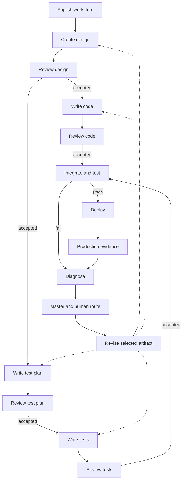
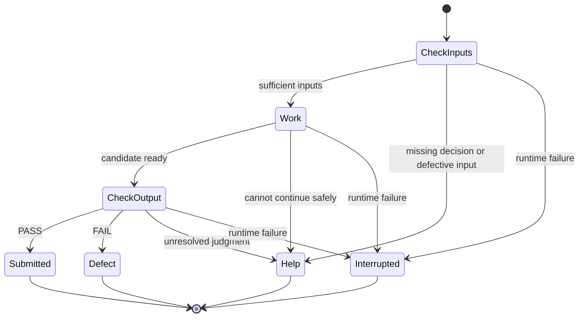

# Neural-Eff

*An AI-native SDLC built around focus.*

Neural-Eff organizes the software development life cycle (SDLC) into focused tasks, from design and implementation through testing, deployment, and production feedback. Each task has a clear responsibility, sufficient relevant context, and an explicit result or request for help.

The workflow is designed around these tasks. Code handles repeatable mechanics, AI agents perform bounded engineering work, and a senior software engineer directs the work by describing intent, reviewing recommendations, and making decisions in English. Each participant can concentrate on its assigned task while recorded artifacts and decisions connect the work across steps.

The organizing rule is:

> Give each step a clear responsibility and the information it needs. Use code, AI, and human judgment where each is useful. Preserve the inputs, outputs, and decisions so another execution can continue the work.

This is the architecture and working plan for Neural-Eff, developed in the [nedschorus repository](../../README.md). Code establishes what is built; GitHub Issues carry work status; [CLAUDE.md](../../CLAUDE.md) governs current operations. The implementation map below identifies existing components and proposed extensions; the complete system is not yet running.

This is the single project overview. It incorporates the Neural Efficiency concept from [PR #260](https://github.com/nedschorus/nedschorus/pull/260) and the [component-reuse research](../issues/queue/external-component-simplicity-recommendations.md) from [PR #261](https://github.com/nedschorus/nedschorus/pull/261). The research notes hold detailed source inspections, not additional operating rules.

## The high concept

A work item is one requested change, defect, or investigation. Its ordinary path is design, code, test plan, tests, integration, and deployment, with review between creation steps. Production supplies new evidence and new work.

A node is one bounded operation in that process. It is not necessarily one agent or one prompt. It may combine deterministic code, an AI judgment, and a human decision. For example, code can collect review reports and group findings by passage; an agent can explain disagreements; the human can decide a disputed change.

**Focus is the deliberate organization of work so that each step has a clear responsibility, sufficient relevant context, and an explicit result or escalation path.** Split large tasks into steps with simpler instructions, fewer competing objectives, and less unrelated history. Keep together facts that must be considered together: a design reviewer may need substantial context while still having one focused job. Shorter prompts and smaller nodes help only when they preserve what the task needs.

**Focus is the design principle; token efficiency is one measure of resource use.** Token efficiency concerns the tokens needed to reach a given quality of result across the whole task, including review and retries. Separate implementation and review can improve focus while spending more tokens because both read the design. That duplication can be worthwhile when their distinct responsibilities improve validation or reduce rework.

**Neural efficiency** names the intended benefit: better use of human and AI reasoning. Assess it through accepted-work quality, rework, human effort, token use, and elapsed time. The name itself does not establish an improvement or imply a measurement of neural activity.

An agent execution is replaceable. It needs the task, applicable instructions, relevant artifacts and code, and enough evidence to do that task—not the conversation that produced them. This is **minimum sufficient context**. Supply necessary dependencies; cutting context that the task needs makes an agent less capable.

Each step also develops a useful point of view on its inputs. Implementing a design exposes implementation holes. Planning tests exposes unspecified behavior. Writing tests exposes an unusable test oracle—the rule for deciding whether a result is correct. A node must use that insight: a significant input defect stops promotion and becomes a recommendation to repair the source.

That combination makes parallel work practical. Work items A and B use the same process, can run concurrently, and meet at explicit dependencies or reconciliation. Starting B during a discussion of A does not require carrying A's whole conversation into B.

## The development path

The diagram shows the normal path and the return from testing or production. Every creation and review step can also report a problem or request help.

Going backward creates a new artifact version; it does not erase history. An environment or external-service problem may need no change to these four artifacts.

The following are useful internal phases, not a requirement to persist an enum for every action. Each step also uses the common input checks, output checks, and help route described below.

| Step | Internal progression | Result and distinctive input check |
| --- | --- | --- |
| Define work | Clarify intent → bound scope → define acceptance | An English work item. Ask about conflicting goals rather than inventing priorities. |
| Design | Inspect relevant system → define behavior and interfaces → check consequences | A design. Expose missing requirements, dependencies, and necessary failure evidence. |
| Write code | Check design → implement → run local checks | Candidate code and evidence. Report design holes rather than silently deciding product behavior. |
| Write test plan | Derive cases from design → choose oracles → rank consequences | A test plan. Identify behavior that cannot yet be judged or reached by a test. |
| Write tests | Check plan → implement cases → verify reach and assertions | Candidate tests. Show they exercise the intended behavior and detect the intended failure. |
| Review an artifact | Read governing inputs → inspect artifact → check evidence → report | Findings and a recommendation tied to specific versions. Distinguish unclear wording from incorrect substance. |
| Integrate and test | Reconcile versions → build → run checks → classify results | Evidence about the combined candidate, not just the separate branches. |
| Diagnose | Reproduce → form hypotheses → run discriminating checks → recommend | A supported cause or explicit uncertainty; a proposed repair location. |
| Deploy and observe | Confirm accepted candidate → release → verify behavior → collect signals | Deployment identity and observations linked to the released revision. |

Code and test planning can proceed in parallel from the accepted design. Tests should derive expected behavior from the design and plan, while reading code when needed to connect to the actual interface. They should not copy the implementation's answer and call that an independent oracle.

## A small common node contract

A node needs four things:

1. **Task:** what to do, what counts as success, and what it may change.
2. **Inputs:** relevant artifact versions, code revision, applicable instructions, and evidence.
3. **Result:** an artifact or findings, checks performed, and any unresolved problem.
4. **Route:** continue, repair within the allowed scope, or ask for help.

Record versions where a change could invalidate the result. Deliver governing instructions deliberately; do not rely on an agent happening to discover them. Use existing repository mechanisms before adding a new manifest or context service.

### Outcomes and nits

A small routing vocabulary is enough:

| Outcome | Meaning | Next action |
| --- | --- | --- |
| `PASS` | This step completed its assigned checks and submitted its result. | Continue to the next required review or acceptance gate. |
| `FAIL` | A check found a concrete defect. | Report evidence; the controller selects an authorized repair attempt or escalation. |
| `HELP` | An input is materially defective, a decision is missing, or the node cannot safely continue. | Preserve the question and recommendation; route through the master to the human. |

A `PASS` from a creator means **submitted**, not independently accepted. A reviewer can find a definite defect and report `FAIL`; a producer unable to implement a defective design can report `HELP`. Both reports should identify the affected artifact and recommended route. The labels do not replace the explanation.

The node contract names the checks and approvals required for acceptance, including any human decision. The controller records acceptance and advances only when those requirements are met. A reviewer's `PASS` completes that review; it does not satisfy other required checks or approvals.

A **nit** is a local, unambiguous, behavior-preserving correction within the node's authority. Fix, verify, and record it without interrupting the human. Treat it as a note on the result, not a separate workflow branch. This can include an input typo when the node is allowed to correct it; version and review rules still apply. A change to intent, expected behavior, public interfaces, or an unauthorized edit to another node's accepted work is not a nit merely because the edit is small.

A node may self-check its work. That is useful but does not replace independent review. If a significant input problem prevents completion, preserve useful partial work only as diagnostic material. Do not promote it as a finished artifact. When inputs change, examine the whole affected output against the new inputs; regenerating or reusing parts is an implementation choice, not permission to keep an obsolete approval.

### Execution and waiting are different

These are states of one execution. After `HELP`, the **work item** waits; the worker need not stay alive. A reply starts a fresh attempt with the revised instructions. After interruption, recovery determines what actually completed before deciding whether to retry.

A provider outage, missing required model, or lost process is an operational failure, not evidence that the design or code is wrong. Keep runtime retry limits separate from the budget for semantic repair. Use the existing runner's required-model and fallback rules; this architecture does not authorize substitutions.

## Review: clear, grounded, and correct are different claims

Creation and independent review alternate for consequential English and code artifacts. The reviewer gets the governing intent and relevant evidence, not an obligation to agree with the creator.

Different checks need different context:

| Check | Question | Context it needs |
| --- | --- | --- |
| Cold Read | Can a fresh reader understand the document without its author's conversation? | The document and the context allowed by the Cold Read instructions. |
| Reference integrity | Do referenced files, symbols, and revisions resolve? | The artifact and the relevant repository or source location. |
| Code-claim verification | Does the implementation actually support what the prose says? | The specific claim and relevant source at an identified revision. |
| Engineering review and tests | Does the artifact satisfy the intended behavior? | Requirements, design, artifact, and appropriate executable or other evidence. |

Freshness reduces dependence on shared conversation; it does not prove correctness. Several reviewers can agree and still be wrong. Cold Read is a readability instrument, not a substitute for code inspection or testing.

Keep Cold Read's policy and roster in its [skill](../../.claude/skills/cold-read/SKILL.md) and [runner](../../scripts/cold-read-grid.py), rather than duplicating them here. A separate code-claim check addresses the [documented verification gap](../issues/queue/cold-read-cannot-check-claims-about-code.md); it does not expand the repository's ordinary PR review to prose.

Mechanical consolidation should preserve original findings, source attribution, and unresolved disagreement. Grouping similar reports helps the human read them; it does not settle their truth.

## Diagnosis and English human oversight

Diagnosis can look anywhere relevant: design, code, test plan, tests, prompts, environment, running revision, instrumentation, or the interface to the outside world. The right conclusion can be “we do not know yet” or “the project is behaving correctly; the external assumption is wrong.”

Repair authority remains narrow. An agent may recommend changing another node's artifact, but meaningful cross-node changes go through the human. A root-cause investigation does not acquire permission to rewrite everything it inspects.

For a failed test, a reasonable initial working hypothesis is a code defect. That is not a rule to rewrite code before looking at evidence. Check that the failure reproduces, that the expected behavior follows from the design, and that the test ran against the intended candidate. A stale daemon can make correct source edits appear ineffective.

Use a small, explicit repair budget. A practical proposed default is one evidence-supported local repair, then broader diagnosis if it fails, then a human recommendation instead of continued guessing. Material upstream defects or uncertainty can go directly to the human; no minimum number of failed attempts is required. The exact counted unit and limit belong in the diagnosis implementation under [#21](https://github.com/nedschorus/nedschorus/issues/21), whose earlier drafts need reconciliation. Do not silently turn an unsettled “three passes” example into a universal rule.

### The master

The intended master is the human-facing coordinator, not an all-knowing agent. Code tracks transitions and budgets; AI can explain evidence and formulate recommendations. Nodes send reports to it, and it brings the human a concise English question:

- What happened, and why does it matter?
- What evidence supports the likely cause? What remains uncertain?
- What action is recommended, and which artifact or work item would change?
- What decision is needed from the human?

Raw reports and evidence remain available. A polished summary is not proof.

The question records the work item, relevant input versions, and the decision being requested. The answer becomes an instruction for the next attempt of that same work item. If the inputs changed while the human was considering the question, reconcile the answer before applying it.

The user can redirect A, start B, pause either, or decide which conflicting work proceeds first. Independent conversations can proceed without a global pause. A shared master means a shared place to route questions and preserve decisions, not one enormous context window.

This is intended architecture, not current seat behavior. The [agent-seat model](../agents/agent-seat-model.md) previously declined a coordinating agent while the human handled routing. Implementation must reconcile that operating model before enabling automatic handoffs between seats. Editing this document alone does not launch or authorize a new seat.

## Versions, parallel work, and reconciliation

Git already supplies versions, branches, worktrees, history, and ordinary merging. Use them.

A review names the version it checked. Changing that artifact makes the old review insufficient for the new version. Only affected downstream work needs reconsideration: a design change does not automatically invalidate an unrelated module, but a test or implementation that relied on the changed behavior must be rechecked.

Reconciliation asks both whether files merge and whether the meanings still agree. A clean Git merge is not evidence that the combined design, code, and tests are compatible. Rerun relevant checks on the integrated candidate. Unresolvable textual or semantic conflicts go to the human with a recommendation.

Where possible, let unaffected work continue. Updating a prompt should not silently change an attempt already running with an earlier version. Finish, cancel, or restart that attempt explicitly, and preserve which version produced its result.

## Continuity and recovery without a new backup system

The user reports that the files are already saved by Time Machine. Treat file backup as provided infrastructure, not a new Neural-Eff subsystem. The existing [preservation-and-placement design](../issues/32-preservation-and-placement.md) remains the home for preservation policy and machine-specific details.

The remaining workflow problem is smaller: after a crash, what was being done, what completed, and what should happen next? Backups preserve files; they do not by themselves identify whether an agent finished, a question is still pending, or an external action succeeded before its reply was lost.

Record the necessary facts at work boundaries:

- Work item, input versions, and current attempt.
- Submitted output and check result, or an explicit interruption.
- Pending question and the human's answer.
- Any externally visible action whose completion must be checked before retrying.

Use Git and the existing work records, reports, and handoffs. Add machine-readable fields only where a consumer needs them. This does not require a second event platform, a universal artifact database, or a database choice before the first useful workflow.

The intended master maintains continuity across session replacements by reconstructing the active work from durable records. Handoff summaries are working aids, not the sole authority for decisions. Relevant source records remain retrievable; routine nodes do not inherit the entire transcript.

Recovery should separate **observation, decision, and action**. Determine whether a worker is live, interrupted, or deliberately stopped before launching anything. A launch command returning successfully is not proof that the replacement is running. After an uncertain external action, inspect its destination before repeating it—for example, check whether the intended PR or check-in already exists. If inspection cannot establish the outcome, the recovery process records the unresolved action and requests human help through the master before repeating it.

Workflow recovery and restoring terminals, sessions, and machine processes are separate jobs. Extend the existing supervisors and seat-recovery work for the latter. Preserve the repository's accepted loss and retention policies; “resilient” does not mean saving every transient thought or requiring exactly-once execution everywhere.

## Production closes the loop

Deployment produces a release identity and enough evidence to say what was deployed and whether it started correctly. User complaints and automated error reports become linked work items, not direct instructions to rewrite code.

Observability belongs in the design and test plan: specify which important failures must be distinguishable, what evidence would distinguish them, and how to test that the evidence is emitted. A small useful record often includes the deployed revision, operation or request identifier, relevant error, and context needed to reproduce it.

Preserve useful messages or traces, not everything. Request or HTML content may contain private data and may be unnecessary. Define redaction and retention according to the application. A production failure may expose a design defect, missing test, implementation bug, environmental fault, or an inherently untested condition; diagnosis should not assume one in advance.

No incident service or telemetry framework is required by this plan. Adopt one when a concrete application needs capabilities beyond its existing logs and deployment records.

## What exists, and what to reuse next

This is a source-tree snapshot for this revision, not a replacement for issue status. Proposed work below is not activated merely by appearing here.

| Area | Existing foundation | Smallest useful extension |
| --- | --- | --- |
| Fresh execution and reports | [Shared cell code](../../scripts/cold-read-cell-common.py) already composes prompts, invokes model chains, verifies report presence, and records provenance; Claude and Codex adapters call it. | For [#41](https://github.com/nedschorus/nedschorus/issues/41), extract the reusable invocation boundary when another caller needs it. Keep Cold Read-specific policy with its caller. A generic runner is not a greenfield build. |
| Review readability | [Cold Read grid](../../scripts/cold-read-grid.py), reviewer prompts, and saved reports. | For [#166](https://github.com/nedschorus/nedschorus/issues/166), gather and group reports mechanically while preserving original evidence and disagreements. Use the current roster, not an old issue's cell count. |
| Reference checking | [Markdown drift checker](../../scripts/md-drift-lint.py) already has `resolve`, `check_markdown_links`, and `lint_markdown`. | Extend that boundary for [#42](https://github.com/nedschorus/nedschorus/issues/42), after defining its caller's reporting needs. Heuristic suspicions are not confirmed broken references. |
| Continuity and recovery | [Handoff design](fast-handoff-design.md), [supervisor](../../scripts/handoff-supervisor.py), and [seat recovery](../../scripts/recover-crashed-seats.py). | Complete existing recovery work in [#242](https://github.com/nedschorus/nedschorus/issues/242) and [#116](https://github.com/nedschorus/nedschorus/issues/116): distinguish intended stops from crashes and verify replacement processes. |
| Integration | Git worktrees, the current PR path, and [main-gatekeeper code](../../scripts/main-gatekeeper.py) and [design](main-gatekeeper-design.md). | Keep one promotion path. The gatekeeper remains dormant under current instructions; its implementation is not evidence that every final gate is active. Verify the actual integrated candidate under its existing owning work. |
| Engineering workflow | Proposed define-work, design, test-plan, implementation, diagnosis, and review work in [#15](https://github.com/nedschorus/nedschorus/issues/15), [#17](https://github.com/nedschorus/nedschorus/issues/17), [#18](https://github.com/nedschorus/nedschorus/issues/18), [#20](https://github.com/nedschorus/nedschorus/issues/20), [#21](https://github.com/nedschorus/nedschorus/issues/21), and [#22](https://github.com/nedschorus/nedschorus/issues/22). | Connect one real change through the path before generalizing the controller. Master question routing and production intake are still implementation work, not established end-to-end behavior. |

### What to borrow from other projects

The [research index](../issues/queue/external-component-simplicity-recommendations.md) links inspected source and limitations. These are specific design borrowings, not dependency recommendations.

| Project | Useful borrowing | Neural-Eff application |
| --- | --- | --- |
| [PocketFlow](../issues/queue/pocketflow-node-boundary-recommendations.md) | Small node boundaries and code that reduces intermediate results. | Shared invocation in #41 and report consolidation in #166. Keep the existing runners and graph. |
| [Anthropic skill-creator](../issues/queue/anthropic-skill-creator-evaluation-recommendations.md) | Side-by-side output viewing and evaluation result layout. | Adapt for #23 when comparing skill versions; correct the inspected aggregator's missing-result and counting problems before relying on its totals. |
| [LangGraph](../issues/queue/langgraph-question-resume-recommendations.md) | A persisted question/resume boundary; care around replayed side effects. | Save the question, end the worker, and start a fresh attempt after the answer. No LangGraph installation is required. |
| [XState](../issues/queue/xstate-recovery-transition-recommendations.md) | Separate deciding a transition from executing its effects. | Test recovery decisions in Python around existing seat functions; do not replace them with a JavaScript runtime. |
| [Camunda](../issues/queue/camunda-error-routing-recommendations.md) | Distinguish operational retries from explicit responses to a work problem. | Runtime failure handling stays separate from diagnosis and semantic repair. |
| [PromptDoctor](../issues/queue/promptdoctor-template-evaluation-recommendations.md) | Distinguish a prompt template from its fully instantiated production input. | Evaluate the existing prompt composer and its actual output; a new extraction or optimization platform is not needed. |

Do not add a general agent-conversation framework, a larger graph service, another backup system, or a separate provenance platform without a concrete need. More reviewers, more state fields, and smaller nodes are not automatically improvements.

## Build a useful slice, then measure it

Start with mechanical work already costing human or agent effort: report consolidation and reference checking. Extract shared runner code when the next real node needs it. Then take one bounded Neural-Eff change through design, review, implementation, test planning, tests, integration, and an English decision when blocked.

Include a deliberate interruption and a defective upstream input in that pilot. Demonstrate that it resumes from recorded facts and routes the defect to the right place. Add the smallest master interface needed for those questions; keep fleet recovery in its existing work.

For prompt or skill changes, [#23](https://github.com/nedschorus/nedschorus/issues/23) should compare baseline and candidate using the same production prompt composer, frozen inputs, and stated assertions. Score readability, factual grounding, and task success separately. Include every attempted run: a missing report is not a passing case and must not disappear from the denominator. Unknown token use stays unknown, not estimated from character counts and labeled as measured tokens.

Useful measures are accepted-work quality, unsafe advances, correct upstream diagnoses, avoidable human interruptions, rework, recovery errors, elapsed time, and cost per accepted work item. Test pass, nit, material input defect, human question, conflict, interruption, and nonconverging repair. Add machinery only when those cases expose a concrete need.

## Established ideas and the proposed synthesis

Finite-state workflows, independent review, Git-based parallel development, human escalation, dependency-aware recomputation, and supervised process recovery are established techniques. Decomposition and separate-context reasoning also have research precedents, linked in the [research index](../issues/queue/external-component-simplicity-recommendations.md).

The proposed synthesis is a software-development process in which every step has its own information needs and examines its inputs, English and code artifacts both receive review, diagnosis can look beyond the failing step, and the human controls changes of meaning through a durable conversation.

This is not a claim that the individual ideas are new, or that less context always produces better reasoning. The system's advantage must be demonstrated by better work with less rework and less human effort.

## Standing decisions

These carry forward the architecture's governing decisions. Implementation recommendations above remain proposals until accepted and built.

1. **Human-and-AI development.** The human owns intent, priorities, ambiguity, and redirection. Code and AI agents perform bounded engineering work; nodes may combine them with human judgment.
2. **Natural-language oversight.** Human-facing designs, questions, recommendations, and decisions are understandable English. Internal records may be structured, with underlying code and evidence available.
3. **Replaceable executions.** Tasks, applicable instructions, relevant artifact versions, and evidence—not a predecessor's private conversation—supply the context.
4. **Input examination.** Material upstream defects stop promotion. Safe nits may be repaired, checked, and recorded within the node's authority.
5. **Independent review.** Creation alternates with review against governing intent. Approval applies to the reviewed version, not every later edit.
6. **Broad diagnosis, narrow repair.** Inspect relevant causes throughout the graph and at its external boundary; do not silently change another node's accepted artifact.
7. **Persistent coordination, replaceable processes.** The intended master routes between nodes and the human. Durable work records and decisions preserve continuity through restarts.
8. **A simple workflow.** Code implements known transitions and limits. Agents do not invent an open-ended organization to choose each next step.
9. **Optimistic parallelism.** Separate work items use separate worktrees. Git handles textual merging; checks and reconciliation establish semantic compatibility.
10. **Production feedback.** Deployment evidence, errors, and English complaints return as work items, with diagnosis selecting the relevant repair location.
11. **Designed observability.** Specify the evidence needed for important failures, with appropriate privacy and retention limits.
12. **Earned complexity.** Progress from manual work to human-invoked scripts to automation when a demonstrated consumer or failure justifies it.
13. **Code where possible, prompts where useful.** Repeatable mechanics belong in code; judgment and unenumerated inputs can require prompts and human decisions. Follow current permission and approval rules. The supervised cooperative fleet does not acquire blanket deliberate-attacker hardening requirements from this architecture.
14. **One gate to main.** The main-gatekeeper is the permanent intended path. The PR process in CLAUDE.md remains current until that gate is active.
15. **Independent readers.** Durable artifacts must be usable with the repository and applicable instructions, without the conversation that created them.
16. **Legacy is reference, not specification.** Deliberate reuse of `nedlern` classifies touched features as `preserve-feature`, `update-feature`, `remove-feature`, or `consider-feature`. Unexamined behavior is not preserved by default.
17. **Sources inform; they do not govern automatically.** Judge public sources by usefulness and reliability. Quoting a source does not make it a runtime contract.

## Project organization

GitHub Issues carry walkable work state, Markdown carries substantive reasoning, and queues hold undecided material. Execution records supplement these homes only where machines need facts not already represented; they must not become a competing authority.

| Home | Content |
| --- | --- |
| `docs/wiki/` | Current standing knowledge that is difficult to reconstruct from code. |
| `docs/issues/<n>-<slug>.md` | Substantive work paired with a GitHub Issue: a GHI-MD. |
| `docs/cross-project/` | Current designs shared across Neural-Eff systems, including this architecture. |
| Existing per-seat handoff and transcript locations | Session continuity and conversation evidence, following their owning designs. |
| `nc-queue/` | Human-requested notes awaiting initial review. |
| `docs/wiki/queue/` and `docs/issues/queue/` | Material with a known destination awaiting review. |
| `legacy-feature-queue/` | Legacy behavior whose disposition remains undecided. |
| GitHub Issues and PRs | Work status, decisions, reviews, and the current check-in path. |
| Git | Code, current Markdown, version history, and ordinary provenance. |

Every retained artifact has a current named home or a named queue with a drain. Human review promotes it, edits it in place, demotes it to supporting evidence, or drops it with a recorded reason.

A substantial work item uses a GHI-MD. Clarifications edit the current body rather than accumulating corrective comments; comments record genuinely new events. On closure, apply the artifact-disposition rule above: human review decides whether the GHI-MD remains at a named home, moves to a named queue, or is dropped with a recorded reason.

A file may be edited in place, but its old and new contents are different logical versions. Git commits and content hashes identify the versions that reviews and dependent work used. An edit does not retroactively change old evidence.

The obsolete boot-up founding plan remains intentionally removed. Its history is available at `git show 615a230:docs/cross-project/nedschorus-founding-plan.md`. Cite this architecture for current architectural rules and that history only for founding events.

## Accepted residuals

An accepted residual is a review objection the human considered and chose not to address. Record the objection, why it is acceptable now, and the concrete evidence that would reopen it. Reviewers should not repeatedly re-file it without new evidence.

This document creates no new accepted residuals. The old founding plan's residuals remain historical; they govern current work only where current code or a present-tense document still relies on the decision.

## What success looks like

The system succeeds when a fresh execution can pick up a bounded task; a downstream agent can identify a bad input; nits are fixed quietly; a material problem reaches the human as an actionable recommendation; independent work continues through conflicts elsewhere; and a restart preserves enough information to resume or explicitly retry.

The final test is a real change through production and back: an English complaint leads to evidence, diagnosis, a human-approved route where needed, corrected artifacts, renewed review, and a verified release.

The graph stays simple. The quality comes from sufficient context, honest input checks, independent evidence, clear authority, and recoverable work.
