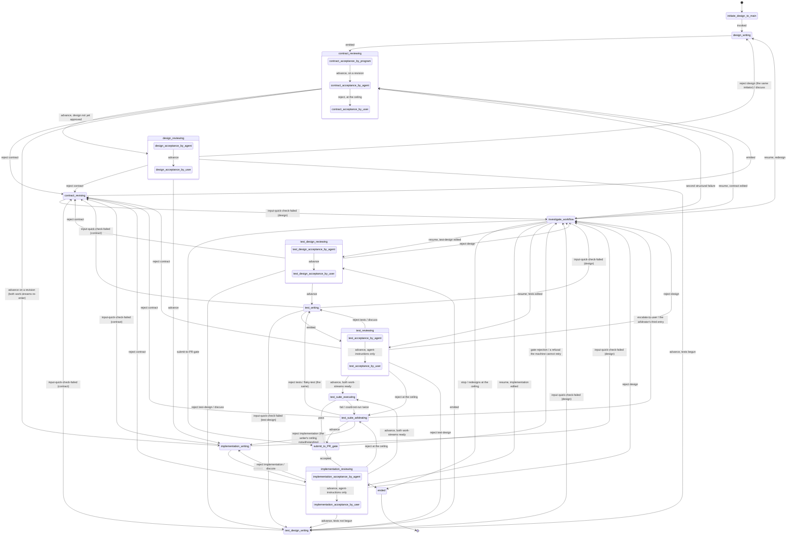

# The design-to-main state machine

The design-to-main workflow takes a design written in English and delivers an implementation and its tests to the gate that guards `main`, or stops and hands the component back to the user. This document specifies the program that runs that workflow: its states, its transitions, what each state receives and emits, how it counts, what it records, and where it stops. It is written for the agent that will build it and for the agents that will run inside it, none of whom will have read the conversations it came from.

**Vocabulary.** Fleet-wide terms are in the fleet glossary, `docs/wiki/nedschorus-glossary.md`. Terms that belong to this workflow alone are in this directory's glossary, `docs/design-to-main/design-to-main-glossary.md`. Every word this document uses in a sense of its own is a hyphenated phrase defined in one of the two; an ordinary software-engineering word keeps its ordinary sense. **The gate** is whatever stands between a finished component and `main`: today the merge-lane seat's review of a pull request under `CLAUDE.md`'s PR process; later the main-gatekeeper program (§3.4).

**Provenance.** The rules here were ruled by the user in seven walks and one vocabulary ruling. Walk files do not land on `main` (user-ruled 2026-09-08): each walk's four files are preserved in the log-store, `nedlern@ned-box:/home/nedlern/nedschorus-logs/walk/`, flat, under the names they had in `docs/walk/`, and are cited below by file name. The reasoning and the discarded alternatives are in their minutes, not here:

- `nedlern@ned-box:/home/nedlern/nedschorus-logs/walk/pr-review-graph-coder-reviewer-originator-loops-minutes.md` — the first walk (2026-09-03 to 04), which produced the rules the superseded draft summarised. Its minutes use the older names *code-design* and *test-code-design* for what this document calls the design and the test-design.
- `nedlern@ned-box:/home/nedlern/nedschorus-logs/walk/state-machine-design-cold-read-triage-minutes.md` — the second walk (2026-09-04 to 05), which triaged the draft's cold read and produced the 2026-09-05 revision. A ruling cited below as "item N" with no walk named is there.
- `nedlern@ned-box:/home/nedlern/nedschorus-logs/walk/state-machine-design-round-2-cold-read-flags-minutes.md` — the third walk (2026-09-05 to 06), on the second cold read; it renamed the investigation and the submission.
- `nedlern@ned-box:/home/nedlern/nedschorus-logs/walk/implementation-review-verdicts-and-code-write-counting-minutes.md` — the fourth walk (2026-09-05 to 06), on what a reviewer can find and what is counted; its item 2 ruled that the design's author writes the component-contract and that the design and the test-design each get an agent's check before the user's.
- `nedlern@ned-box:/home/nedlern/nedschorus-logs/walk/state-machine-design-section-11-open-questions-minutes.md` — the fifth walk (2026-09-06), which closed three questions this document had left open and carries the state-name table (its "SIDE RULING, STATE NAMES").
- `nedlern@ned-box:/home/nedlern/nedschorus-logs/walk/state-machine-design-third-cold-read-decisions-minutes.md` — the sixth walk (2026-09-06 to 07), on the third cold read; it restored `nit`, scrubbed `adjudicator` from the fleet glossary, set the pull request's alignment with the run's documents, and, in a step-by-step of the whole run, settled who talks to the user — the initiator until approval, arbitrators after — with the initiator living until the code and the tests exist, the initiator's two revisions, the arbitrator's two rulings, the three reasons a write is thrown out, the `-based-test` nouns and the user's `reset`.
- `nedlern@ned-box:/home/nedlern/nedschorus-logs/walk/design-to-main-machine-slice-1-build-findings-minutes.md` — the seventh walk (2026-09-08), on what a fresh agent building the machine's first slice (PR #287) found insufficient in this design, and what six review rounds found at the checkout's edges.
- `nedlern@ned-box:/home/nedlern/nedschorus-logs/walk/design-to-main-design-gaps-from-slices-1b-and-2-minutes.md` — the eighth walk (2026-09-08 to 10), on what two fresh agents building slice 1b of the machine (PR #295) and the agent-instructions drafts (PR #292) found the design still did not say: the state-exit's file form, the record's home before code exists, the arbitrator entered from a reviewer's ceiling and at its own, the discard rule, and that a resume from an investigation gives every agent its chance again.
- The coverage-type vocabulary was ruled 2026-09-03 in the MD-skills seat; its fourth value was renamed by the user on 2026-09-06 (the fifth walk, item 2); see §2.

**Standing decisions.** Where this document cites one, it means the numbered list under the heading "Standing decisions" in the objective page, `docs/wiki/queue/nedschorus-ai-native-software-development-objective.md`. **That page is not yet on `main`**: it is on the merge-lane seat's branch and will land, then move to `docs/wiki/`; its numbers are stable, and the wording of decisions 4 and 21 is pending the user's review (§10). The AI-native architecture, `docs/cross-project/nedschorus-ai-native-software-development.md`, carries an earlier list under its own §19 with 17 entries; where a number below means the same thing in both lists (13 and 14) this document says so. A citation written "the architecture's §N" is to that document; a bare §N is to this one.

## 1. What the machine is

**The workflow is the process. The state machine is the program that runs it.** The state machine is code and holds no judgement. It assembles each state's state-package, launches whatever does that state's work, reads the state-exit that comes back, checks that the destination is a legal transition from that state (§3.2), routes, counts (§7), commits and pushes every state-exit to the component's topic branch (§9), and pauses the run to wait for the user when a transition says so. Standing decision 13, and the architecture's decision 13, say why: state transitions, counters, validation and routing belong in deterministic code.

**A state is not an agent.** A state is where the run is. What each state's work is, and who does it:

- `initiate-design-to-main` and `design-writing` are conversations with the user; `design-writing` launches a fresh agent, the **initiator**, to hold its side of the conversation, and the initiator's instance lasts until the code and the tests both exist (§4).
- Every sub-state ending in `-acceptance-by-user`, and `investigate-workflow`, wait for the user; `investigate-workflow` hands the report to the initiator while it lives, and launches a fresh arbitrator to talk with him once the code and the tests exist.
- Every sub-state ending in `-acceptance-by-program`, and `submit-to-PR-gate`, run code alone.
- `test-suite-executing` runs code, and launches a single-purpose agent for each prompt-based-test.
- `ended` does nothing; it is the terminal state.
- Every other state launches one fresh agent with its agent-instructions and one state-package.

A launched agent receives one state-package, does one task, emits one state-exit, and ends, with one exception: the initiator, which stays alive from the user's invocation until the code and the tests both exist, because it holds the user's intent and no code has yet crowded it (user-ruled 2026-09-07, the sixth walk, item 5). The arbitrator may, within its instance, ask the machine to rerun the test suite, which is a service call and not a state-exit (§6.5). A state that waits for the user records his answer as a file before routing on it. A reviewing state is a composite state: its sub-states are the acceptance-checks of the artifact it reviews, run in order (§3.1).

**Between agent instances, only files cross.** An agent persists within its own instance — across the cold-read iterations of §4, or the turns of a conversation — and never across instances. What sets the user apart from every agent in the run is not memory but availability (standing decision 20): the arbitrator holds the branch history and so has a broad context across the states it is entered in, but the user is often not available, so his checks are states the machine waits in, not steps it can route around, and the counters in §7 bound how often the automated work spends his attention.

**Together the states are one Code Prompt Code (CPC) program**, the fleet glossary's term: code launching agents and reading their state-exits. Its input is a conversation with the user about one component; it ends with a submission accepted by the gate, or with the component failed or stopped by the user. The fleet already has the pattern: `scripts/cold-read-grid.py` is code that launches reviewer agents and reads their status lines.

## 2. Vocabulary

A **component** is what one design describes: one design, one component, one run. A **run** is a component's whole life in the machine, from the user's invocation to `ended`; an investigation (§6.6) pauses a run, and ends it only when the user rules `stop`. Counters, the topic branch, and the user rulings are per component.

A **state-package** is the set of files the machine assembles for one launched agent and tells it to read. Every agent downstream of the design receives the **standard-package**: the design, the component-contract, the component's user-rulings file (§9), and — when the state is re-entered after a rejection or an input-quick-check-failed — the notes or the failed-check report that caused the re-entry and the version being corrected. The table in §3.1 lists only what a state receives beyond that. An agent works in a worktree of the topic branch that the machine prepares, holding the state-package and whatever the state-package needs to run — the repository as it was when the branch was cut — with the other work-stream's artifacts absent (§3.1); the arbitrator's worktree is the whole branch.

A **state-exit** is what a state's work emits and the machine routes on: a **verdict**, a **destination**, and the commit of the state-package it was built from, as one structured record: a file, `state-exit.json`, that the agent writes in its instance's evidence directory beside its notes (§9). Its fields, spelled with hyphens like every name here, are `state`, `verdict`, `package-commit`, `destination` where the agent names one (§6.1), the one the verdict needs — `input-named`, `investigation-focus`, `coverage-type`, `refusal-class`, `held-ruling` (§6.6) — and `named-files`, the artifact files its commit carries; the initiator and the arbitrator, the two agents that talk to the user, add `rulings`, his words verbatim, `reset` included, which the machine appends to the user-rulings file (user-ruled 2026-09-08, the eighth walk, item 2). The work also writes files — artifacts, notes, evidence — which the machine commits and delivers, but does not route on. Every state emits one state-exit per instance; a composite state emits the state-exit of the sub-state that ended it. The machine discards a state-exit whose state-package commit is no longer the branch's current one (§3.2).

An **implementation-write** and a **test-write** are the two finished writings the machine counts (§7). An **input-quick-check-failed** is a writing state stopping because what it received is not enough to do its task; it names the input and what was missing (§4). A **contract-revision** is a re-write of the component-contract after a rejection or a failed check against it, once the design is approved. A **test-design-correction** is a re-write of the test-design on the same grounds, once the test-design is approved. A **redesign** is a re-write of the design entered from an investigation. A re-write before approval — a design or test-design sent back by its agent check — is none of these and is not counted.

A **writer** produces an artifact a later state is written from: the design and its component-contract, the implementation, the test-design, the tests. A **reviewer** produces none; its notes and evidence are committed as record, delivered to the writer that must act on them, and never landed as part of the component. The **arbitrator** is the one reviewer that reads the whole branch and writes every investigation report. The user is neither a writer nor a reviewer in the machine's sense, though he writes the design in conversation and may edit any document in an investigation (§6.6).

The **design** is intent. Nothing below it decides intent. The **component-contract** is the file beside the design, written by the same author in the same conversation, listing what the component promises its component-consumers (§5). A **component-consumer** is anything that invokes the component or reads what it leaves. The **test-design** is the document the test-work-stream writes from the design and the component-contract: the list of test-requirements, one per promise a test must observe, each with the coverage-type of the test that will cover it and, where that is `no-tests`, the reason and a sentence saying why (the MD-skills seat's ruled text, 2026-09-03). An **implementation** is what `implementation-writing` produces.

The **coverage-type** of an implementation, and of a test, says what kind of thing it is: `script`, `prompt`, or `script-and-prompt`. A test-requirement in the test-design carries the same field for the test that will cover it and may instead be `no-tests`, with one of three reasons and a sentence: `can-not-be-tested`, `do-not-know-how-to-test`, `no-tests-written`. The user ruled this vocabulary for tests on 2026-09-03 (the MD-skills seat's walk minutes, `nedlern@ned-box:/home/nedlern/nedschorus-logs/walk/cold-read-terminology-pass-rulings-minutes.md`, "Item 1"; the MD-skills seat ships it), confirmed on 2026-09-05 that the field names what an implementation is as well, and on 2026-09-06 renamed the fourth value and ruled it a value of the test-design only. A design that asks only for something that is not a file in the repository — a GitHub setting, for instance — is done by hand and does not enter the machine; a design that asks for a file and a setting enters with the file, and the setting is a `world-requires` clause of its component-contract (§5.2).

**Who talks to the user.** From his invocation until the code and the tests both exist, the initiator; from then to the gate, a fresh arbitrator on each entry, reading everyone's notes and the branch history. The switch is there because code would overwhelm the initiator's context, and it is the arbitrator that reads code. No other agent talks to him (user-ruled 2026-09-07, the sixth walk, item 5). A test is named in prose by what it is based on: a **code-based-test** is coverage-type `script`, a **prompt-based-test** is coverage-type `prompt` — agent-instructions run by a single-purpose agent that reports pass or fail — and a **CPC-based-test** is `script-and-prompt`; a **user-based-test** is a clause's by-hand demonstration. Other kinds — simulated-user-based, web-scripting-based — join the coverage-type list when a component needs one. **Reset** is a user ruling, given in any dialog with him, that zeroes every counter of §7; it is recorded in the user-rulings file like every ruling.

**Agent-instructions**, the fleet glossary's word, are prompts or MD files that instruct agents. An implementation or a prompt-based-test is agent-instructions; one of coverage-type `script-and-prompt` is agent-instructions in its prompt half and follows the rules for both. **Standing-agent-instructions** are instructions that will be followed again and again — a skill, the instructions a state launches its agent with, an implementation or a test that is agent-instructions — and the user reviews them. **Per-run-text** is what one agent writes during a run for another — a reviewer's notes, a failed-check report, a contract-revision — and the user does not, except at `contract-acceptance-by-user` (§6.6).

A **nit** is the standard word: a small defect of no consequence to any component-consumer. `exxample` for `example` in a comment is one; the same typo in a CLI flag is a contract defect, because a component-consumer depends on it. Nits are recorded in a reviewer's notes, in their own section, and never routed to a writer as work.

A **cold read** is the fleet's fresh-reader review, `.claude/skills/cold-read/SKILL.md`, run by `scripts/cold-read-grid.py`: reviewer agents with no context from the conversation that produced a document report what each passage made them think it meant and what defects they found. A **cold-read run** is one invocation. In this machine it is not a state (§4).

**Durable prose** lands where people read it and stays: `docs/`, the wiki, skills, `CLAUDE.md`, and standing-agent-instructions wherever they land. **Run-record prose** is consumed inside one run and stays on the component's topic branch as record. The design, the component-contract and the test-design are durable prose and land with the component (§9); the notes and the investigation reports are run-record prose.

The test suite ends `pass`, `fail`, or `could-not-run` (§6.4); the words were the seat's `green` and `red` until the user asked for labels that make sense (2026-09-07, the sixth walk, item 8).

**Work-streams.** After the design is approved the run has two: the **implementation-work-stream**, `implementation-writing` and `implementation-reviewing`, and the **test-work-stream**, `test-design-writing`, `test-design-reviewing`, `test-writing` and `test-reviewing`. They meet at `test-suite-executing`.

**Skills and agent-instructions.** A skill is agent-instructions a person invokes. This workflow has five of its own: `initiate-design-to-main`, `investigate-workflow`, `design-review`, `test-design-review`, `contract-review`; it also uses the fleet's cold-read skill. The instructions every other state launches its agent with are that state's agent-instructions, not skills (user-ruled 2026-09-06). All of them are the MD-skills seat's to write.

## 3. States and transitions

### 3.1 The states

Every state is named by the document or code it works on and the work it does on it — `-writing`, `-reviewing`, `-revising`, `-executing`, `-arbitrating` — except four, named for what they are: `initiate-design-to-main`, `investigate-workflow`, `submit-to-PR-gate` and `ended` (user-ruled 2026-09-06; the ruled table is in the fifth walk's minutes). In state names, verdicts and paths, `contract` is the component-contract. A reviewing state is composite: its sub-states are the artifact's acceptance-checks, in the order listed, each a check of the artifact against its acceptance criteria that passes or fails — by program, by agent, or by user. The Package column lists what a state receives beyond the standard-package of §2.

| State | Sub-states | Package beyond the standard-package | State-exit verdicts |
| --- | --- | --- | --- |
| `initiate-design-to-main` | | the user's invocation of the skill, naming the component | `invoked` |
| `design-writing` | | the invocation; on a redesign, the investigation report | `emitted`, with the design and the component-contract |
| `contract-reviewing` | `contract-acceptance-by-program`; after a contract-revision also `contract-acceptance-by-agent`; at the revisions ceiling `contract-acceptance-by-user` | the previous version and the notes, on a revision | `advance` / `reject contract` / `discuss` / `redesign`, the last from the user only |
| `design-reviewing` | `design-acceptance-by-agent`, `design-acceptance-by-user` | — | `advance` / `reject design` / `reject contract` / `discuss` |
| `contract-revising` | | the notes or the failed-check report, and the version being revised | `emitted` / `input-quick-check-failed` |
| `implementation-writing` | | on re-entry, the implementation as it stands and the notes; when an upstream document changed, its diff | `emitted` with coverage-type / `input-quick-check-failed` |
| `implementation-reviewing` | `implementation-acceptance-by-agent`; for agent-instructions also `implementation-acceptance-by-user` | the implementation's files; on a second review, the previous reviewer's notes | `advance` / `reject <artifact>` / `discuss` |
| `test-design-writing` | | on re-entry, the test-design as it stands and the notes; when an upstream document changed, its diff | `emitted` / `input-quick-check-failed` |
| `test-design-reviewing` | `test-design-acceptance-by-agent`, `test-design-acceptance-by-user` | the test-design | `advance` / `reject <artifact>` / `discuss` |
| `test-writing` | | the test-design; on re-entry, the tests as they stand and the notes; when an upstream document changed, its diff | `emitted` with coverage-type — every coverage-type present in the set, `script, prompt` for nine scripts and one prompt-based-test — / `input-quick-check-failed` |
| `test-reviewing` | `test-acceptance-by-agent`; for tests that are agent-instructions also `test-acceptance-by-user` | the test-design; the tests' files | `advance` / `reject <artifact>` / `discuss` |
| `test-suite-executing` | | the implementation; the tests; the test-design | `pass` / `fail` / `could-not-run` |
| `test-suite-arbitrating` | | the implementation-work-stream's last state-package and files; the test-work-stream's; the whole branch | `advance` / `reject <artifact>`, the implementation, the tests, both as `reject implementation and tests`, or the contract / `flaky-test` / `escalate-to-user` |
| `investigate-workflow` | | the whole branch; the notes or state-exit that opened it | `stop` / `submit-to-PR-gate` / `resume`, with an optional destination |
| `submit-to-PR-gate` | | the accepted implementation and tests | `accepted` / `gate-rejection` / `gatekeeper-refusal` |
| `ended` | | — | none; the terminal state |

**Every reviewing sub-state by agent, `contract-revising`, `test-design-writing` and `test-suite-arbitrating` also have `escalate-to-user`**, for a problem the agent believes is in the design or the test-design; it routes to `investigate-workflow` with that investigation-focus. `implementation-writing` and `test-writing` do not have it: the user wants nothing to do with code, and a problem there is the reviewer's or the arbitrator's to raise (§6.6). The table lists it only where it is the state's ordinary business. It is also how `contract-acceptance-by-agent`, whose verdicts name no `reject design`, rejects the design: `escalate-to-user` with investigation-focus `design` reaches the same investigation a reviewer's `reject design` does.

**The first component-contract is checked with the design.** `design-writing` emits both files. The machine runs `contract-acceptance-by-program` on the component-contract first, at once; only then does `design-reviewing` begin, and `design-acceptance-by-agent` reads both files: does the design hold together, and does the component-contract promise what the design says. `contract-reviewing`'s own agent check and user check exist for contract-revisions after the design is approved (§5.3).

**The implementation-work-stream runs first**, and when it reaches `ready-for-test-suite` and waits, the test-work-stream runs; both re-entered, the same order (user-ruled 2026-09-08, the seventh walk, the build's findings).

**The two work-streams never see each other's output.** `implementation-writing` never receives the tests or the test-design; `test-design-writing` and `test-writing` never receive the implementation. A worktree prepared for a state in one work-stream has the other work-stream's artifacts absent. The work-streams meet in `test-suite-executing`, which is the machine's, and in `test-suite-arbitrating`. The one place test behaviour reaches the implementation-work-stream is the arbitrator's notes after a failed suite, which describe what the suite did.

### 3.2 The transitions

This table is normative. The Trigger column names the state-exit verdict and any guard on it. The machine holds the table, derives the destination from the row, checks that the destination the state-exit names is that row's, and treats any other as a machine error: the run pauses in `investigate-workflow`, investigation-focus `unknown`, the illegal state-exit in the arbitrator's report. A state-exit whose state-package commit is not the branch's current commit is discarded as stale, and the state is re-run.

| From | Trigger | To | Counter (§7) |
| --- | --- | --- | --- |
| `initiate-design-to-main` | `invoked` | `design-writing`, after the machine has cut the topic branch (§9) | — |
| `design-writing` | `emitted` | `contract-reviewing`, program check only | redesigns are counted on entry, not here |
| `contract-reviewing` | `reject contract` from the program check, first time | `contract-revising` (fresh) | — (not counted; a structural failure) |
| `contract-reviewing` | `reject contract` from the program check, second consecutive time | `investigate-workflow`, investigation-focus `contract` — the contract-revising agent cannot satisfy the script, which is the machine's to look at | — |
| `contract-reviewing` | `advance` from the program check, the design not yet approved | `design-reviewing` | — |
| `contract-reviewing` | `advance` from the program check, on a contract-revision | `contract-acceptance-by-agent` | — |
| `contract-reviewing` | `reject contract` from `contract-acceptance-by-agent`, the revisions counter below its ceiling | `contract-revising` | contract-revisions |
| `contract-reviewing` | `reject contract` from `contract-acceptance-by-agent`, the counter at its ceiling | `contract-acceptance-by-user`, a dialog with the initiator or an arbitrator (§6.6) | — |
| `contract-reviewing` | `advance` from `contract-acceptance-by-agent` or `-by-user`, on a contract-revision | both work-streams re-enter their writing states (the revised-contract invalidation rule below) | — |
| `contract-reviewing` | `discuss` from `contract-acceptance-by-user` | `contract-revising`, with the user's ruling | — (the user's own time) |
| `contract-reviewing` | `redesign` from `contract-acceptance-by-user` | `investigate-workflow`, investigation-focus `contract`, then `design-writing` as a redesign | redesigns, on entry to `design-writing` |
| `design-reviewing` | `reject design` from `design-acceptance-by-agent`, the design-revisions counter below its ceiling | `design-writing`, the same initiator, with the notes; it revises alone | design-revisions |
| `design-reviewing` | `reject design` from `design-acceptance-by-agent`, the counter at its ceiling | `design-writing`, the same initiator, which brings the user into the conversation with all the notes | — |
| `design-reviewing` | `reject contract` from `design-acceptance-by-agent`, the design-revisions counter below its ceiling | `design-writing`, the same initiator, which fixes the component-contract in the conversation; then the program check and back to `design-reviewing` | design-revisions |
| `design-reviewing` | `reject contract` from `design-acceptance-by-agent`, the counter at its ceiling | `design-writing`, the same initiator, which brings the user into the conversation with all the notes | — |
| any reviewing state but `contract-reviewing`, whose program check's `advance` has its own rows above | `advance` from an acceptance-check that is not the state's last | the state's next acceptance-check, in the order §3.1 lists | — |
| `design-reviewing` | `discuss` from `design-acceptance-by-user` | `design-writing` | — (the user's own time) |
| `design-reviewing` | `advance` | `implementation-writing`; and, if tests have begun in this design version, `test-design-writing` | — |
| `contract-revising` | `emitted` | `contract-reviewing` | — (counted on entry) |
| `contract-revising` | `input-quick-check-failed` against the design | `investigate-workflow`, investigation-focus `design` | — |
| `implementation-writing` | `emitted` | `implementation-reviewing` | implementation-writes, only when the state was entered by a `reject implementation` from review, by the user's `discuss`, or as the first write; a write forced by an upstream change or ordered by the arbitrator charges nothing here (§7, the three buckets) |
| `implementation-writing` | `input-quick-check-failed` against the component-contract, the contract-revisions counter below its ceiling | `contract-revising` | contract-revisions |
| `implementation-writing` | `input-quick-check-failed` against the design | `investigate-workflow`, investigation-focus `design` | — |
| `implementation-reviewing` | `advance`, tests not yet begun | `test-design-writing` | — |
| `implementation-reviewing` | `advance`, tests begun and the test-work-stream at `ready-for-test-suite` | `test-suite-executing` | — |
| `implementation-reviewing` | `advance`, tests begun and the test-work-stream not yet there | this work-stream holds at `ready-for-test-suite` | — |
| `implementation-reviewing` | `reject implementation`, the implementation-writes counter below its ceiling | `implementation-writing` | — |
| `implementation-reviewing` | `reject implementation`, the counter at or above its ceiling | `test-suite-arbitrating`, which rules (§7) | arbitrator-rulings, on entry |
| `implementation-reviewing` | `reject contract`, the contract-revisions counter below its ceiling | `contract-revising` | contract-revisions |
| `implementation-reviewing` | `reject design` | `investigate-workflow`, investigation-focus `design` | — |
| `implementation-reviewing` | `discuss` from `implementation-acceptance-by-user` | `implementation-writing` | — (the user's own time; the write it forces is counted like any other) |
| `test-design-writing` | `emitted` | `test-design-reviewing` | — |
| `test-design-writing` | `input-quick-check-failed` against the component-contract, the contract-revisions counter below its ceiling | `contract-revising` | contract-revisions |
| `test-design-writing` | `input-quick-check-failed` against the design | `investigate-workflow`, investigation-focus `design` | — |
| `test-design-reviewing` | `reject test-design` from `test-design-acceptance-by-agent` | `test-design-writing` (fresh), with the notes | — (a re-write before approval) |
| `test-design-reviewing` | `reject contract`, the contract-revisions counter below its ceiling | `contract-revising` | contract-revisions |
| `test-design-reviewing` | `reject design` | `investigate-workflow`, investigation-focus `design` | — |
| `test-design-reviewing` | `discuss` from `test-design-acceptance-by-user` | `test-design-writing` | — |
| `test-design-reviewing` | `advance` | `test-writing` | — |
| `test-writing` | `emitted` | `test-reviewing` | test-writes, on the same rule |
| `test-writing` | `input-quick-check-failed` against the test-design, the corrections counter below its ceiling | `test-design-writing` | test-design-corrections |
| `test-writing` | `input-quick-check-failed` against the test-design, the counter at its ceiling | `test-design-acceptance-by-user` | — |
| `test-writing` | `input-quick-check-failed` against the component-contract, the contract-revisions counter below its ceiling | `contract-revising` | contract-revisions |
| `test-writing` | `input-quick-check-failed` against the design | `investigate-workflow`, investigation-focus `design` | — |
| `test-reviewing` | `advance`, the implementation-work-stream at `ready-for-test-suite` | `test-suite-executing` | — |
| `test-reviewing` | `advance`, the implementation-work-stream not yet there | this work-stream holds at `ready-for-test-suite` | — |
| `test-reviewing` | `reject tests`, the test-writes counter below its ceiling | `test-writing` | — |
| `test-reviewing` | `reject tests`, the counter at or above its ceiling | `test-suite-arbitrating`, which rules (§7) | arbitrator-rulings, on entry |
| `test-reviewing` | `reject test-design`, the corrections counter below its ceiling | `test-design-writing` | test-design-corrections |
| `test-reviewing` | `reject test-design`, the counter at its ceiling | `test-design-acceptance-by-user` | — |
| `test-reviewing` | `reject contract`, the contract-revisions counter below its ceiling | `contract-revising` | contract-revisions |
| `test-reviewing` | `reject design` | `investigate-workflow`, investigation-focus `design` | — |
| `test-reviewing` | `discuss` from `test-acceptance-by-user` | `test-writing` | — (the user's own time) |
| `test-suite-executing` | `pass` | `submit-to-PR-gate` | — |
| `test-suite-executing` | `fail` | `test-suite-arbitrating` | — |
| `test-suite-executing` | `could-not-run`, the first of consecutive entries | `test-suite-executing` (retry) | — |
| `test-suite-executing` | `could-not-run`, the second consecutive | `test-suite-arbitrating` | — |
| `test-suite-arbitrating` | `advance`, entered on a failed suite (a rerun passed and the failure was the environment's) | `submit-to-PR-gate` | — |
| `test-suite-arbitrating` | `advance`, entered from a reviewer's ceiling (the reviewer was wrong, §6.5) | wherever that reviewing state's own `advance` goes: the artifact continues as if the reviewer had advanced it | — |
| `test-suite-arbitrating` | `reject implementation`, the writer's counter below its ceiling | `implementation-writing` | arbitrator-rulings, charged on entry to `test-suite-arbitrating`, as every row of this state |
| `test-suite-arbitrating` | `reject tests` or `flaky-test`, the writer's counter below its ceiling | `test-writing` | — |
| `test-suite-arbitrating` | `reject implementation`, `reject tests` or `flaky-test` whose writer's counter is at or above its ceiling | that writer anyway, fresh: the writer's counter stops deciding and is not reset; the write is bounded by arbitrator-rulings, and past that by the user's resume (§7) | — |
| `test-suite-arbitrating` | `reject implementation and tests`, one verdict, both artifacts contradicting the component-contract | both writers, fresh, the implementation-work-stream first; each write bounded as above | — |
| `test-suite-arbitrating` | entered for the third time in the design version: applied on entry, no arbitrator launched here | `investigate-workflow`, investigation-focus `unknown`; the investigation's arbitrator rules, and the ruling it would have made rides in its report and on its `resume` state-exit (§6.6) | — |
| `test-suite-arbitrating` | `reject contract`, the contract-revisions counter below its ceiling | `contract-revising` | contract-revisions |
| any state above | a reject of, or a failed check against, the component-contract with the contract-revisions counter at its ceiling | `contract-acceptance-by-user` (§5.3, §6.6) | — |
| `test-suite-arbitrating` | `escalate-to-user`, no investigation-focus named | `investigate-workflow`, investigation-focus `unknown` | — |
| a reviewing sub-state by agent, `contract-revising`, `test-design-writing` or `test-suite-arbitrating` | `escalate-to-user` | `investigate-workflow`, investigation-focus `design` or `test-design` as the agent names it | — |
| `investigate-workflow` | `stop` | `ended`, outcome `stopped-by-user` | — |
| `investigate-workflow` | `submit-to-PR-gate` | `submit-to-PR-gate` (the user's override; the gate still reviews) | — |
| `investigate-workflow` | `resume`, the redesigns counter below its ceiling or the destination not `design-writing` | the earliest state downstream of what the user changed, by the machine's diff of the branch (§6.6); or the destination the user names; or, nothing changed and no destination, the state that was paused, or the held ruling applied (§6.6) | redesigns, if the destination is `design-writing`; the six per-version counters start from zero on every resume (§7) |
| `investigate-workflow` | `resume` to `design-writing`, the redesigns counter at its ceiling | `ended`, outcome `failed`; the user is told in the investigation before it closes | — |
| `submit-to-PR-gate` | `accepted` | `ended`, outcome `passed` | — |
| `submit-to-PR-gate` | `gate-rejection` | `investigate-workflow`, investigation-focus `unknown`, the gate's findings in the report | — |
| `submit-to-PR-gate` | `gatekeeper-refusal`, an infrastructure refusal, fewer than five attempts | `submit-to-PR-gate` (retry, backed off) | — |
| `submit-to-PR-gate` | `gatekeeper-refusal`, an infrastructure refusal, the fifth attempt; or an integration or scope refusal | `investigate-workflow`, investigation-focus `unknown` | — |
| `submit-to-PR-gate` | `gatekeeper-refusal`, a form refusal | `investigate-workflow`, investigation-focus `unknown` — a machine error, the submit state built a bad request | — |

Four rules the table relies on:

- **The revised-contract invalidation rule.** When `contract-reviewing` advances a contract-revision, the machine marks both work-streams not ready; `implementation-writing` is re-entered by a fresh agent that receives the design, the revised component-contract, the user rulings, the implementation as it stands and the diff between the old component-contract and the new, and updates the implementation to the revised clauses. If tests have begun, `test-design-writing` and `test-writing` update the same way. This does not apply to the first component-contract, which is reviewed with the design before either work-stream starts.
- **Tests begin after the first implementation-write is accepted**, which is the first evidence the design can be built from (item 6.8). The machine holds a `tests-begun` flag per design version; the first `advance` from `implementation-reviewing` in a version sets it and routes to `test-design-writing`. Sequencing changes when the test-work-stream runs, not what it sees.
- **A redesign resets the version.** Entering `design-writing` from `investigate-workflow` starts a new design version: `tests-begun`, both work-streams' positions, the approvals and every state's entry reason, and all six per-version counters — design-revisions, implementation-writes, test-writes, contract-revisions, test-design-corrections, arbitrator-rulings — start from zero; the redesigns counter does not.
- **The arbitrator is launched in two states**: `test-suite-arbitrating`, on a failed suite, a suite that could not run twice, or a reviewer's reject against a writer whose counter is at or above its ceiling — except on its third entry in a design version, when the investigation opens on entry and no arbitrator is launched there; and `investigate-workflow`, on every entry (§6.5, §6.6).

### 3.3 The diagram

Derived from §3.2 and not normative where they differ. Mermaid identifiers cannot carry hyphens, so `design-writing` appears as `design_writing`; the names are the same names. The composite reviewing states are drawn with their sub-states; the counter guards, the retry loops, the user's `discuss` returns, and the arbitrator's `advance` from a reviewer's ceiling, which continues that work-stream, are not drawn.

### 3.4 How a run ends

**`submit-to-PR-gate`.** The machine hands the accepted implementation and tests to the gate. What the gate does is the gate's (standing decision 14, the same in both lists): the main-gatekeeper, `docs/cross-project/main-gatekeeper-design.md`, is the permanent path, and `CLAUDE.md`'s PR process — a branch cut from current `main`, a pull request, review and merge at the merge-lane seat — holds until it is active. What the gatekeeper is ruled to do once it is running (its design, "RULED 2026-08-29") is to open a pull request rather than push; the program as built pushes a single candidate commit and predates that ruling. Whether the gate's pull request will carry that single commit or the topic branch with the run's commits is unspecified in the gatekeeper design; the topic-branch retention rule of §9 holds under either. Under the PR process today, this state opens the pull request from the topic branch and the merge-lane seat's review is the gate; how this state maps that review's outcome and, later, the gatekeeper's answers onto its three verdicts is step 1's to build (§11).

No pull request exists during a run: the topic branch is the run's only record and the only channel between its states (§9), and no agent the machine launches reads a pull request. The machine writes the pull request at this state from the run's record: its body names the component and links the design, the component-contract and the test-design at their paths on the branch, and says nothing those documents do not, so the gate's reviewer reads the context the machine's reviewers read. The gate's review findings come back into the run only as a gate-rejection, in the arbitrator's report (user-ruled 2026-09-07, the sixth walk, item 5).

Two things can come back, and the machine tells them apart. A **gate-rejection** is a review finding: the gate's reviewer found a code defect with a failure scenario that this machine's reviewers missed, or the suite fails on current `main` because something merged since the branch was cut. The gate reports nothing about the wording of designs, component-contracts or test-designs; a defect in embedded code, or in agent-instructions the component is, it does report (`CLAUDE.md`'s review rule). A gate-rejection opens an investigation with the user, with the gate's findings in the arbitrator's report, because the machine's own review missed it or `main` moved. A **gatekeeper-refusal** is the gatekeeper program declining a request, each naming its error and its fix, in the four classes of its catalog: infrastructure (`network-down`, `push-auth-failed`, `workspace-io-error`) — a transient failure, retried by the machine up to five times, backed off, then an investigation; integration (`conflict`, `main-moving-too-fast`) — `main` moved and the branch must be brought up to it, which is work for an investigation; scope (`gatekeeper-source-refused`, the component is the gate's own source) — the pull request is opened by hand from the investigation; form (`malformed-field` and its kin) — the submit state built a bad request, a machine error, an investigation.

**`ended`.** The one terminal state, reached three ways — one state, because every ending does the same thing, commit, push and keep the branch; its outcome says whether the run passed or failed (user-ruled 2026-09-07, the sixth walk, item 8) —, which `run-state.json` records as the run's outcome: `passed`, when the gate accepts; `stopped-by-user`, when the user rules `stop` in an investigation; `failed`, when a third redesign is asked for and the user has not ruled `reset` (§7). The topic branch and its record remain (§9).

## 4. Writers

**The initiator.** `design-writing` launches one fresh agent, the initiator, and its instance lasts from the user's invocation until both work-streams reach `ready-for-test-suite` for the first time in the design version, when `test-suite-executing` is first entered. When `design-acceptance-by-agent` rejects the design or the component-contract before approval, the notes return to the same initiator: it revises alone from them, up to twice per design version, and at the third rejection brings the user into the conversation with every set of notes. Its agent-instructions tell it to come to him sooner when it is not sure what he meant; the two is a ceiling, not a quota (user-ruled 2026-09-07, the sixth walk, item 5, steps 1 and 2). While the initiator lives, every dialog with the user is its: the contract's second failure, the test-design's ceiling, a problem any writer or reviewer believes is in the design; it receives the escalating agent's notes, cold-reads what it prepares for him, and talks. Once the code and the tests exist the initiator ends, and every later dialog is with a fresh arbitrator, because code would overwhelm the initiator's context (user-ruled 2026-09-07, the sixth walk, item 5). A redesign from an arbitrator's investigation launches a fresh initiator with the report.

**A re-entered writer updates; it does not start over.** Whatever the cause — a reject by a reviewer, the arbitrator or the user, or a change to a document upstream — the fresh writer receives the artifact as it stands with the notes that rejected it, and when the cause is an upstream change, the diff of that document with its instructions naming the changed clauses. It fixes what is there. The contract reviser and the test-design writer already worked this way; code and tests do now too, because fixing code is cheaper than writing it again without the defect, and a rewrite introduces defects of its own (user-ruled 2026-09-08, the sixth walk, after item 9, superseding the 2026-09-06 rule that a contract-forced rewrite started from scratch). The reviewer still checks the whole artifact against the current documents, so a writer anchored on old code is caught where it was caught before. Fresh means a fresh instance: the writer is a new agent reading files, never the previous one continuing.

**Every writing state begins with the input-quick-check.** The agent-instructions of every writing state carry an enumerated list of checks for its inputs — the component-contract's are in §5.3; the design's and the test-design's are owed by step 1 of the architecture's §18 build order (§11) — and say: read your inputs once; if they fail these checks, or are missing information you need, or raise questions you must have answered before you can write, stop and exit `input-quick-check-failed`, naming the input and what was missing. It is a quick check, not a validation: the writer reads its inputs once against the list and stops if it cannot proceed. The same exit is open at any point in the write: a writer that finds, mid-fix, that its fix would need the design or the component-contract to say something they do not, stops with `input-quick-check-failed` naming the clause, and never fixes around the document (user-ruled 2026-09-08); it names what it has written so far in its state-exit, and the next writer receives it (§9). That is what keeps a code fix from drifting away from the design it is built from: no agent below the design edits the design, the design changes only by a redesign in the user's dialog, and a writer that would need it changed says so. The failed check is the asking; the machine routes it to the state that can answer by re-writing the input, or to an investigation when the input is the design. There is no separate validator state for a writer's inputs. The user folded that into the writer on 2026-09-05 (item 8): a separate state doubled the cost of reading the same state-package, and no case showed it catching what a writer told to ask first would not. `design-writing`'s input is its conversation with the user; what it lacks it asks him for there. The acceptance-checks of a reviewing state are a different thing: a fresh agent, or the user, examining a finished artifact and able to reject it upward (§6).

**An `input-quick-check-failed` is not a write.** It increments no write counter; it counts against the input it names (§7). When a later state fails on an input that passed the earlier writer's input-quick-check, that failure shows which check was missing from that writer's list; adding it is step 1's work, not the machine's.

**An `emitted` state-exit says nothing about its inputs.** A defect in an input that the writer worked around and still finished is recorded in its notes as a finding against that input, committed as evidence (§9) and read by reviewers, not routed.

**Every writing state that emits prose cold-reads it inside the state before emitting.** The design, the component-contract, the test-design, and every investigation report are prose. The writer starts a cold-read run on its draft, reads the cold-read reports, revises, and may run it once more; it emits after at most two rounds, whatever the second run reports. The cold-read reports return to the agent that wrote the draft, never to a fresh one: only the writer knows what it was trying to say, and a fresh agent handed a cold-read report mostly smooths what reads badly. Measured on this fleet (cold-read-research seat, `nedlern@ned-box:/home/nedlern/nedschorus-logs/cold-read-records/2026-09-03-cold-read-tier-roster-campaign/REPORT.md`, once that seat ships it; the figures are means over calibrated judges): a fresh author given the reports resolved 14–17 of 50 known defects; the writer's own revision resolved 42.7. So the machine does not own the cold read and it is not a state. The skill's final step — walking findings with the user — is not part of the in-state read; the findings the writer did not apply are recorded in its notes, and reach the user at the artifact's acceptance-check by user where there is one. Which reviewers compose a cold-read run is the cold-read-research seat's to settle (§11); the writer invokes whatever the run runs.

**Agent-instructions are cold-read too.** An implementation that is agent-instructions, or a prompt-based-test, is also cold-read by its writer inside the writing state before it is emitted, because its reader is an agent that was not in the conversation, which is what a cold read simulates (user-ruled 2026-09-06, the fifth walk, item 1). Agent-instructions that are a template, with sections filled in mechanically or per reader — the handoff supervisor's launch prompt is one; a reviewing state's agent-instructions with the component's documents filled in is another — are cold-read as a filled-in sample, as their reader will receive them, never blank; the writer chooses the sample and says in its notes which values it filled in. A script is not cold-read. Standing-agent-instructions reach the user at the artifact's `-acceptance-by-user` check after the agent's check advances them (§6.6); per-run-text does not.

## 5. The component-contract

### 5.1 What it is

What the design promises its component-consumers, plus the details a tester needs to observe those promises, and nothing else, where a component-consumer is anything that invokes the component or reads what it leaves. Anything a component-consumer cannot observe is implementation, not contract. A clause belongs if deleting it leaves some promise of the design unobservable; two clauses that observe one promise the same way are one clause written twice (user-ruled 2026-09-06, the fifth walk, item 3). The component-contract may change without the design changing: it carries the details, arbitrary to the design, that an implementation and its tests need — an exit status for "a refusal is an error".

The component-contract is written by the design's author, in the design conversation with the user, as a second file beside the design (user-ruled 2026-09-06, the fourth walk, item 2): the details it adds are decisions, and the design conversation is where they are made and where the gaps a derivation would find are found live. It is a separate file so that a contract-revision after the design is approved changes it and not the design the user approved. After the design is approved it is revised by a fresh agent in `contract-revising`, from a reviewer's notes or a writer's failed-check report, or by the user in an investigation; the user sees the first version because he discussed it, and later versions at `contract-acceptance-by-user` (§6.6) or in an investigation he opens.

### 5.2 Structure

Five groups, numbered as one sequence across the groups. Design by Contract's three — preconditions, postconditions, invariants — with preconditions split by who is responsible and postconditions split by what is checked. **The world** is everything outside the component and its component-consumers that the component does not itself create: the repository and its settings, the file system, GitHub, the network, and the tools the component runs.

| Group | Clause contents |
| --- | --- |
| `component-consumer-supplies` | A precondition on what the component-consumer passes in. One clause each, with what makes it invalid and what the component does then. |
| `world-requires` | A precondition on what must already be true in the world. Each names its refusal, or is declared `unchecked`. A setting outside the repository that a component depends on — a branch-protection rule, for instance — is a clause here. |
| `component-consumer-receives` | A postcondition on what the component-consumer gets back, per case, and how the outcome is observed. |
| `world-changes` | A postcondition on what is different in the world after a run, per case. |
| `world-unchanged` | The invariant: what in the world is the same after a run, and which runs it covers. |

Rules the writer follows:

1. One clause, one sentence, one observable effect. A sentence ends at a period followed by a space or the end of the clause, outside a code span.
2. Every clause names how it is seen: the test that would fail if it were violated, or, where no test can reach it, how a reviewer demonstrates it by hand — except a `world-requires` clause declared `unchecked`, which names neither.
3. Every `component-consumer-receives` clause names the observable effect that distinguishes the outcomes. For a script, the exit status, conventionally 0 for success; for agent-instructions, the result in the report the agent writes; for `script-and-prompt`, both.
4. A **refusal** is the component declining to act because a `world-requires` clause fails. It is written as a refusal-clause-pair: one `world-requires` clause and one `component-consumer-receives` clause sharing a number with suffixes `a` and `b`. An `unchecked` clause has no refusal.
5. A clause is **challenged** when a reviewer's notes assert, with a failure scenario, that the clause is wrong; the challenge lives in those notes and is spent when the contract-revision they cause is advanced. Where the component-contract is challenged or silent, the design governs (§8).

### 5.3 The checks

**`contract-acceptance-by-program`** — the machine runs a script on the emitted component-contract before any other state receives it. They are structural checks a script can make without judgement: every clause numbered, in a group, one sentence; every refusal-clause-pair matched; every `component-consumer-receives` clause naming its observable effect; every clause naming a test, a user-based-test, or `unchecked`. The file syntax the script checks is step 1's (§11). A failure routes to a fresh `contract-revising`, not counted; a second consecutive failure is the machine's to look at (§3.2).

**The agent checks** — each clause states one observable effect; no clause names internals; no two clauses contradict, as far as the reader can see; every `component-consumer-supplies` clause has its invalid case; every `world-unchanged` clause says which runs it covers; every outcome in `component-consumer-receives` is produced by some stated condition; **every observable effect the design promises a component-consumer has a clause**, and no clause promises what the design forbids or leaves to the implementation; and the test a clause names would fail if the clause were violated — a judgement, which is why it is not a program check. They run in three places: on the first version, in `design-acceptance-by-agent`, which reads the design and the component-contract together and may reject either; on a contract-revision, in `contract-acceptance-by-agent`, a fresh agent; and in every writing state that receives the component-contract, as part of its input-quick-check, where a failure exits `input-quick-check-failed` against the component-contract. In the writing state the list is the same, the reading is one pass, and the writer stops at the first failure it meets.

**`contract-acceptance-by-user`** — at the revisions ceiling, always and not only (§6.6): the component-contract has failed review twice, and the initiator, or an arbitrator once the code and the tests exist, walks the user through the original and the first contract-revision with both sets of notes before a second is written; he advances one, rules and a fresh `contract-revising` writes from the ruling, or orders a redesign (§6.6).

### 5.4 In a dispute

Where the component-contract speaks, it governs. Where it is silent or challenged, the design governs. Nothing below the design decides intent (§8).

## 6. Reviewers, the arbitrator, and the user

### 6.1 What every reviewer emits

A state-exit — verdict, destination and state-package commit — and one notes file. The verdicts are `advance`, meaning no material defect whether or not there are nits; `reject <artifact>`, naming the artifact under review or an upstream document of it — when more than one is at fault, the furthest upstream, since whatever is downstream of it is rewritten from the corrected version anyway, and when two sibling artifacts are at fault, the implementation and the tests, both are named and both are re-entered; the user's `discuss`; `flaky-test`, the arbitrator's alone; and `escalate-to-user`, which any launched agent may take (§6.6). The destination is optional on a state-exit, because where the row depends on a counter or on the other work-stream only the machine knows it; when an agent names one the machine checks it against the matching row, and on `resume` the user's named destination is taken (user-ruled 2026-09-08, the seventh walk, the build's findings). `resume` may not name `ended` or `initiate-design-to-main`. **A reviewer never edits the artifact it reviewed, the component-contract, or the design.** Every fix is done by a fresh writer at the destination.

Notes are evidence for that writer. Each material entry is a finding with a failure scenario and may carry a proposed fix. Nits go in a separate section headed as such; the receiving writer's agent-instructions say they are not work. Rejecting an upstream document carries a failure scenario; it need not carry a failing test, because the suite descends from that document.

**A reviewer reports no wording findings**, with one boundary. A claim stated too strongly, a term used before it is defined, wording a reader dislikes: none of it is a finding. A clause that means the right thing, badly said, is not a finding; a clause that promises the wrong thing is; and wording that leaves a promise open, so two readings give two behaviours, is a contract finding, because two behaviours is a defect and not a matter of style. The reason for the rule is the measurement behind `CLAUDE.md`'s review rule: wording findings between cooperative agents produce fix rounds whose fixes are the next round's findings. This binds the machine's reviewers; the cold read inside a writing state is the writer's own and reports what it likes to the writer.

### 6.2 The design's and the test-design's agent checks

`design-acceptance-by-agent` and `test-design-acceptance-by-agent` are each a fresh agent that receives the standard-package — for the design, the design and the component-contract; for the test-design, those and the test-design — and runs the enumerated checks its consumers will run, before the user reads the document. The lists are step 1's (§11); until they exist the check asks three things: is every promise the document makes stated so that a writer can build from it, does nothing in it contradict itself or its upstream documents, and can a writer build from it. They exist so that the user does not read a document the next writer will reject an hour later (user-ruled 2026-09-06, the fourth walk, item 2). A reject from either goes back to the writer with notes and is a re-write before approval, not counted (§7). They report no wording findings, like every reviewer. What they cannot check is intent, which is why the user's check follows.

### 6.3 The implementation reviewer

`implementation-acceptance-by-agent` receives the standard-package, the implementation's files, and on a second review the previous reviewer's notes — the arbitrator's, if the arbitrator sent the implementation back. For a script it writes and runs its own tests to its own stopping point, performs by hand any demonstration a clause names, and keeps all of it under its evidence directory (§9), never in the suite; code that will not run at all fails here and is rejected as implementation. For agent-instructions it runs them — launches an agent with them against the cases the clauses name — and judges the results against the component-contract the same way. **It does not receive the suite or the suite's result**: a reviewer handed the project's tests tries less hard to write its own and inherits the project's sense of what matters, and one handed a passing score approves on the score; the one exception is the arbitrator's notes after a failed suite, which describe what the suite did. It holds the component-contract to check the implementation against it, and keeps `reject contract` as a verdict because running the code can surface a contradiction with the design that reading missed. Its stopping point is its own judgement within the resource limits every state gets (step 1's, §11). How its tests might later be reused is not designed.

### 6.4 The test reviewer, and the suite

`test-acceptance-by-agent` receives the standard-package, the test-design, and the tests' files. It reads the tests against the component-contract and the test-design — do they reach the behaviour they claim, would they fail if the clause were violated, do they test the promise rather than one way of keeping it — and judges. It does not run them, because it never receives the implementation; `test-suite-executing` runs them. It has three upstream documents and may reject any of them. Tests that are agent-instructions then go to `test-acceptance-by-user`, as standing-agent-instructions (§2): the check runs when `prompt` or `script-and-prompt` is among the coverage-types the test writer's `emitted` carries for the set, which the machine checks against the test-design's per-requirement types (user-ruled 2026-09-09, the eighth walk, item 8).

**`test-suite-executing`** is the machine's. It runs every test the test-design names as covered: a code-based-test with the test runner the test-design names, and a prompt-based-test by launching its agent with the test's agent-instructions and the implementation's files and reading its result, in the form the test-design fixes (§11); a `script-and-prompt` test both ways, and it fails if either does. A test-requirement marked `no-tests` runs nothing and counts as neither pass nor fail. The suite is **pass** when every test that ran reports success, **fail** when the runner or an agent reports at least one failing test, and **could-not-run** when the runner or a launched agent produced no result at all — a missing interpreter, a crash, a launch that did not return. A fixture that breaks inside a test is a failing test, and fails. On `could-not-run` the machine retries once, then hands it to the arbitrator (user-ruled 2026-09-05, the third walk, item 2).

### 6.5 The arbitrator

`test-suite-arbitrating` launches the one reviewer that works in a worktree of the whole branch, with the last state-package and files of each work-stream named for it. It is entered on a failed suite, which is the one way the two work-streams' disagreement becomes visible after review; on a suite that could not run after one retry; and on a reviewer's reject against a writer whose counter is at its ceiling. It has its own counter, arbitrator-rulings, ceiling two per design version, incremented on entry: on its first and second entries it rules alone by the table below, and a write it orders is bounded by its counter, not the writer's; on its third entry no arbitrator is launched here: the machine opens the investigation on entry, and the investigation's fresh arbitrator rules (§6.6, §7; user-ruled 2026-09-07, the sixth walk, item 5, and 2026-09-09, the eighth walk, item 5); sooner, when it genuinely needs the user, it takes `escalate-to-user`. On a failed suite, whether the two work-streams actually conflict, and where, is what it determines:

| It finds | Verdict | Destination |
| --- | --- | --- |
| The component-contract speaks to the point; one artifact contradicts it | `reject <that artifact>` | its writer, fresh |
| The component-contract speaks; both the implementation and the tests contradict it | `reject implementation and tests` | both writers, fresh |
| The component-contract is silent or challenged; the design settles it | `reject contract` | `contract-revising`, a contract-revision |
| A test gives different results on the same inputs, and the implementation does not | `flaky-test` | `test-writing` |
| The implementation gives different results on the same inputs | `reject implementation` | `implementation-writing` |
| A rerun passes and the failure was the environment's | `advance` | `submit-to-PR-gate` |
| Neither the component-contract nor the design settles it, or the world is at fault | `escalate-to-user` | `investigate-workflow`, investigation-focus `unknown` |

To establish the determinism verdicts and the environment verdict it may ask the machine to rerun the suite, up to three times, as a service call within its instance — a script the machine places in its worktree, named in the code; a rerun is not a state-exit and is not committed as one. Entered from a reviewer's ceiling, with no suite run, it rules from the same table, reading the reviewer's notes where the table says the suite; its `advance` then means the reviewer was wrong, and the artifact continues as if that reviewer had advanced it (user-ruled 2026-09-09, the eighth walk, item 4). On a suite that could not run, it routes to the tests when a fixture or import is at fault and to the implementation when the component will not start; only a fault in the world goes `escalate-to-user`, with the report naming what is broken. A ruling that sends work to a writer whose counter is at or above its ceiling is bounded by the arbitrator's own counter, and past that by the user's resume (§7).

The arbitrator is also the agent the user talks to in every investigation, and the author of every investigation report (§6.6). It never edits the artifacts, the component-contract or the design.

### 6.6 The user

The user appears in `initiate-design-to-main`, in the conversation of `design-writing`, in the acceptance-checks that carry his name, and in `investigate-workflow`. What sets him apart is availability (§1), so every state that waits for him is designed to keep the wait short: one decision at a time, plainly stated, and never a question another state could settle (standing decision 20). How long the machine waits, and what it does if he never answers, is step 1's (§11).

**`initiate-design-to-main`.** The user starts a run by invoking the skill of that name, naming the component and, until the layout rule of GitHub issue #224 lands, its directory — `initiate-design-to-main create-topic-branch scripts/create-topic-branch` (user-ruled 2026-09-08, the eighth walk, item 3); the machine cuts the topic branch by the topic-branch rule (§9) and, if the name is refused, says so in the invoking conversation and the run does not start. The invocation is `design-writing`'s state-package, and the design conversation follows.

**`design-acceptance-by-user`, `test-design-acceptance-by-user`, `implementation-acceptance-by-user`, `test-acceptance-by-user`.** The user reads the document after its cold read and its agent check, and advances or discusses. `discuss` returns it to the writer for another draft, with what he said; it is the user's own time and is not counted, though an implementation-write or test-write it forces is counted like any other, and may take the counter past its ceiling, which the ceiling guards read as "at or above" (user-ruled 2026-09-09, the eighth walk, item 6). The design's check carries the component-contract, because he discussed it; whether he reads every clause is his business. The last two exist only for an implementation that is agent-instructions and for prompt-based-tests — standing-agent-instructions, which the user reads, as he reads the instructions to a reviewer on how to prepare its notes or to a writer on how to write, but not the notes themselves (user-ruled 2026-09-06, the fifth walk, item 1). These are this machine's instances of standing decision 19 — the user reviews all durable prose after its cold read, before it lands — which also covers every landing document outside the machine: wiki pages, `CLAUDE.md`, skills. Not scripts, and never a code-based-test; not per-run-text. `test-acceptance-by-user` runs on the set, not on each test: the machine delivers every prompt-based-test of the component with its cold-read reports and the reviewer's notes, the user reads what he chooses, and advances or discusses the set — usually short and important, but there may be many (user-ruled 2026-09-07, the sixth walk, item 5).

**`contract-acceptance-by-user`.** The user is not a routine check on the component-contract; his words on 2026-09-04 were "I'd rather not," and on 2026-09-06, "I won't review the contract unless I have to." He sees its first version in the design conversation. A contract-revision reaches him without fail at the revisions ceiling: the component-contract has failed review twice — the original, and the first contract-revision — and at that point the component-contract is the suspect, so he sees both versions and both sets of notes before a second contract-revision is written. The dialog is with the initiator while it lives, and with a fresh arbitrator once the code and the tests exist (§4); it is an investigation with investigation-focus `contract`: whichever talks delivers both versions and both sets of notes by the walk-me-through skill, and the dialog ends one of three ways. He may `advance` the first contract-revision as it stands, overruling the reviewer; `discuss`, which sends his ruling to a fresh `contract-revising`; or `redesign`, which opens the redesign through the investigation and is counted (user-ruled 2026-09-07, the sixth walk, item 5, step 3). That is an **always**, not an **only**: the ceiling guarantees the contract reaches him. It is not a path around the two tries: a problem an agent believes is in the contract is resolved by contract-revisions, twice, without him; only a problem it believes is in the design or the test-design may be brought to him earlier by `escalate-to-user`.

**`investigate-workflow`.** A dialog between the user and one agent: the initiator while it lives, or a fresh arbitrator launched on entry with the whole branch once the code and the tests exist (§4). Whichever talks writes the investigation report before the dialog opens. It pauses the run: whatever agent was working is ended, its uncommitted work discarded, and its state re-run on resume. The user may open one at any time with the `investigate-workflow` skill; the machine opens one on:

- a `reject design` after the design's approval, or an `input-quick-check-failed` against the design — every rejection of an approved design is an investigation (item 6.2), and re-entering `design-writing` from it is a redesign;
- a gate-rejection, a refusal the machine cannot retry, or a machine error (§3.2, §3.4);
- the arbitrator's third entry in a design version, or its `escalate-to-user` sooner (§6.5, §7);
- the contract's second failure, at `contract-acceptance-by-user`;
- a reviewing agent's, `contract-revising`'s or `test-design-writing`'s `escalate-to-user`, for a problem it believes is in the design or the test-design.

The **investigation report** has an **investigation-focus**: `design`, `contract`, `test-design`, or `unknown`. The arbitrator writes it from the branch history and from the notes, failed-check report, gate findings or illegal state-exit that opened the investigation, and cold-reads it inside its state before the machine delivers it. It carries the evidence, the commits it cites, and the user rulings, so that a second report on the same component does not re-ask what the user has ruled. What else it must contain is not specified; the user's placeholder (2026-09-04) is: prepare the information the user needs, then cold-read it — every report the machine delivers to the user is cold-read first. Live conversation is not.

The arbitrator delivers the report with the walk-me-through skill, one item at a time, then tells the user it needs to walk through the unresolved problem with him. Together they settle a course of action: it may change the design, the test-design or the component-contract, or add a user ruling to the user-rulings file that overrides any of them (user-ruled 2026-09-07, the sixth walk, item 5).

Once in the investigation the user may edit any file on the branch, ask the arbitrator, or rule. Its exits are `stop`; `submit-to-PR-gate`, the user's override, after which the gate still reviews; and `resume`. On `resume` the machine diffs the branch against the commit at which the investigation opened, ignoring the report and the user-rulings file, and resumes at the earliest state downstream of what changed: the design edited, `design-writing` as a redesign; the component-contract, `contract-reviewing`; the test-design, `test-design-reviewing`; the implementation, `implementation-reviewing`; the tests, `test-reviewing`; nothing edited, the state that was paused — except an investigation the arbitrator's third entry opened, where returning to the arbitrator would open it again: there a `resume` either names a destination, and the held ruling is then not applied, or applies the ruling the arbitrator held, which rides on its `resume` state-exit as `held-ruling` — one of `reject implementation`, `reject tests`, `reject implementation and tests`, `flaky-test`, `reject contract` or `advance`, never `escalate-to-user`, since the arbitrator is already talking to him (user-ruled 2026-09-09, the eighth walk, item 5). Every resume zeroes the six per-version counters, as a redesign does: the user has intervened, and every agent gets its chance again (user-ruled 2026-09-09, the eighth walk, his words "if I intervene all the agents get their chance again"). The user may name a destination instead. Any document the user edited is re-read before anything is built from it: the machine starts a cold-read run on it and delivers the cold-read reports to the next writer that receives the document, and the component-contract's program check runs; the user's own acceptance-check of a document he just edited is skipped, the agent's check is not. The `design-review`, `test-design-review` and `contract-review` skills run the artifact's agent check on demand, outside the run, and report to the person who invoked them. A user ruling given in an investigation rides in the `rulings` field of the talking agent's state-exit, and the machine appends it to the user-rulings file before the run resumes; the latest ruling on a point governs, and a ruling that changes intent is written into the design at the next redesign or by the user's own edit.

**The channel.** The machine opens a session the user can attach to, the way the fleet opens a seat, and one agent does the talking, whichever agent escalated: the initiator while it lives, a fresh arbitrator after (user-ruled 2026-09-07, the sixth walk, item 5, revising the third walk's item 2). The one who talks holds everyone's notes and the user's rulings, the arbitrator the branch history too, and the user does not split his attention between agents. Where the machine runs and how the session reaches the user's Mac is step 1's (§11). The user may also let a run proceed without opening an investigation; his acceptance-checks still wait for him.

**Who may reach the user, and for what.** The user reads prose. So the agents that may take `escalate-to-user` are the reviewing agents, the arbitrator, and the writers of prose after the design — `contract-revising` and `test-design-writing` — and only for a problem they believe is in the design or the test-design; a problem in the component-contract they resolve by contract-revisions, twice, before it reaches him at the ceiling; `implementation-writing` and `test-writing` never escalate (user-ruled 2026-09-07, the sixth walk, item 5). The agent writes what it needs him for, the machine opens an investigation, and the run pauses as it does for any other. The discipline is in those agents' agent-instructions, not in the machine: reach him only when you genuinely need him, never for what another state can settle (standing decision 20). If the privilege is overused, those instructions are tightened; the machine does not refuse the escalation.

## 7. Counting

The machine keeps these counters per component in the run-state file (§9), all but the redesigns counter per design version. It bounds the expensive work and the cheap. A write that is thrown out is counted by why it was thrown out (user-ruled 2026-09-07, the sixth walk, item 5): it failed review, the writer's counter; it failed the suite and the arbitrator so ruled, the arbitrator's counter; an upstream document changed and nobody judged the write, that document's counter and nothing else.

| Counter | Increments when | Ceiling | At the ceiling |
| --- | --- | --- | --- |
| **redesigns** | `design-writing` is entered from `investigate-workflow` | two; a third entry is refused | `ended`, outcome `failed` — the user has approved a design and ruled two redesigns, and the machine does not open a third |
| **design-revisions**, per design version | `design-acceptance-by-agent` rejects the design or the component-contract before the design's approval | two | the initiator brings the user into the conversation with every set of notes |
| **implementation-writes**, per design version | `implementation-writing` emits `emitted` after a `reject implementation` from review, or as the first write | three; a write the user's `discuss` forces may take it past three, and "at its ceiling" reads at or above | the third write, when it fails review, goes to `test-suite-arbitrating`, which rules |
| **test-writes**, per design version | `test-writing` emits `emitted` after a `reject tests` from review, or as the first write | three; at or above, as above | the same |
| **arbitrator-rulings**, per design version | `test-suite-arbitrating` is entered | two | the third entry opens the investigation with the user, launching no arbitrator here; the investigation's arbitrator rules, and its ruling rides in the report and on its resume. A write the arbitrator orders is bounded by this counter, not the writer's, whose counter stops deciding once the arbitrator is in and is not reset |
| **contract-revisions**, per design version | `contract-revising` is entered after a rejection or a failed check against the component-contract, once the design is approved | one revision: the user is called after the original and one contract-revision have both failed review, and no second is written | `contract-acceptance-by-user` |
| **test-design-corrections**, per design version | `test-design-writing` is re-entered after a rejection or a failed check against the test-design, once the test-design is approved | one correction: the user is called after the approved test-design and one correction have both failed, and no second is written | `test-design-acceptance-by-user` |

A **design version** is the life of one version of the design: the original and up to two redesigns, three versions. Per version and per work-stream, at most three writes by review and two more ordered by the arbitrator; the rewrites an upstream change forces are bounded by that document's counter.

- **Only an `emitted` state-exit increments a write counter.** An `input-quick-check-failed` counts against the input it names — the contract-revisions or test-design-corrections counter — and against nothing else; against the design it opens an investigation and counts nowhere.
- **A re-write before approval is counted for the design, not for the test-design.** A `reject` from `design-acceptance-by-agent` before approval is a design-revision, bounded at two; a `reject` from `test-design-acceptance-by-agent` before approval sends the writer another round on the user's behalf, uncounted. The user's `discuss` is his own time and is not counted.
- **A contract-revision is not an implementation-write.** Component-contract ping-pong with no code written costs nothing against the implementation-writes ceiling. The implementation-write forced by a revised component-contract is real work — the fresh writer updates the implementation to the revised clauses — but nobody judged the write it replaces, so it is bounded by the contract-revisions counter and does not count against the writer's three (user-ruled 2026-09-07, the sixth walk, item 5, superseding the fourth walk's item 4); because the component-contract reaches the user before its second contract-revision, a defective component-contract is seen by him after at most two contract-revisions' worth of rewriting. The same holds for a rewrite forced by a test-design-correction or a redesign.
- **A suite run is uncounted.** It is mechanical, and belongs to the pair of writes it follows.
- **The third failed implementation-write goes to the arbitrator** (user-ruled 2026-09-05, the third walk, item 3.1), the same for the third failed test-write, and the arbitrator rules: a write it orders is bounded by arbitrator-rulings, not by the writer's three, so that the reviewer's rejections never leave the arbitrator with no chance of its own (user-ruled 2026-09-07, the sixth walk, item 5). On the arbitrator's third entry in a design version the investigation opens before any arbitrator is launched, and the investigation's arbitrator writes the ruling it would have made into its report and its resume.
- **The arbitrator resets nothing**; the machine increments arbitrator-rulings on its entry, and every route it takes leads to a writer or to the user.
- **A resume from an investigation zeroes the six per-version counters**, as a redesign does, so that after the user has intervened every agent gets its chance again and the run reaches him next only when a whole automated budget is spent; the redesigns counter is not zeroed (user-ruled 2026-09-09, the eighth walk). Past the ceilings, the user's resume is what bounds each further cycle.
- **The user's `reset`** zeroes every counter, the redesigns counter included, so a stop at the redesigns ceiling is one he can lift with a word; it is a ruling in the user-rulings file like any other.
- A redesign is a new design version, and the four work counters start from zero (§3.2).
- The ceilings are the user's numbers. Lowering a write ceiling means changing the per-version figure; the total follows.

## 8. Disputes and where they go

The design is intent, and nothing below it decides intent. A dispute — a reviewer finding an artifact wrong, or the two work-streams disagreeing — resolves in this order:

1. **The component-contract speaks.** The artifact contradicting it is wrong and goes back to its writer. Reviewers settle this without needing the design.
2. **The component-contract is silent or challenged, and the design speaks.** The component-contract is defective; a fresh agent revises it from the reviewer's notes. Where the design speaks about something no component-consumer can observe — an internal constraint — the implementation is rejected against the design directly, with a failure scenario, and the component-contract is not touched.
3. **Neither speaks.** No state below the design may decide, so the user does: a reviewer's `reject design` with a failure scenario in the design, or the arbitrator's `escalate-to-user`, both reach the user through `investigate-workflow`.

After its approval, the design changes only through `investigate-workflow`: because something below it could not be built from it, because a reviewer found a failure scenario in it, or because neither it nor the component-contract settled a dispute. No state re-reads it looking for drift; each reads it for its own task. A redesign is a new conversation between the user and a fresh agent, carrying the investigation report; a designer holding context it never wrote down is a defect signal, not a resource.

## 9. Git is the record

Every component has a topic branch, cut by the machine from `origin/main` when the run starts and named for the component, following the topic-branch rule in `docs/issues/238-topic-branch-creation-script-design.md`; the component's name comes from the user's invocation. The branch is a branch of this repository and its directories mirror `main`: every file on it sits at the path it will have on `main`, or is deleted before the merge (user-ruled 2026-09-07, the sixth walk, item 7). There is no directory of the run's own.

| Path | Holds |
| --- | --- |
| `docs/designs/queue/<component>-design.md`, `-contract.md` | the design and the component-contract while no code exists: written there in the design conversation, and moved by the machine into the component's directory when `implementation-writing` is first entered, before anything outside the run cites them. The queue follows the pattern of `docs/wiki/queue/`, `docs/issues/queue/` and `docs/agents/queue/` |
| the component's directory | created by the machine when it cuts the topic branch, holding only `design-to-main-record/` until code exists (user-ruled 2026-09-08, the eighth walk, item 3); then the implementation, and its tests in a `tests/` subdirectory; the design, the component-contract and the test-design once code exists, the test-design as `<component>-test-design.md` beside them. Where the component's directory is follows the repository's layout rule (GitHub issue #224), and until that lands the invocation names it (§6.6); a component's tests live in a subdirectory of its own directory (user-ruled 2026-09-07) |
| `<component's directory>/design-to-main-record/evidence/<state or sub-state>-<n>/` | a reviewer's notes and its own tests, or a writer's notes, as `notes.md`, and the instance's `state-exit.json` (§2), for the nth instance of that state or sub-state, counted from 1: `implementation-writing-1` is the first |
| `<component's directory>/design-to-main-record/reports/investigation-<n>.md` | each investigation report |
| `<component's directory>/design-to-main-record/user-rulings.md` | every ruling the user has given on this component: approvals, `discuss` outcomes, investigation rulings, `reset`, each marked user-ruled with its date; append-only, the latest on a point governing |
| `<component's directory>/design-to-main-record/run-state.json` | the design version; each work-stream's position, or `ready-for-test-suite`; the counters of §7; `tests-begun`; whether the design and the test-design are approved; the consecutive could-not-run, program-check-failure and submit-retry counts; why each state was entered; each artifact's coverage-type; the paused state and the commit at which an investigation opened; whether row 1 has cut the topic branch; the outcome once `ended` |

**The record does not land on `main`.** `submit-to-PR-gate` deletes `design-to-main-record/` in its last commit before the gate; the design, the component-contract, the test-design, the implementation and the tests are what `main` receives, and the wiki links to the design once it is in use. The record survives on the retained topic branch (below), where every earlier commit still holds it: git keeps every commit a kept branch points to, on every clone that fetched it (user-ruled 2026-09-07, the sixth walk, item 7; this closes the question of what the gate carries of the record). Two components in flight never collide, because each lives in its own directory.

**Every state-exit is committed and pushed by the machine**, in one process, one at a time, whether or not it produced an artifact: an `input-quick-check-failed`, a failed suite, an arbitrator's ruling, a user ruling are all commits. The commit message carries a structured trailer — `State:`, `Exit:`, `Package-commit:`, `Write:` (the write number, counting what the writer's counter counts; a write forced by an upstream change or ordered by the arbitrator carries `Write: forced` instead), and every counter as `Counter-<name>:` — on the model of the gatekeeper's trailer (its design, "The trailer"). The branch history is therefore the record of the run; the arbitrator reads it with `git log` and `git show` in its worktree, and the investigation report cites commits from it. A state-exit's commit carries only the files the state-exit names — the artifact, the notes, the record — never the whole worktree, so a paused agent's half-written files are not committed as anyone's work. After committing a state-exit, the machine discards every other change in its worktree. A state-exit naming a file that is not there is a machine error, routed like any illegal state-exit (§3.2). A writer that stops mid-write names what it has written so far, and the next writer receives it; a rejected write is named by its writer and committed, and the fresh writer that follows starts from it (§4), so the discard only ever removes what no state-exit claimed (user-ruled 2026-09-09, the eighth walk, item 7). Recovery: a process that dies before committing a state-exit discards the uncommitted files and re-runs that state from the last commit, unless the paused state is `investigate-workflow`, where the uncommitted files are the user's and recovery keeps the worktree as it finds it and reopens the dialog; one that dies after committing and before pushing pushes on restart; recovery of a run that has `ended` touches nothing (user-ruled 2026-09-08, the seventh walk, the build's findings). A `reset` carried on a malformed `resume` is refused with the whole state-exit, not applied.

**The topic-branch retention rule.** Topic branches carrying the run's commits are pushed to origin and retained after the component reaches `main`, until the component is retired; cleanup is fleet maintenance, issue #226. Under either shape the gate may take (§3.4), this branch is where the run's history lives.

**The user rulings are delivered in every state-package** (§2), and the redesign's conversation receives them inside the investigation report. They should also reach the reviewer agents of any cold-read run on the branch after the first: reviewer agents that could not see the rulings re-raise them — measured on this fleet (MD-skills seat, five rounds on one prompt; cold-read-research seat, the same `REPORT.md` as §4), precision on instruction prose whose rulings the reviewers had not seen ran far below precision on designs. The cold-read run today takes only a target; until the cold-read skill takes a rulings file (§11), a writer's cold read runs without them and the writer sets the re-raised rulings aside.

The architecture's §20 `supersedes` edges and §5 disposition dimension are not used inside a run; the branch is.

## 10. Departures from the AI-native architecture

The architecture's §19 says: "Recommendations elsewhere remain proposals until accepted and built." Its §5, §6 and §7 are therefore proposals, and this document departs from them where the user ruled otherwise, saying why. Two departures also touch standing decisions 4 and 21 of the objective page, whose current wording keeps a separate validator and tells a writer — the page's words are "a producing node" — not to audit its inputs; the user reversed both on 2026-09-05 and their rewording is pending his review. Until then this document governs the machine and those two decisions are being brought into line with it, not the reverse.

**One state-exit, not four dimensions** (the architecture's §5, "Do not force all meaning into one state field"). A reviewer emits a verdict, a destination and its state-package commit, the machine checks them against §3.2, and everything else goes in the notes as evidence. Two representations of one fact drift; the second is not made into state.

**No separate validator of a writer's inputs** (the architecture's §5, duties 1 and 3; decisions 4 and 21). A writer reads its inputs once against the enumerated list in its own agent-instructions and stops with `input-quick-check-failed` (§4). The reason is the user's: a separate state doubled the cost of reading one state-package without a demonstrated catch. The two agent checks that stand in front of the user's on the design and the test-design (§6.2) are not validators of the next writer's inputs; they are standing decision 5's independent review of the previous writer's output, added on 2026-09-06 for the user's time. So decision 21 is narrowed, not reversed: validation of inputs is inside the producing state; review of outputs is a state of its own.

**No local repair of a nit** (the architecture's §5, "When a nit may be repaired silently"; decision 4's second half, "A safe nit may be repaired, verified, and recorded locally"). A reviewer never edits; nits are recorded and never routed (user-ruled 2026-09-06, the third walk, item 6).

**Tests after the first implementation-write, not in parallel** (the architecture's §6, "Code and test planning"). The first accepted implementation-write is the first evidence the design is buildable; the test-writes ceiling is not spent before it.

**Git, not a workflow store, as the run's record** (the architecture's §20). The run's state is the topic branch and one JSON file on it, and both the arbitrator and the user already know how to read a branch.

## 11. Not decided here

- **Provenance and attestation fields** on state-packages and state-exits beyond the state-package commit of §2. Step 1 of the architecture's §18 build order owns them; this design lands into that step's GitHub issue as its GHI-MD when the merge-lane seat files it, and does not pre-empt it.
- **The design's and the test-design's enumerated checks**, in the form of §5.3, and the component-contract's file syntax that `contract-acceptance-by-program` checks. Step 1.
- **Resource limits per state** — time, tokens, retries — which bound every "to its own judgement" above, and how long the machine waits for the user. Step 1. The retry counts fixed in §3.2 stand until step 1 changes them.
- **Where the machine runs**, how `initiate-design-to-main`'s conversation becomes `design-writing`'s, how the investigation's session reaches the user's Mac, and how `submit-to-PR-gate` maps the merge-lane review and the gatekeeper's answers onto its three verdicts. Step 1.
- **The machine is Python** (user-ruled 2026-09-07). Before writing it, read PocketFlow's node and flow pages (https://the-pocket.github.io/PocketFlow/core_abstraction/node.html): a node with prep, exec and post phases, post returning an action string that a flow routes on with `node_a - "rejected" >> node_b`, and a flow that acts as a node. It is this design's shape in about a hundred lines. Borrow the shape and the wiring; do not take the dependency, because its shared store is memory where ours is the branch, and its retry is the same node again where ours is a counted fresh writer.
- **The test runner** a test-design may name, and the result form of a test that is agent-instructions. The test-design fixes both per component; the defaults are step 1's.
- **The investigation report's required content**, beyond §6.6's placeholder.
- **What the gate's pull request carries** — the single candidate commit or the topic branch. The gatekeeper design does not say; the record's fate no longer depends on it (§9).
- **Which reviewers compose a cold-read run**, and passing the user rulings to it. The cold-read-research seat's work on the reviewer roster, and the cold-read skill, respectively.
- **How a reviewer's own tests might be reused.** Evidence only, for now.
- **Who restarts the machine after a crash**, and whether a state's entry is recorded on the branch so a watcher can see which state the run is in and since when; today only state-exits are committed (§9), and recovery re-runs the state after the last one (raised by the user 2026-09-08, the eighth walk, item 9).
