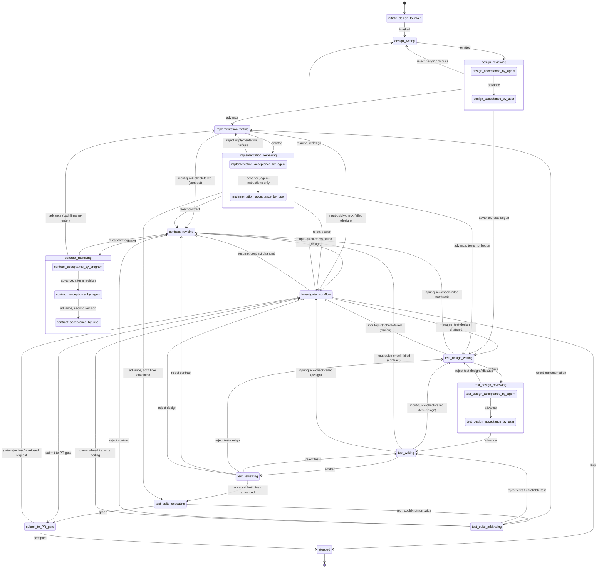

# The design-to-main state machine

The design-to-main workflow takes a design written in English and delivers an implementation and its tests to the gate that guards `main`, or hands the component back to the user as stopped. This document specifies the program that runs that workflow: its states, its transitions, what each state receives and emits, how it counts, what it records, and where it stops. It is written for the agent that will build it and for the agents that will run inside it, none of whom will have read the conversations it came from.

**Vocabulary.** Fleet-wide terms are in the fleet glossary, `docs/wiki/nedschorus-glossary.md`. Terms that belong to this workflow alone are in this directory's glossary, `docs/design-to-main/design-to-main-glossary.md`; every hyphenated phrase below is defined there. This document does not redefine common software-engineering words.

**Provenance.** The rules here were ruled by the user in five walks and one vocabulary ruling. The reasoning and the discarded alternatives are in their minutes, not here:

- `docs/walk/pr-review-graph-coder-reviewer-originator-loops-minutes.md` — the first walk (2026-09-03/04), which produced the rules the superseded draft summarised. Its minutes use the older names *code-design* and *test-code-design* for what this document calls the design and the test-design.
- `docs/walk/state-machine-design-cold-read-triage-minutes.md` — the second walk (2026-09-04/05), which triaged the draft's cold read and produced the 2026-09-05 revision. Every ruling cited below as "item N" is there.
- `docs/walk/state-machine-design-round-2-cold-read-flags-minutes.md` — the third walk (2026-09-05/06), on the second cold read; it renamed the investigation and the submission, and closed with the ruling that every state is named by artifact and phase.
- `docs/walk/implementation-review-verdicts-and-code-write-counting-minutes.md` — the fourth walk (2026-09-05/06), on what a reviewer can find and what is counted; it ruled that the design's author writes the component-contract.
- `docs/walk/state-machine-design-section-11-open-questions-minutes.md` — the fifth walk (2026-09-06), which closed three questions this document had left open and carries the state-name table.
- The coverage-type vocabulary was ruled 2026-09-03 in the MD-skills seat and renamed by the user on 2026-09-06 (the fifth walk, item 2); see §2.

**Standing decisions.** Where this document cites one, it means the numbered list under the heading "Standing decisions" in the objective page, `docs/wiki/queue/nedschorus-ai-native-software-development-objective.md`. **That page is not yet on `main`**: it is on the merge-lane seat's branch and will land, then move to `docs/wiki/`; its numbering is how it cites itself and is stable except where noted in §10. The AI-native architecture, `docs/cross-project/nedschorus-ai-native-software-development.md`, carries an earlier list under its own §19 with 17 entries; where a number below means the same thing in both lists (13 and 14) this document says so. All other section citations of the form §N are to that architecture document.

## 1. What the machine is

**The workflow is the process. The state machine is the program that runs it.** The state machine is code and holds no judgement. It assembles each state's package, launches whatever does that state's work, reads the exit that comes back, checks that the destination is a legal transition from that state (§3.2), routes, counts (§7), commits and pushes every exit to the component's branch (§9), and pauses the run to hand the component to the user when a transition says so. Standing decision 13, and the architecture's decision 13, say why: state transitions, counters, validation and promotion belong in deterministic code.

**A state is not an agent.** A state is where the run is. To do its work a state launches a fresh agent, runs a script, or waits for the user, and its name says which: a state ending in `-acceptance-by-user` waits for the user; one ending in `-acceptance-by-program`, and `test-suite-executing` and `submit-to-PR-gate`, run code alone; every other state launches a fresh agent with its agent-instructions and one package. A launched agent receives one package, does one task, emits one exit, and ends. A user state is a conversation with the user; the machine records its result as a file before routing on it. A reviewing state is a composite state: its sub-states are the acceptance-checks of the artifact it reviews, run in order (§3.1).

**Between agent instances, only files cross.** An agent persists within its own instance — across the cold-read iterations of §4, or the turns of a conversation — and never across instances. What sets the user apart from every agent in the run is not memory but availability (standing decision 20): the arbitrator holds the branch history and so shares his broad context across passes, but the user is often not available, so his checks are states the machine waits in, not steps it can route around, and the counters in §7 bound how often the automated work spends his attention.

**Together the states are one code-prompt-code composite**: code launching agents and reading their exits. Its input is a conversation with the user about one component; its two outputs are a submission to the gate, or the component handed back as stopped. The fleet already has the pattern: `scripts/cold-read-grid.py` is code that launches reviewer cells and reads their status lines.

## 2. Vocabulary

A **component** is what one design describes: one design, one component, one run. A **run** is a component's whole life in the machine, from the user's invocation to a terminal state; an investigation (§6.5) pauses a run and does not end it. Counters, the branch, and the user rulings are per component.

A **package** is everything one launched agent receives, assembled by the machine and delivered over one input connection; the arbitrator (§6.4) is the one agent that receives two. A package holds files. Every agent downstream of the design receives the **standard delivery**: the design, the component-contract, the component's user-rulings file (§9), and — when the state is re-entered after a rejection or an input-quick-check-failed — the notes or the failed-check report that caused the re-entry and the version being corrected. The table in §3.1 lists only what a state receives beyond that.

An **exit** is what a state's work emits and the machine routes on: a **verdict** and a **destination**, as one structured record. The work also writes files — artifacts, notes, evidence — which the machine commits and delivers, but does not route on. Every state has one output connection and emits one exit per instance.

A **write** is a writing state finishing with an artifact; an **implementation-write** and a **test-write** are the two the machine counts (§7). An **input-quick-check-failed** is a writing state stopping because what it received is not enough to do its task; it names the input and what was missing (§4). A **revision** is a re-write of the component-contract after a rejection or a failed check against it. A **correction** is a re-write of the test-design on the same grounds. A **redesign** is a re-write of the design.

A **writer** produces a pipeline artifact: the design and its component-contract, the implementation, the test-design, the tests. A **reviewer** produces no pipeline artifact; its notes and evidence are committed as record and never built from. The **arbitrator** is the one reviewer that reads the whole branch. The user is none of these (§6.5).

The **design** is intent. Nothing below it decides intent. The **component-contract** is the file beside the design, written by the same author in the same conversation, listing what the component promises its component-consumers (§5). A **component-consumer** is anything that invokes the component or reads what it leaves. An **implementation** is what `implementation-writing` produces; its **coverage-type** is `script`, `prompt`, or `script-and-prompt`. A test carries the same field and may also be `no-tests`, with one of three reasons and a sentence saying why: `can-not-be-tested`, `do-not-know-how-to-test`, `no-tests-written`. The user ruled this vocabulary for tests on 2026-09-03 (the MD-skills seat's walk minutes, `docs/walk/cold-read-terminology-pass-rulings-minutes.md`, "Item 1", not yet on `main`), confirmed on 2026-09-05 that the field names what an implementation is as well, and on 2026-09-06 renamed the fourth value and ruled it a test-side value only (the fifth walk, item 2). A design that asks for something that is not a file in the repository — a GitHub setting, for instance — is done by hand and does not enter the machine.

**Agent-instructions**, the fleet glossary's word, are prompts or MD files that instruct agents. An implementation of coverage-type `prompt` is agent-instructions. **Standing-agent-instructions** are instructions any agent will follow — a skill, or the instructions a state launches its agent with — and the user reviews them. **Per-run-text** is what one agent writes during a run for another — a reviewer's notes, a failed-check report, a revised component-contract — and the user does not.

A **nit** is a real defect with no observable consequence. `log-in` for `login` in a comment is a nit; the same typo in a CLI flag is a contract defect, because a component-consumer observes it. Nits are recorded in a reviewer's notes, in their own section, and never routed to a writer as work.

A **cold read** is the fleet's fresh-reader review instrument, `.claude/skills/cold-read/SKILL.md`, run by `scripts/cold-read-grid.py`: reviewer agents with no context from the conversation that produced a document report what each passage made them think it meant and what defects they found. In this machine it is not a state (§4).

**Final prose** lands where people read it: `docs/`, the wiki, skills, `CLAUDE.md`, and standing-agent-instructions wherever they land. **Pipeline prose** is consumed inside the run and lands on the component's branch as record. The design and the test-design are final prose; the component-contract and the investigation reports are pipeline prose.

The test suite is **green** or **red**. "Pass" is not used.

**Skills and agent-instructions.** A skill is agent-instructions a person invokes. This workflow has five: `initiate-design-to-main`, `investigate-workflow`, `design-review`, `test-design-review`, `contract-review`. The instructions every other state launches its agent with are that state's agent-instructions, not skills (user-ruled 2026-09-06). All of them are the MD-skills seat's to write.

## 3. States and transitions

### 3.1 The states

Every state is named by its artifact and its phase (user-ruled 2026-09-06; the ruled table is in the fifth walk's minutes). A reviewing state is composite: its sub-states are the artifact's acceptance-checks, in the order listed, each a pass-or-fail check of the artifact against its acceptance criteria — by program, by agent, or by user. The Package column lists what a state receives beyond the standard delivery of §2.

| State | Sub-states | Package beyond the standard delivery | Exit |
| --- | --- | --- | --- |
| `initiate-design-to-main` | | the user's invocation of the skill | `invoked` |
| `design-writing` | | the invocation; on a redesign, the investigation report | `emitted`, with the design and the component-contract |
| `design-reviewing` | `design-acceptance-by-agent`, `design-acceptance-by-user` | the design and the component-contract, cold-read | `advance` / `reject design` / `discuss` |
| `contract-reviewing` | `contract-acceptance-by-program`; after a revision also `contract-acceptance-by-agent`; on the second revision also `contract-acceptance-by-user` | the component-contract | `advance` / `reject contract` / the user's ruling |
| `contract-revising` | | the reviewer's notes and the version being revised | `emitted` / `input-quick-check-failed` |
| `implementation-writing` | | — | `emitted` with coverage-type / `input-quick-check-failed` |
| `implementation-reviewing` | `implementation-acceptance-by-agent`; for agent-instructions also `implementation-acceptance-by-user` | the implementation's files | `advance` / `reject <artifact>` / `discuss` |
| `test-design-writing` | | — | `emitted` / `input-quick-check-failed` |
| `test-design-reviewing` | `test-design-acceptance-by-agent`, `test-design-acceptance-by-user` | the test-design, cold-read | `advance` / `reject <artifact>` / `discuss` |
| `test-writing` | | the test-design | `emitted` with coverage-type / `input-quick-check-failed` |
| `test-reviewing` | `test-acceptance-by-agent` | the test-design; the tests' files | `advance` / `reject <artifact>` |
| `test-suite-executing` | | the implementation; the tests | `green` / `red` / `could-not-run` |
| `test-suite-arbitrating` | | the implementation line's package; the test line's package; the branch history | `advance` / `reject <artifact>` / `unreliable-test` / `over-its-head` |
| `investigate-workflow` | | the investigation report; the branch history | `stop` / `submit-to-PR-gate` / `resume`, with an optional destination |
| `submit-to-PR-gate` | | the accepted implementation and tests | `accepted` / `gate-rejection` / `gatekeeper-refusal` |
| `stopped` | | — | — |

**The first component-contract is reviewed with the design.** `design-writing` emits both files, so `design-acceptance-by-agent` reads both: does the design hold together, and does the component-contract promise what the design says. `contract-reviewing` is entered on every emission for the program check alone, and after a `contract-revising` for the program check, then a fresh agent's check, then, on the second revision, the user's (§5.3). The consumers of the component-contract still run its agent checks as part of their own input-quick-check (§4).

**The two lines never see each other's output.** `implementation-writing` never receives the tests or the test-design; `test-design-writing` and `test-writing` never receive the implementation. Packages are assembled files, not a checkout of the branch, so a state sees only what its row and the standard delivery name. The lines meet in `test-suite-executing`, which is the machine's, and in `test-suite-arbitrating`.

### 3.2 The transitions

This table is normative. The machine holds it, checks every destination an exit names against it, and treats a destination not in it as a machine error: the run pauses in `investigate-workflow` with focus `unknown` and the illegal exit as the report.

| From | On | To | Counter (§7) |
| --- | --- | --- | --- |
| `initiate-design-to-main` | `invoked` | `design-writing` | — |
| `design-writing` | `emitted` | `design-reviewing`; the program check of `contract-reviewing` runs on the same emission | redesigns, if this was a redesign |
| `design-reviewing` | `reject design` from `design-acceptance-by-agent` | `design-writing` (fresh), with the notes | — (a correction before approval) |
| `design-reviewing` | `discuss` from `design-acceptance-by-user` | `design-writing` | — (the user's own time) |
| `design-reviewing` | `advance` | `implementation-writing`; and, if tests have begun, `test-design-writing` | — |
| `contract-reviewing` | `reject contract` from the program check | `contract-revising` (fresh) | — (uncharged; a form failure) |
| `contract-reviewing` | `reject contract` from `contract-acceptance-by-agent` | `contract-revising` | revisions |
| `contract-reviewing` | the user's ruling at `contract-acceptance-by-user` | `contract-revising`, or `investigate-workflow` focus `contract` | — |
| `contract-reviewing` | `advance` | both lines re-enter their writing states (the invalidation rule below) | — |
| `contract-revising` | `emitted` | `contract-reviewing` | — (counted on entry) |
| `contract-revising` | `input-quick-check-failed` against the design | `investigate-workflow`, focus `design` | — |
| `implementation-writing` | `emitted` | `implementation-reviewing` | implementation-writes |
| `implementation-writing` | `input-quick-check-failed` against the component-contract | `contract-revising` | revisions |
| `implementation-writing` | `input-quick-check-failed` against the design | `investigate-workflow`, focus `design` | — |
| `implementation-reviewing` | `advance`, tests not yet begun | `test-design-writing` | — |
| `implementation-reviewing` | `advance`, tests begun and the test line advanced | `test-suite-executing` | — |
| `implementation-reviewing` | `advance`, tests begun and the test line not yet advanced | waits for the test line | — |
| `implementation-reviewing` | `reject implementation` | `implementation-writing` | — |
| `implementation-reviewing` | `reject contract` | `contract-revising` | revisions |
| `implementation-reviewing` | `reject design` | `investigate-workflow`, focus `design` | — |
| `implementation-reviewing` | `discuss` from `implementation-acceptance-by-user` | `implementation-writing` | — (the user's own time) |
| `test-design-writing` | `emitted` | `test-design-reviewing` | — |
| `test-design-writing` | `input-quick-check-failed` against the component-contract | `contract-revising` | revisions |
| `test-design-writing` | `input-quick-check-failed` against the design | `investigate-workflow`, focus `design` | — |
| `test-design-reviewing` | `reject test-design` from `test-design-acceptance-by-agent` | `test-design-writing` (fresh), with the notes | — (a correction before approval) |
| `test-design-reviewing` | `reject contract` or `reject design` | `contract-revising`, or `investigate-workflow` focus `design` | revisions, for the contract |
| `test-design-reviewing` | `discuss` from `test-design-acceptance-by-user` | `test-design-writing` | — |
| `test-design-reviewing` | `advance` | `test-writing` | — |
| `test-writing` | `emitted` | `test-reviewing` | test-writes |
| `test-writing` | `input-quick-check-failed` against the test-design | `test-design-writing` | test-design corrections |
| `test-writing` | `input-quick-check-failed` against the component-contract | `contract-revising` | revisions |
| `test-writing` | `input-quick-check-failed` against the design | `investigate-workflow`, focus `design` | — |
| `test-reviewing` | `advance`, the implementation line advanced | `test-suite-executing` | — |
| `test-reviewing` | `advance`, the implementation line not yet advanced | waits for the implementation line | — |
| `test-reviewing` | `reject tests` | `test-writing` | — |
| `test-reviewing` | `reject test-design` | `test-design-writing` | test-design corrections |
| `test-reviewing` | `reject contract` | `contract-revising` | revisions |
| `test-reviewing` | `reject design` | `investigate-workflow`, focus `design` | — |
| `test-suite-executing` | `green` | `submit-to-PR-gate` | — |
| `test-suite-executing` | `red` | `test-suite-arbitrating` | — |
| `test-suite-executing` | `could-not-run`, first time | `test-suite-executing` (retry) | — |
| `test-suite-executing` | `could-not-run`, second time | `test-suite-arbitrating` | — |
| `test-suite-arbitrating` | `reject implementation` | `implementation-writing` | — |
| `test-suite-arbitrating` | `reject tests` or `unreliable-test` | `test-writing` | — |
| `test-suite-arbitrating` | `reject contract` | `contract-revising` | revisions |
| `test-suite-arbitrating` | `over-its-head` | `investigate-workflow`, focus `unknown` | — |
| an implementation-write or test-write counter | reaches its ceiling | `test-suite-arbitrating`, which opens the investigation (§7) | — |
| the redesigns counter | reaches its ceiling | `stopped` | — |
| the revisions or test-design-corrections counter | reaches its ceiling | the artifact's `-acceptance-by-user` sub-state | — |
| `investigate-workflow` | `stop` | `stopped` | — |
| `investigate-workflow` | `submit-to-PR-gate` | `submit-to-PR-gate` (the user's override; the gate still reviews) | — |
| `investigate-workflow` | `resume` | the earliest state downstream of what the user changed, by the machine's diff of the branch; or the destination the user names | redesigns, if the destination is `design-writing` |
| `submit-to-PR-gate` | `accepted` | `stopped` (the run is complete) | — |
| `submit-to-PR-gate` | `gate-rejection` | `investigate-workflow`, focus `unknown`, the gate's findings as the report | — |
| `submit-to-PR-gate` | `gatekeeper-refusal`, network weather | `submit-to-PR-gate` (retry) | — |
| `submit-to-PR-gate` | `gatekeeper-refusal`, the request itself refused | `investigate-workflow`, focus `unknown` — a machine error, the submit state built a bad request | — |

Three rules the table relies on:

- **A revised component-contract invalidates everything built from the old one.** When `contract-reviewing` advances a revision, the machine marks both lines not-advanced; `implementation-writing` is re-entered by a fresh agent that receives the design, the revised component-contract and the user rulings but not the old code, and writes from scratch — an implementation-write, counted (§7; the fourth walk, item 4). If tests have begun, `test-design-writing` re-derives. A stale review never reaches `test-suite-executing`. This is the check that keeps the `advance` verdicts honest without provenance fields.
- **Tests begin after the first implementation-write is accepted**, which is the first evidence the design can be built from (item 6.8). The machine holds a `tests-begun` flag; the first `advance` from `implementation-reviewing` sets it and routes to `test-design-writing`. Sequencing changes when the test line runs, not what it sees.
- **The arbitrator has three triggers**: a red suite, a suite that could not run twice, and an implementation-write or test-write counter at its ceiling. It never opens for anything else (§6.4).

### 3.3 The diagram

Derived from §3.2. Mermaid state identifiers cannot carry hyphens, so `design-writing` appears as `design_writing`; the names are the same names. The composite reviewing states are drawn with their sub-states; the arbitrator's three triggers and the counter ceilings are drawn, the retry loops are not.

### 3.4 The two terminal states

**`submit-to-PR-gate`.** The machine hands the accepted implementation and tests to the gate. What the gate does is the gate's (standing decision 14, the same in both lists): the main-gatekeeper, `docs/cross-project/main-gatekeeper-design.md`, is the permanent path, and `CLAUDE.md`'s PR process — a branch cut from current `main`, a pull request, review and merge at the merge-lane seat — holds until it is active. The gatekeeper's ruled activation shape (its design, "RULED 2026-08-29") is that it opens a pull request rather than pushing; the program as built pushes a single candidate commit and is the pre-ruling build. Whether the gate's pull request will carry that single commit or the topic branch with its pass commits is unspecified in the gatekeeper design; the retention rule of §9 holds under either.

Two things can come back, and the machine tells them apart. A **gate-rejection** is a review finding: the gate's reviewer found a code defect with a failure scenario that this machine's reviewers missed, or the suite is red on current `main` because something merged since the branch was cut. Prose is never a cause; the gate reports nothing about designs, component-contracts or test-designs. A gate-rejection opens an investigation with the user, with the gate's findings as the report, because it means this machine's own review has a hole. A **gatekeeper-refusal** is the gatekeeper program declining a request it cannot apply — a malformed path, a stale base, a conflict with `main`, `main` moving too fast, the network down — each naming its error and its fix, resubmission always safe. Refusals are the machine's to handle: a retry for weather; and, if the submit state itself built a bad request, a machine error, which opens an investigation because the machine's own code is wrong.

**`stopped`.** Reached when the gate accepts, when the user rules `stop` in an investigation, or when the redesigns counter reaches its ceiling (§7). The branch and its record remain (§9).

## 4. Writers

**Every writing state begins with the input-quick-check.** The agent-instructions of every writing state carry an enumerated list of checks for its inputs — the component-contract's are in §5.3; the design's and the test-design's are owed by step 1 of the architecture's §18 build order (§11) — and say: read your inputs once; if they fail these checks, or are missing information you need, or raise questions you must have answered before you can write, stop and exit `input-quick-check-failed`, naming the input and what was missing. It is a quick check, not a validation: the writer does not audit its inputs, it reads them and stops if it cannot proceed. The failed check is the asking; the machine routes it to that input's writer, who answers by re-writing. There is no separate validator state for a writer's inputs. The user folded that into the writer on 2026-09-05 (item 8): a separate state doubled the cost of reading the same package, and no case showed it catching what a writer told to ask first would not. The acceptance-checks of a reviewing state are a different thing: they check the previous state's output, not the next state's inputs (§6).

**An `input-quick-check-failed` is not a write.** It increments no write counter; it is charged to the input it was against (§7). When a later state fails on an input that passed its writer's checks, that failure shows which check was missing from the list; adding it is step 1's work, not the machine's.

**A writer's exit says nothing about its inputs.** Anything it worked around and still finished is a nit in its own notes, which are committed as evidence (§9) and read by reviewers, not routed.

**Every writing state that emits prose cold-reads it inside the state before emitting.** The design, the component-contract, the test-design, and every investigation report are prose. The writer starts a cold-read run on its draft, reads the reports, revises, and may run it once more; it emits after at most two rounds. The reports return to the agent that wrote the draft, never to a fresh one: only the writer knows what it was trying to say, and a fresh agent handed a cold-read report mostly smooths what reads badly. Measured on this fleet (cold-read-research seat, `cold-read-records/2026-09-03-cold-read-tier-roster-campaign/REPORT.md`, machine-local; the figures are means over calibrated judges): a fresh author given the reports resolved 14–17 of 50 known defects; the writer's own revision resolved 42.7. So the machine does not own the cold read and it is not a state. The skill's final step — walking findings with the user — is not part of the in-state read; it happens at the user's acceptance-checks. Which reviewers compose a cold-read run is the campaign's to settle (§11); the writer invokes whatever the run runs.

**Implementations and tests are reviewed and run.** An implementation or test of coverage-type `prompt` — agent-instructions — is also cold-read by its writer inside the writing state before it is emitted, because its reader is an agent that was not in the conversation, which is what a cold read simulates (user-ruled 2026-09-06, the fifth walk, item 1). Agent-instructions that are a form, with sections filled in mechanically or per reader — the handoff supervisor's launch prompt is one; a reviewing state's agent-instructions with the component's documents filled in is another — are cold-read as a filled-in sample, as their reader will receive them, never blank. A script is not cold-read. Standing-agent-instructions reach the user for acceptance after the agent's check advances them (`implementation-acceptance-by-user`, §6.5); per-run-text does not.

## 5. The component-contract

### 5.1 What it is

What the design promises its component-consumers, plus the details a tester needs to observe those promises, and nothing else, where a component-consumer is anything that invokes the component or reads what it leaves. Anything you would have to read the source to know is implementation, not contract. A clause belongs if deleting it leaves some promise of the design unobservable; two clauses that observe one promise the same way are one clause written twice (user-ruled 2026-09-06, the fifth walk, item 3). The component-contract may change without the design changing: it carries the details, arbitrary to the design, that an implementation and its tests need.

The component-contract is written by the design's author, in the design conversation with the user, as a second file beside the design (user-ruled 2026-09-06, the fourth walk, item 2): the details it adds — an exit status for "a refusal is an error" — are decisions, and the design conversation is where they are made and where the gaps a derivation would find are found live. It is a separate file so that a revision after the design is approved changes it and not the design the user approved. After the fan-out it is revised only by a fresh agent in `contract-revising`, from a reviewer's notes; the user sees the first version because he discussed it, and later versions only at `contract-acceptance-by-user`, on the second revision (§6.5). It is pipeline prose.

### 5.2 Form

Five numbered groups. Design by Contract's three — preconditions, postconditions, invariants — with preconditions split by who is responsible and postconditions split by what is checked.

| Group | Holds |
| --- | --- |
| `component-consumer-supplies` | A precondition on what the component-consumer passes in. One clause each, with what makes it invalid. |
| `world-requires` | A precondition on what must already be true that the component does not create. Each names its refusal, or is declared `unchecked`. A setting outside the repository that a component depends on — a branch-protection rule, for instance — is a clause here, not an implementation. |
| `component-consumer-receives` | A postcondition on what the component-consumer gets back, per case, and how the outcome is observed. |
| `world-changes` | A postcondition on what is different after a run, per case. |
| `world-unchanged` | The invariant: what is the same after a run, and which runs it covers. |

Rules the writer follows:

1. One clause, one sentence, one observable. A sentence ends at a period outside a code span.
2. Every clause names how it is seen: the test that would fail if it were violated, or, where no test can reach it, how a reviewer demonstrates it by hand. Observability decides whether it is a clause; testability decides its evidence.
3. Every `component-consumer-receives` clause names the observable that distinguishes the outcomes. For a script, the exit status, conventionally 0 for success; for a prompt, the result in its report; for `script-and-prompt`, both.
4. A **refusal** is the component declining to act because a `world-requires` clause fails. It is one `world-requires` clause and one `component-consumer-receives` clause sharing a number with suffixes `a` and `b`. An `unchecked` clause has no refusal and names no test.
5. A clause is **challenged** when a state's exit asserts, with a failure scenario, that the clause is wrong. Where the component-contract is challenged or silent, the design governs (§8).

### 5.3 The checks

**`contract-acceptance-by-program`** — the machine runs a script on the emitted component-contract before any downstream state receives it; a failure routes to a fresh `contract-revising` uncharged (§3.2). They are token checks: every clause numbered, in a group, one sentence; every refusal a matched `a`/`b` pair; every `component-consumer-receives` clause naming its observable; every clause naming a test, a by-hand demonstration, or `unchecked`.

**The agent checks** — each clause states one observable; no clause names internals; no two clauses contradict, as far as the reader can see; every `component-consumer-supplies` clause has its invalid case; every `world-unchanged` clause says which runs it covers; every outcome in `component-consumer-receives` is produced by some stated condition; **every observable the design promises a component-consumer has a clause**, and no clause promises what the design does not; and the test a clause names would fail if the clause were violated — a judgement, which is why it is not a program check. They run in three places: on the first version, in `design-acceptance-by-agent`, which reads the design and the component-contract together; on a revision, in `contract-acceptance-by-agent`, a fresh agent; and in every writing state that receives the component-contract, as part of its input-quick-check, exiting `input-quick-check-failed` against the component-contract on a failure.

**`contract-acceptance-by-user`** — only when the component-contract has failed review twice: the user sees both versions before a third is written (§6.5).

### 5.4 In a dispute

Where the component-contract speaks, it governs. Where it is silent or challenged, the design governs. Nothing below the design decides intent (§8).

## 6. Reviewers, the arbitrator, and the user

### 6.1 What every reviewer emits

An exit — verdict and destination — and one notes file. The verdicts are `advance`, meaning no substantial issue whether or not there are nits; `reject <artifact>`, naming the artifact under review or a prose parent of it — when more than one is at fault, the highest document at fault, since whatever is below it is rewritten from the corrected version anyway; and, for the arbitrator only, `unreliable-test` and `over-its-head`. The destination is the transition §3.2 pairs with the verdict, and the machine checks it. **A reviewer never edits the artifact it reviewed, the component-contract, or the design.** Every fix is done by a fresh writer at the destination.

Notes are evidence for that writer. Each substantial entry is a concern with a failure scenario and may carry a proposed fix. Nits go in a separate section headed as such; the receiving writer's agent-instructions say nits are not work. Rejecting a prose parent carries a failure scenario; it need not carry a failing test, because the suite descends from that parent.

**A reviewer reports no wording findings.** A claim stated too strongly, a term used before it is defined, wording a reader dislikes: none of it is a finding. A clause that means the right thing, badly said, is not a finding; a clause that promises the wrong thing is. Wording that leaves a promise open, so two readings give two behaviours, is a contract finding. The reason is the measurement behind `CLAUDE.md`'s review rule: wording findings between cooperative agents produce fix rounds whose fixes are the next round's findings. This binds reviewers; the cold read inside a writing state is the writer's own instrument and reports what it likes to the writer.

### 6.2 The design's and the test-design's agent checks

`design-acceptance-by-agent` and `test-design-acceptance-by-agent` are each a fresh agent that receives the document and the user rulings and runs the enumerated checks its consumers will run — is every path's promise stated, does nothing contradict, can a writer build from it — before the user reads it. They exist so that the user does not read a document the next writer will reject an hour later (user-ruled 2026-09-06, the fourth walk, item 2). A reject from either goes back to the writer with notes and is a correction before approval, not counted (§7). They report no wording findings, like every reviewer. What they cannot check is intent, which is why the user's check follows.

### 6.3 The implementation reviewer

`implementation-acceptance-by-agent` receives the standard delivery and the implementation's files — its agent-instructions, the design, the component-contract, the user's rulings on the component, and on a second review the previous reviewer's notes. It writes and runs its own tests to its own completion bar, performs by hand any demonstration a clause names, and keeps all of it under its evidence directory (§9), never in the suite. Code that will not run at all fails here and is rejected as implementation. **It does not receive the suite or the suite's result**, in any round: a reviewer handed the project's tests tries less hard to write its own and inherits the project's sense of what matters, and one handed a green score approves on the score. It holds the component-contract to check the implementation against it, and keeps `reject contract` as a verdict because running the code can surface a contradiction with the design that reading missed. Its stopping point is its own judgement within the resource limits every state gets (step 1's, §11). How its tests might later be reused is not designed.

### 6.4 The test reviewer

`test-acceptance-by-agent` receives the standard delivery, the test-design, and the tests' files. It reads the tests against the component-contract and the test-design — do they reach the behaviour they claim, would they fail if the clause were violated, do they mirror an implementation they never saw — and judges. It does not run them, because it never receives the implementation; `test-suite-executing` runs them. It has three prose parents and may reject any of them.

**`test-suite-executing`** is the machine's. It runs every test of coverage-type `script` with the test runner, and for every test of coverage-type `prompt` — a test run by a single-purpose agent — it launches that agent with the test's agent-instructions and reads its result. A suite that cannot run at all — a missing interpreter, a broken fixture, a runner crash — exits `could-not-run`; the machine retries once, then hands it to the arbitrator (user-ruled 2026-09-05, the third walk, item 2).

### 6.5 The arbitrator

`test-suite-arbitrating` launches the one reviewer with two input connections: the implementation line's package and the test line's, with the branch history (§9) alongside. It is entered on three triggers: a red suite, which is the one way the two lines' disagreement becomes visible; a suite that could not run after one retry; and an implementation-write or test-write counter at its ceiling, where it opens the investigation with the user (§7). On a red suite, whether the two lines actually conflict, and where, is what it determines:

| It finds | Verdict | Destination |
| --- | --- | --- |
| The component-contract speaks to the point; one artifact contradicts it | `reject <that artifact>` | its writer, fresh |
| The component-contract is silent or challenged; the design settles it | `reject contract` | `contract-revising`, a revision |
| A test gives different results on the same inputs, and the implementation does not | `unreliable-test` | `test-writing` |
| The implementation gives different results on the same inputs | `reject implementation` | `implementation-writing` |
| Neither the component-contract nor the design settles it | `over-its-head` | `investigate-workflow`, focus `unknown` |

To establish the last three it may ask the machine to rerun the suite, which the machine does. It never routes back to `test-suite-executing` with nothing changed. On a suite that could not run, it routes to the tests when a fixture or import is at fault and to the implementation when the component will not start; only an environment fault goes `over-its-head`, with the report naming what is broken. If its ruling would send work to a writer whose counter is at its ceiling, the ceiling wins: the investigation opens and the ruling rides in the report.

The arbitrator is also the agent the user talks to in every investigation (§6.6). It never edits the component-contract or the design.

### 6.6 The user

The user appears in the acceptance-checks that carry his name, in `initiate-design-to-main`, and in `investigate-workflow`, and nowhere else. What sets him apart is availability (§1), so every state that waits for him is designed to keep the wait short: one decision at a time, plainly stated, independent work continuing meanwhile, and never a question another state could settle (standing decision 20).

**`initiate-design-to-main`.** The user starts a run by invoking the skill of that name; the invocation is `design-writing`'s package, and the design conversation follows.

**`design-acceptance-by-user`, `test-design-acceptance-by-user`, `implementation-acceptance-by-user`.** The user reads the document after its cold read and its agent check, and advances or discusses. `discuss` returns it to the writer for another draft; it is the user's own time and is not counted. The design's package carries the component-contract, because he discussed it; whether he reads every clause is his business. `implementation-acceptance-by-user` exists only for an implementation that is agent-instructions — standing-agent-instructions, which the user reads, as he reads the instructions to a reviewer on how to prepare its notes or to a writer on how to write, but not the notes themselves (user-ruled 2026-09-06, the fifth walk, item 1). These are this machine's instances of standing decision 19 — the user reviews all final prose after its cold read, before it lands — which also covers every landing document outside the machine: wiki pages, `CLAUDE.md`, skills. Not scripts; not per-run-text.

**`contract-acceptance-by-user`.** The user is not a routine gate on the component-contract; his words on 2026-09-04 were "I'd rather not," and on 2026-09-06, "I won't review the contract unless I have to." He sees its first version in the design conversation. A revised component-contract reaches him only when it has failed review twice: at that point the component-contract is the suspect, and he sees both versions before a third is written. A bad component-contract can therefore cost at most two implementation-writes before he sees it (§7).

**`investigate-workflow`.** A dialog between the user and the arbitrator, which holds the branch history and writes the report. It pauses the run. The user may open one at any time with the `investigate-workflow` skill; the machine opens one on:

- a `reject design` or an `input-quick-check-failed` against the design — every rejection of the design is an investigation (item 6.2), and re-entering `design-writing` from it is a redesign;
- a gate-rejection, or a machine error (§3.2, §3.4);
- the arbitrator's `over-its-head`, or a write counter at its ceiling, where the arbitrator opens it (§7);
- the revisions or test-design-corrections counter at its ceiling — which is the artifact's `-acceptance-by-user` check, with the report focused on that artifact.

The **investigation report** has a focus, `design`, `contract`, `test-design`, or `unknown`. It is written by the arbitrator from the branch history, except where a reviewer's or writer's exit opened the investigation, where that agent writes it from its notes or its failed check and the arbitrator holds it. The author cold-reads it inside its state before the machine delivers it. It carries the evidence, the commits it cites, and the user rulings, so that a second report on the same component does not re-ask what the user has ruled. What else it must contain is not specified; the user's placeholder (2026-09-04) is: prepare the information the user needs, then cold-read it — every report the machine delivers to the user is cold-read first. Live conversation is not.

Once in the investigation the user may do almost anything: edit the design, the component-contract or the test-design, ask the arbitrator, or rule. Its exits are `stop`; `submit-to-PR-gate`, the user's override, after which the gate still reviews; and `resume`. On `resume` the machine diffs the branch and resumes at the earliest state downstream of what changed, or at the destination the user names. Any document the user edited is re-read before anything is built from it — its writer's cold read, and the component-contract's program checks — automatically; the user's own acceptance-check of a document he just edited is skipped, the cold read is not. The `design-review`, `test-design-review` and `contract-review` skills run the same checks on demand. A user ruling given in an investigation is appended to the user-rulings file before the run resumes.

**The channel.** The machine opens it — a tmux session on the user's Mac, launched the way `scripts/handoff-supervisor.py` launches a seat — and the arbitrator does the talking. The arbitrator may likewise open a conversation with the user at its own discretion when the run looks wrong to it. The user may also let a run proceed without intervening.

## 7. Counting

The machine keeps these counters per component in the run-state file (§9). It counts the expensive work and bounds the cheap.

| Counter | Increments when | Ceiling | At the ceiling |
| --- | --- | --- | --- |
| **redesigns** | `design-writing` is re-entered from `investigate-workflow` | up to two redesigns; the third re-entry is not made | `stopped` — the user has ruled three times and the machine does not open a fourth |
| **implementation-writes**, per design version | `implementation-writing` emits `emitted` | up to three per design version, nine in all | `test-suite-arbitrating`, which opens the investigation, focus `unknown` |
| **test-writes**, per design version | `test-writing` emits `emitted` | up to three per design version, nine in all | `test-suite-arbitrating`, which opens the investigation, focus `unknown` |
| **revisions** | `contract-revising` is entered after a rejection or a failed check against the component-contract, once the design is approved | 2 | `contract-acceptance-by-user`, focus `contract` |
| **test-design corrections** | `test-design-writing` is re-entered after a rejection or a failed check against the test-design, once the test-design is approved | 2 | `test-design-acceptance-by-user`, focus `test-design` |

A **design version** is the life of one version of the design: the original and up to two redesigns, three versions, which is where nine comes from. **Round N** is the state of the machine after the Nth implementation-write in the current design version; it is the same number as that counter.

- **Only an `emitted` exit increments a write counter.** An `input-quick-check-failed` is charged to the input it was against and to nothing else.
- **A rejection before approval is not counted.** A `reject` from an artifact's `-acceptance-by-agent` check before the user has approved it sends the writer another round on the user's behalf; the revisions and corrections counters count re-entries after approval. The user's `discuss` is his own time and is not counted.
- **A revision is not an implementation-write.** Component-contract ping-pong with no code written costs nothing from the write budget. The implementation-write forced by a revised component-contract is real work — the fresh writer writes from scratch — and is counted (the fourth walk, item 4); because the component-contract reaches the user at its second revision, a defective component-contract can cost at most two implementation-writes before the user sees it.
- **A suite run is part of the write it follows.** It is mechanical and uncounted.
- **The third failed implementation-write goes to the arbitrator, who opens the investigation with the user** (user-ruled 2026-09-05, the third walk, item 3.1), whether the write failed review or failed the suite. The machine does not try a fourth. A ruling the arbitrator would have made rides in the report instead of being acted on.
- **The arbitrator resets nothing** and increments nothing; every route it takes leads to a counted writer or to the user.
- A redesign is a new design version, and its writes are counted from zero.
- The ceilings are the user's numbers. Lowering a write ceiling means changing the per-version figure; the total follows.

## 8. Disputes and where they go

The design is intent, and nothing below it decides intent. A dispute — a reviewer finding an artifact wrong, or the two lines disagreeing — resolves by one descent:

1. **The component-contract speaks.** The artifact contradicting it is wrong and goes back to its writer. Reviewers settle this without needing the design.
2. **The component-contract is silent or challenged, and the design speaks.** The component-contract is defective; a fresh agent revises it from the reviewer's notes.
3. **Neither speaks.** No state below the design may decide, so the user does: a reviewer's `reject design`, or the arbitrator's `over-its-head`, both reach the user through `investigate-workflow`.

After its approval, the design changes only through `investigate-workflow`: because something below it could not be built from it, because a reviewer found a failure scenario in it, or because neither it nor the component-contract settled a dispute. It is never re-read for drift. A redesign is a new conversation between the user and a fresh agent, carrying the investigation report; a designer holding context it never wrote down is a defect signal, not a resource.

## 9. Git is the record

Every component has a topic branch, cut by the machine from `origin/main` and named for the component, following the topic-branch rule in `docs/issues/238-topic-branch-creation-script-design.md`. The branch has a fixed layout:

| Path | Holds |
| --- | --- |
| `design.md` | the design, current version |
| `contract.md` | the component-contract |
| `test-design.md` | the test-design |
| `src/` | the implementation |
| `tests/` | the suite — `test-writing`'s tests and nothing else |
| `evidence/<state>-<n>/` | a reviewer's notes and its own tests, or a writer's notes, for the nth instance of that state |
| `reports/investigation-<n>.md` | each investigation report |
| `user-rulings.md` | every ruling the user has given on this component: approvals, `discuss` outcomes, investigation rulings, each marked user-ruled with its date; append-only |
| `run-state.json` | the counters, the `tests-begun` and both-lines-advanced flags, and the current state |

**Every exit is committed and pushed by the machine**, whether or not it produced an artifact: an `input-quick-check-failed`, a red suite, an arbitrator's ruling, a user ruling are all commits. The commit message carries a structured trailer — `State:`, `Exit:`, `Write:` (the write number, for writes), and the counter values — on the model of the gatekeeper's trailer (its design, "The trailer"). The branch history is therefore the record of the run; the arbitrator reads it with `git log` and `git show`, and the investigation report cites commits from it. A process that dies between writing files and committing is recovered by the machine from the last commit.

**Topic branches carrying pass history are pushed to origin and retained after landing**, until the component is retired; cleanup is fleet maintenance, issue #226. Under either shape the gate may take (§3.4), this branch is where the pass history lives.

**The user rulings are delivered in every package** (§2) and, at any cold read of a document on the branch after the first, to the reviewer cells. Cells that could not see the rulings re-raise them: measured on this fleet (MD-skills seat, five rounds on one prompt; cold-read-research seat, the same `REPORT.md` as §4), precision on instruction prose whose rulings the cells had not seen ran far below precision on designs. The cold-read run today takes only a target; passing it a rulings file is instrument work, not this document's.

The architecture's §20 `supersedes` edges and §5 disposition dimension are not used inside a run; the branch is.

## 10. Departures from the AI-native architecture

The architecture's §19 opens: "Recommendations elsewhere remain proposals until accepted and built." Its §5, §6 and §7 are therefore proposals, and this document departs from them where the user ruled otherwise, saying why. Two departures also touch standing decisions 4 and 21 of the objective page, whose current wording keeps a separate validator and tells a producing node not to audit its inputs; the user reversed both on 2026-09-05 and their rewording is pending his review. Until then this document governs the machine and those two decisions are being brought into line with it, not the reverse.

**One exit, not four dimensions** (§5, "Do not force all meaning into one state field"). A reviewer emits a verdict and a destination the machine checks against §3.2, and everything else goes in the notes as evidence. Two representations of one fact drift; the second is not made into state.

**No separate validator of a writer's inputs** (§5 duties 1 and 3; decisions 4 and 21). A writer checks its inputs by the enumerated list in its own agent-instructions and stops with `input-quick-check-failed` (§4). The reason is the user's: a separate state doubled the cost of reading one package without a demonstrated catch. The two agent checks that stand in front of the user's on the design and the test-design (§6.2) are not validators of the next writer's inputs; they are standing decision 5's independent review of the previous writer's output, added on 2026-09-06 for the user's time, and they qualify decision 21 rather than reverse it.

**No local nit repair** (§5, "When a nit may be repaired silently"; decision 4's second half, "A safe nit may be repaired, verified, and recorded locally"). A reviewer never edits; nits are recorded and never routed (user-ruled 2026-09-06, the third walk, item 6).

**Tests after the first implementation-write, not in parallel** (§6, "Code and test planning"). The first accepted implementation-write is the first evidence the design is buildable; the test budget is not spent before it.

**Git, not a workflow store, as the run's record** (§20). The run's state is the branch and one JSON file on it, and both the arbitrator and the user already know how to read a branch.

## 11. Not decided here

- **Provenance and attestation fields** on packages and exits. Step 1 of the architecture's §18 build order owns them; this design lands into that step's GitHub issue as its GHI-MD when the merge-lane seat files it, and does not pre-empt it.
- **The design's and the test-design's enumerated checks**, in the form of §5.3. Step 1.
- **Resource limits per state** — time, tokens, retries — which bound every "to its own judgement" above. Step 1.
- **The investigation report's required content**, beyond §6.6's placeholder.
- **What the gate's pull request carries** — the single candidate commit or the topic branch. The gatekeeper design does not say; merge-lane is routing it.
- **Which reviewers compose a cold-read run**, and passing the user rulings to it. The cold-read-research seat's campaign and the cold-read skill, respectively.
- **How a reviewer's own tests might be reused.** Evidence only, for now.
